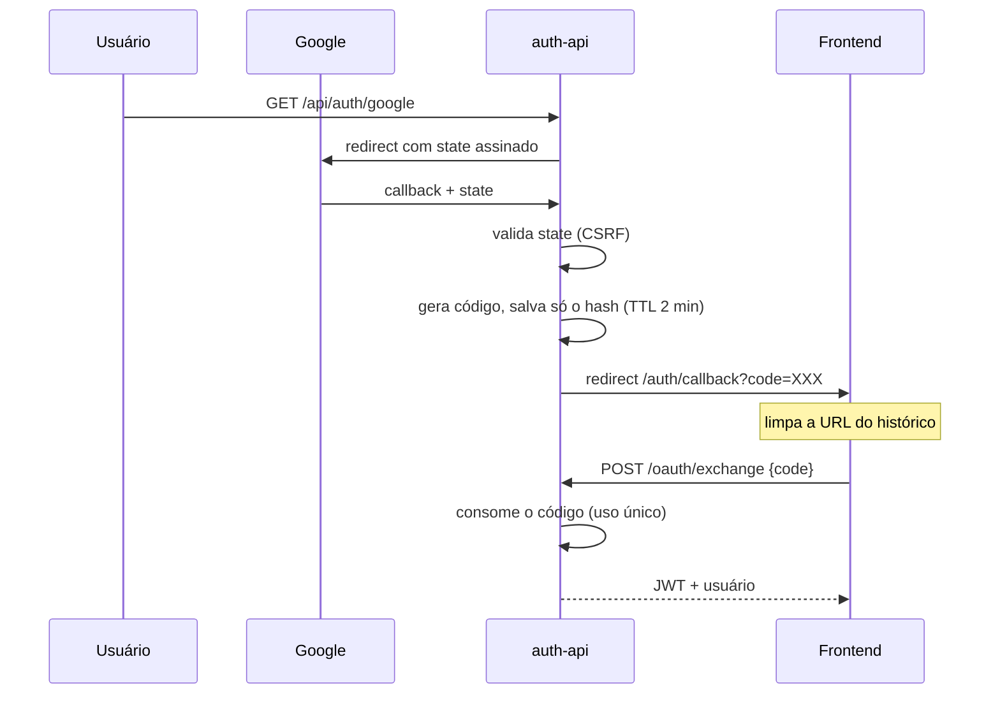

# Alterações — Revisão de Segurança e Simplificação de Perfis

**Data:** 19/08/2026
**Repositórios:** `C:\Mora-Backend` (auth-api + portaria-service) e `C:\Mora-Frontend`
**Estado:** aplicado no código e validado contra PostgreSQL real. **Nenhum commit feito.**

Dois blocos de trabalho, na ordem em que foram executados:

1. **Revisão de segurança** do serviço de usuários/autenticação
2. **Simplificação de perfis** — de 11 para 6

---

## Sumário

| | Backend | Frontend | Total |
|---|---|---|---|
| Arquivos criados | 5 | 0 | **5** |
| Arquivos alterados | 24 | 17 | **41** |
| Migrações de banco | 2 | — | **2** |

Os 24 do backend são 22 do `auth-api`, 1 do `portaria-service` (`VeiculoService.java`) e o `docker-compose.yml`. Não estão contados aqui os arquivos que já apareciam modificados no repositório antes desta sessão — listados em [4.4](#44-alterações-não-deste-trabalho).

**Verificações:** 20/20 testes passando · build do frontend OK · migrações aplicadas em base real com 12 usuários, sem perda de dados.

---

# PARTE 1 — Revisão de segurança

## 1.1 Falhas corrigidas

| # | Falha | Correção | Arquivo |
|---|---|---|---|
| 1 | **JWT trafegava na query string** do redirect do OAuth, vazando para histórico do navegador, logs de proxy e cabeçalho `Referer` | Redirect passa a entregar um **código de uso único** (TTL 2 min, só o hash é persistido), trocado por JWT em `POST /oauth/exchange` | `routes/auth.js`, `models/User.js` |
| 2 | **Fluxo OAuth sem proteção CSRF** | `state: true` na estratégia Google, assinado na sessão | `config/passport.js` |
| 3 | **`session.secret` reutilizava o `JWT_SECRET`** — dois domínios criptográficos com a mesma chave | `SESSION_SECRET` próprio; aborta o boot em produção se ausente | `server.js` |
| 4 | **Usuário Google conseguia trocar o e-mail pela API** — o bloqueio existia só na tela | `PUT /me` retorna 403 quando `provider === 'google'` e o e-mail muda | `routes/auth.js` |
| 5 | **Logout só limpava o navegador** — token roubado valia até expirar | `POST /logout` + `User.revogarTokens()` incrementando `tokenVersion` | `routes/auth.js`, `models/User.js` |
| 6 | **Reset de senha não derrubava sessões** — quem estava expulsando um invasor o mantinha logado | `tokenVersion++` no reset e na troca via `PUT /me` | `routes/auth.js` |
| 7 | **Rate limiter único** para login, reset e OAuth — estourar um bloqueava os outros | Três limitadores por finalidade | `routes/auth.js` |
| 8 | **`err.message` vazando** detalhes internos (host, porta, dialeto do banco) | `console.error` + mensagem genérica em 6 pontos | `routes/users.js`, `routes/auth.js` |
| 9 | **Scope `withPassword` por `attributes.include`** — dependia da ordem de merge com o `defaultScope` | Reescrito por exclusão a partir da lista `SEGREDOS` | `models/User.js` |
| 10 | **Interceptor 401 atropelava o retorno do OAuth** | Allowlist de rotas que tratam o próprio 401 | `src/services/api.js` |
| 11 | **Senha de admin hardcoded** (`Vibers@2112`, a mesma do `docker-compose.yml`) | Vem de `ADMIN_SEED_EMAIL`/`ADMIN_SEED_PASSWORD`; sem elas o seed é pulado | `server.js` |

> O item 11 não estava no escopo original — foi encontrado durante a revisão.

## 1.2 Novo fluxo do OAuth



**Antes:** `/auth/callback?token=<JWT>` — o token completo na URL.
**Depois:** `/auth/callback?code=<código>` — descartável, uso único, 2 minutos.

## 1.3 Itens do plano que **não** se aplicavam

O plano de revisão descrevia um codebase diferente. Verificado item a item:

| Item do plano | Realidade local |
|---|---|
| `Admin.jsx` usa `u._id` (herança do MongoDB) | **Não existe `Admin.jsx`.** `grep -rn "_id" src/` retorna vazio |
| Sem revogação de JWT | `tokenVersion` **já existia** e já era verificado no middleware |
| `sequelize.sync({ alter: true })` em produção | **Não há nenhum `sync(`** no `server.js` |
| `console.log` de debug no callback OAuth | Havia `console.error` para erro real, não log de debug |
| URL do OAuth fixa em `localhost:3001` | Era fallback de `VITE_API_URL`, não valor fixo |
| Senha mínima de 6, repetida em 4 lugares | Já era **8 + dígito + maiúscula**, centralizado em `utils/passwordValidation.js` |
| Expor `bloco`/`apartamento`/`vaga` no modal | Colunas marcadas `/** Legado */`; a decisão D40 é removê-las |

O plano também propunha substituir `models/User.js` e `routes/auth.js` por versões que removeriam `perfil`, `status`, `condominioId` e `unidadeId`, reabririam o cadastro público e trocariam o claim `perfil` por `role` no JWT — o que quebraria o `portaria-service`, os convites e o frontend. **Não aplicado**, por decisão sua de adaptar ao modelo real.

Verificação de email por token também ficou de fora: o cadastro já é por convite enviado ao e-mail, então a posse do endereço está provada na ativação.

---

# PARTE 2 — Simplificação de perfis

## 2.1 De 11 para 6

| Perfil novo | Absorve | Usuários migrados |
|---|---|---|
| `ADMIN_GERAL` | `CONTRACTING_PROPERTY_MANAGER`, `CONTRACTING_SYNDIC` | 0 |
| `ADMIN_SINDICO` | `OPERATIONAL_SYNDIC`, `ADMINISTRATOR`, `REAL_ESTATE_AGENCY` | 3 |
| `PORTEIRO` | `DOORMAN` | 1 |
| `MORADOR` | `RESIDENT_OWNER`, `LESSEE`, `OCCUPANT` | 7 |
| `DONO_ALUGUEL` | `ABSENT_OWNER` | 0 |
| `CONVIDADO` | `GUEST` | 1 |
| | | **12 total** |

`REAL_ESTATE_AGENCY` foi descontinuado (tinha 0 usuários). Nomes em português, acompanhando as tabelas do domínio (`moradores`, `blocos`).

## 2.2 Camadas e permissões

```
Plataforma → ADMIN_GERAL          alcance global
Condomínio → ADMIN_SINDICO        um condomínio
             PORTEIRO
Unidade    → MORADOR              uma unidade (exigem unidadeId)
             DONO_ALUGUEL
             CONVIDADO            sem acesso ao sistema
```

**Matriz de delegação:**

```
ADMIN_GERAL   → todos os perfis
ADMIN_SINDICO → PORTEIRO, MORADOR, DONO_ALUGUEL, CONVIDADO
DONO_ALUGUEL  → MORADOR, CONVIDADO
MORADOR       → CONVIDADO
PORTEIRO      → (nenhum)
CONVIDADO     → (nenhum)
```

## 2.3 A distinção que precisou de outro lugar

Juntar `RESIDENT_OWNER` + `LESSEE` + `OCCUPANT` em `MORADOR` apagaria **quem paga a fatura**. A informação migrou para a flag `responsavelFinanceiro`:

- A migração marcou os antigos `LESSEE` e `RESIDENT_OWNER` com unidade — **3 dos 7 moradores**
- `invites` ganhou a coluna `responsavelFinanceiro`, senão a informação se perderia entre o convite e a ativação
- `criarConvite()`, `reenviarConvite()` e `ativarConta()` propagam a flag
- A transferência de responsabilidade segue funcionando: o morador responsável passa o bastão e vira `DONO_ALUGUEL`

**Bug corrigido no processo:** `lesseeAtivoNaUnidade` passou a exigir `responsavelFinanceiro = true`, mas a transferência usa essa busca justamente para achar quem **ainda não** é responsável. Criada `moradorSucessorNaUnidade()` para esse caso.

## 2.4 Compatibilidade

`constants/perfis.js` mantém o de-para completo dos 11 perfis antigos em `PERFIL_LEGADO_PARA_NOVO`, com a função `normalizarPerfil()` — assim tokens JWT emitidos antes da mudança continuam traduzíveis durante a transição.

---

# PARTE 3 — Migrações de banco

Ambas rodam no boot do `auth-api`, são idempotentes e já foram aplicadas na base local.

## `migrate-oauth-code.js`

```sql
ALTER TABLE users
  ADD COLUMN IF NOT EXISTS "oauthCode" VARCHAR(255),
  ADD COLUMN IF NOT EXISTS "oauthCodeExpira" TIMESTAMP;
CREATE INDEX IF NOT EXISTS idx_users_oauthCode ON users("oauthCode");
```

> O índice é criado como `idx_users_oauthcode` — o Postgres rebaixa identificadores sem aspas.

## `migrate-perfis-v2.js`

O Postgres não permite remover valor de `enum`, então a estratégia é **trocar o tipo**:

1. Cria `enum_users_perfil_v2` e `enum_invites_perfil_v2` com os 6 valores
2. Adiciona `invites.responsavelFinanceiro` e marca os `LESSEE` — **antes** da conversão, pois depois o rótulo deixa de existir
3. Marca `users.responsavelFinanceiro` para `LESSEE` e `RESIDENT_OWNER` com unidade
4. Converte as colunas com `USING CASE`, aplicando o de-para
5. Descarta os tipos antigos
6. Marca `semAcessoSistema` para `CONVIDADO`

**Resultado verificado:**

```
ENUM: 6 valores — ADMIN_GERAL, ADMIN_SINDICO, PORTEIRO, MORADOR, DONO_ALUGUEL, CONVIDADO
USUÁRIOS: 7 MORADOR (3 responsáveis) · 3 ADMIN_SINDICO · 1 PORTEIRO · 1 CONVIDADO = 12
ENUMS ANTIGOS: removidos
invites.responsavelFinanceiro: criada
```

---

# PARTE 4 — Arquivos

## 4.1 Criados (5)

| Arquivo | Papel |
|---|---|
| `services/auth-api/config/regras.js` | TTLs de token e helper `ehProducao()` |
| `services/auth-api/config/passport.js` | Estratégia Google, movida do `server.js`, com CSRF |
| `services/auth-api/utils/tokens.js` | `gerarTokenComHash`, `hashToken`, `expiraEm` |
| `services/auth-api/migrations/migrate-oauth-code.js` | Colunas do código OAuth |
| `services/auth-api/migrations/migrate-perfis-v2.js` | Conversão dos enums de perfil |

## 4.2 Backend alterado (23 de código + `docker-compose.yml`)

**Segurança**

| Arquivo | O que mudou |
|---|---|
| `models/User.js` | Scopes por exclusão, colunas `oauthCode`/`oauthCodeExpira`, `revogarTokens()` |
| `middleware/auth.js` | *(sem alteração — `tokenVersion` já era verificado)* |
| `routes/auth.js` | Código OAuth, `/oauth/exchange`, `/logout`, bloqueio de e-mail Google, `tokenVersion++`, 3 rate limiters, uso de `utils/tokens.js` |
| `routes/users.js` | 4 vazamentos de `err.message` |
| `server.js` | `SESSION_SECRET`, cookie endurecido, `setupPassport()`, remoção de `passport.session()`, seed do admin por env, chamada das 2 migrações |
| `.env.example` | `NODE_ENV`, `SESSION_SECRET`, `JWT_EXPIRES_IN`, `ADMIN_SEED_*` |

**Perfis**

| Arquivo | O que mudou |
|---|---|
| `constants/perfis.js` | Reescrito: 6 perfis, camadas, matriz, helpers, de-para legado |
| `constants/perfisInfo.js` | Reescrito: descrições e permissões dos 6 |
| `constants/occupantMessages.js` | Rótulos Lessee/Occupant/Guest → Morador/Convidado |
| `models/Invite.js` | Coluna `responsavelFinanceiro` |
| `services/inviteService.js` | `moradorSucessorNaUnidade()`, propagação da flag, perfis novos |
| `services/occupantService.js` | Convites de morador com/sem responsabilidade, transferência corrigida |
| `services/userManagementService.js` | Escopos e cascata de desativação unificados; removido bloco morto |
| `routes/condominios.js` | `isPM` → `ADMIN_GERAL` |
| `routes/portaria.js` | `DOORMAN` → `PORTEIRO`, `GUEST` → `CONVIDADO` |
| `routes/user-management.js` | Lista de perfis administrativos |
| `utils/redirectPorPerfil.js` | Reescrito para os 6 |
| `utils/usuarioPublico.js` | Fallback de perfil |
| `make-admin.js` | Cria `ADMIN_GERAL` |
| `migrations/migrate-rf03.js` | Literais legados fixados (opera sobre o enum antigo) |
| `migrations/migrate-rf07.js` | Idem |
| `tests/auth.test.js` | Testes dos perfis novos + asserção de que são 6 |
| `tests/occupants.test.js` | Reescrito para a matriz nova |

**portaria-service (Java)**

| Arquivo | O que mudou |
|---|---|
| `service/VeiculoService.java` | `ADMIN_PERFIS`, `MORADOR_PERFIS` e `isPorteiro()` — comparava os valores antigos por string |

## 4.3 Frontend alterado (17)

| Arquivo | O que mudou |
|---|---|
| `src/utils/perfis.js` | Reescrito: 6 perfis, labels, matriz, helpers |
| `src/services/api.js` | Interceptor 401 com allowlist |
| `src/contexts/AuthContext.jsx` | `completarOAuth(code)`, `logout` chamando a API |
| `src/pages/auth/AuthCallback.jsx` | Lê `code`, limpa a URL, roda uma vez |
| `src/components/navbar/Navbar.jsx` | `NAV_LINKS_PORTEIRO` |
| `src/components/sidebar/Sidebar.jsx` | Perfis de gestão |
| `src/layouts/AppLayout.jsx` | `isDoorman` → `PORTEIRO` |
| `src/routes/DoormanRoute.jsx` | Perfis com acesso à portaria |
| `src/pages/adm/GerenciarPerfis.jsx` | Meta, matriz de acesso e listagem dos 6 |
| `src/pages/adm/GerenciarUsuarios.jsx` | Listas de perfis |
| `src/pages/adm/GerenciarCondominios.jsx` | `isGerente` |
| `src/pages/adm/GerenciarEstruturas.jsx` | `isGerente` e perfis de unidade |
| `src/pages/adm/GerenciarVeiculos.jsx` | `isDoorman` |
| `src/pages/inicio/Inicio.jsx` | Desvio do porteiro |
| `src/pages/portaria/Portaria.jsx` | `isGuest` |
| `src/pages/usuario/MeusConvidados.jsx` | `podeGerenciar` |
| `src/pages/usuario/perfil/FamiliaView.jsx` | Ícones e checagens de cadastro |

## 4.4 Alterações **não** deste trabalho

Estes arquivos já apareciam modificados no repositório antes desta sessão e **não foram tocados**:

- `services/auth-api/routes/invites.js`
- `services/portaria-frontend/src/pages/BaseConhecimento.jsx`
- `services/portaria-service/.../Bloco.java`, `BlocoResponseDTO.java`, `BlocoService.java`
- Frontend: `AtivacaoContaForm.jsx`, `GerenciarConhecimento.jsx`, `DetalhesContaView.jsx`

`docker/docker-compose.yml`, `routes/auth.js` e `services/inviteService.js` já tinham alterações anteriores **e** receberam as minhas — o diff desses arquivos é misto.

---

# PARTE 5 — Infraestrutura e ambiente

Feito para conseguir rodar e testar localmente:

| Mudança | Motivo |
|---|---|
| `docker-compose.yml`: postgres de `5432:5432` para **`5433:5432`** | Havia um **PostgreSQL 18 nativo do Windows** ocupando a 5432 e vencendo o bind, o que fazia toda conexão do host falhar com `28P01`. A 5433 é o que o `.env` já esperava. Containers seguem usando `postgres:5432` pela rede interna |
| `SESSION_SECRET` + `NODE_ENV` acrescentados ao `.env` local | Exigidos pela revisão; `.env` é gitignored |
| `ALTER USER admin` no container do postgres | Alinhou a senha do banco ao `.env` — feito antes de descobrir o conflito de porta acima |

---

# PARTE 6 — Antes de subir

### 1. Variáveis novas no `.env`

```bash
node -e "console.log('SESSION_SECRET='+require('crypto').randomBytes(48).toString('hex'))"
```

Obrigatória em produção — o boot aborta sem ela. Opcionais: `JWT_EXPIRES_IN`, `ADMIN_SEED_EMAIL`, `ADMIN_SEED_PASSWORD`.

### 2. Backend e frontend sobem juntos

O contrato do OAuth mudou de `?token=` para `?code=`. Versões descasadas quebram o login com Google.

### 3. Rotacionar os segredos expostos

`POSTGRES_PASSWORD=Vibers@2112` e o `JWT_SECRET` default seguem commitados no `docker-compose.yml`. A senha do admin saiu do código, mas **as duas do compose continuam lá**.

### 4. Tokens antigos caem

A migração não altera `tokenVersion`, mas os JWT emitidos antes carregam perfis que não existem mais. `normalizarPerfil()` cobre a tradução; ainda assim, o esperado é que todos refaçam login.

### 5. Serviços Java precisam de rebuild

`VeiculoService.java` mudou. Sem recompilar o `portaria-service`, a autorização de veículos passa a recusar todos os perfis.

---

# PARTE 7 — Verificações executadas

| Verificação | Resultado |
|---|---|
| `node --check` em todos os arquivos alterados | ✅ |
| Resolução de imports (5 módulos) | ✅ |
| `npm test` | ✅ **20/20** |
| `vite build` | ✅ |
| Migrações em base real (12 usuários) | ✅ sem perda |
| Login + JWT com perfil novo | ✅ `{"perfil":"ADMIN_SINDICO"}` |
| `/api/perfis/info` | ✅ 6 perfis em 3 camadas |
| Logout revoga o token | ✅ token anterior → 401 |
| Código OAuth de uso único | ✅ segunda troca recusada |
| Google trocando e-mail | ✅ 403 |
| `/register` segue bloqueado | ✅ 403, só por convite |

Usuários de teste criados durante a validação foram removidos — a base voltou aos 12 originais.

---

# PARTE 8 — Pendências

| Item | Situação |
|---|---|
| Documentação dos perfis | `ESPECIFICACAO-PROJETO.md` e `HISTORIAS-DE-USUARIO.md` ainda descrevem os 11 perfis |
| `SUPER_ADMIN` da decisão D24 | Absorvido por `ADMIN_GERAL` — a D24 precisa ser revista |
| Coluna legada `role` | Continua ativa em paralelo ao `perfil`; a decisão D40 é removê-la |
| Segredos do `docker-compose.yml` | Ainda commitados |
| `consul` e serviços Java | Caindo no ambiente local por motivo alheio a estas alterações |
| Commits | **Nenhum feito**, conforme combinado |

---

*Documento gerado a partir do diff real dos dois repositórios em 19/08/2026.*
