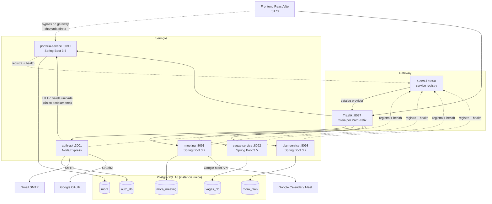
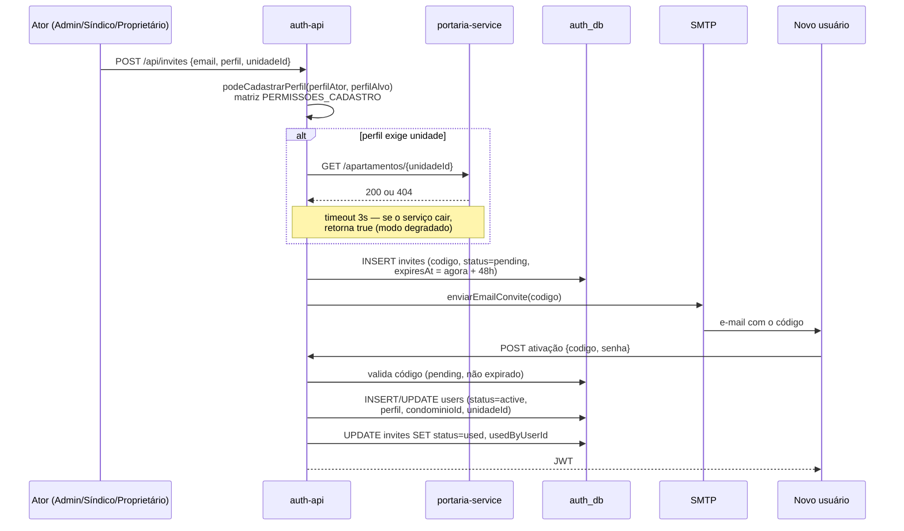
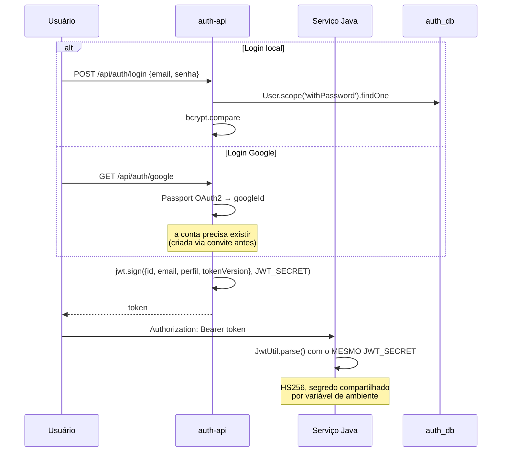
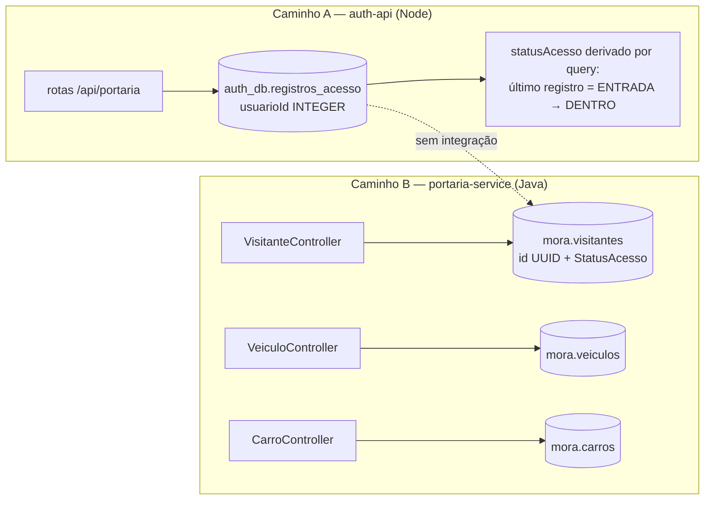
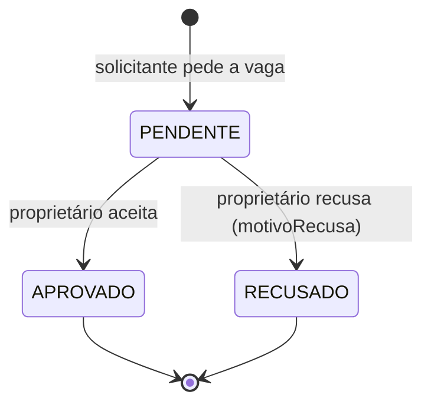
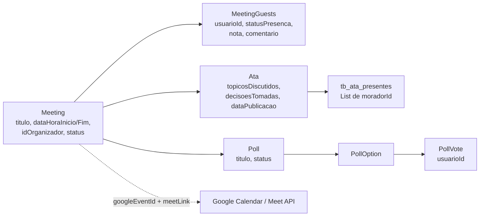

# Mora — Arquitetura, Stack e Fluxos de Dados

> Documento descritivo do **estado atual** da aplicação (como está funcionando hoje, não como
> deveria funcionar). Levantado a partir do código-fonte: entidades JPA, modelos Sequelize,
> rotas, controllers, `docker-compose.yml` e os SQLs de inicialização.
>
> Repositório `Mora-Backend`, branch `develop`.

---

## 1. Visão geral

O **Mora** é um sistema de gestão condominial no formato SaaS multi-condomínio, construído
como um conjunto de **5 serviços de backend independentes** (1 Node.js + 4 Spring Boot),
orquestrados por Docker Compose, com **Consul** para service discovery e **Traefik** como
API gateway.

Cada serviço é dono do seu próprio banco PostgreSQL — são **5 bancos separados** dentro de
uma única instância. Não há comunicação síncrona relevante entre serviços (existe exatamente
uma chamada HTTP entre eles), nem barramento de eventos. Na prática, os serviços são
**silos de dados independentes** que compartilham apenas o segredo do JWT.

---

## 2. Stack tecnológica

### Infraestrutura

| Componente | Versão | Papel | Porta |
|---|---|---|---|
| PostgreSQL | 16-alpine | Banco único, 5 databases | 5432 |
| Consul | 1.15 | Service discovery / health check | 8500, 8600/udp |
| Traefik | 2.9 | API gateway, roteamento via Consul Catalog | 8080 (dashboard), 8087 (web) |
| pgAdmin | 4 | Interface visual do banco | 5050 |
| Docker Compose | v2 | Orquestração | — |

### Serviços

| Serviço | Stack | Porta | Banco | Auth |
|---|---|---|---|---|
| **auth-api** | Node.js 20, Express 4, Sequelize 6 | 3001 | `auth_db` | JWT próprio (emissor) |
| **portaria-service** | Java 21, Spring Boot 3.5.6 | 8090 | `mora` | Filtro JWT (não aplicado — ver §7) |
| **meeting** | Java 21, Spring Boot 3.2.4 | 8091 | `mora_meeting` | Nenhuma |
| **vagas-service** | Java 21, Spring Boot 3.5.6 | 8092 | `vagas_db` | Nenhuma |
| **plan-service** | Java 21, Spring Boot 3.2.4 | 8093 | `mora_plan` | Nenhuma |
| **portaria-frontend** | React + Vite | 5173 | — | — |

### Bibliotecas relevantes

**auth-api (Node)**

- `jsonwebtoken` — emissão e validação de JWT
- `bcryptjs` — hash de senha (cost 10, via hook `beforeSave` no modelo `User`)
- `passport` + `passport-google-oauth20` — login social Google
- `nodemailer` — e-mail de convite e recuperação de senha
- `multer` + `sharp` — upload e processamento de avatares
- `helmet`, `cors`, `express-rate-limit` — hardening HTTP
- `express-session` — sessão usada apenas no handshake do OAuth

**Serviços Java**

- `spring-boot-starter-data-jpa` + `postgresql` — persistência
- `spring-cloud-starter-consul-discovery` — registro no Consul
- `spring-boot-starter-actuator` — `/actuator/health` para o health check do Consul
- `springdoc-openapi` — Swagger UI (apenas `meeting`)
- `jjwt` (api/impl/jackson) — parsing de JWT (**apenas `portaria-service`**)
- `lombok` — boilerplate; `mapstruct` — mapeamento DTO (apenas `meeting`)
- `google-api-services-meet`, `google-api-client` — integração Meet (apenas `meeting`)
- `h2` — banco em memória para testes
- ⚠️ **`spring-boot-starter-security` não é usado em nenhum serviço**

---

## 3. Topologia de rede



### Como o roteamento funciona

Cada serviço Java se registra no Consul com **tags do Traefik** embutidas na configuração.
Exemplo do `portaria-service`:

```yaml
tags:
  - "traefik.enable=true"
  - "traefik.http.routers.portaria.rule=PathPrefix(`/api/portaria`)"
  - "traefik.http.routers.portaria.entrypoints=web"
  - "traefik.http.middlewares.portaria-stripprefix.stripprefix.prefixes=/api/portaria"
  - "traefik.http.routers.portaria.middlewares=portaria-stripprefix"
```

O Traefik lê o catálogo do Consul (`providers.consulcatalog`) e monta as rotas
dinamicamente. O prefixo `/api/portaria` é removido antes de repassar ao serviço.

**Porém:** todos os serviços também expõem suas portas diretamente no host (`3001`, `8090`,
`8091`, `8092`, `8093`) no `docker-compose.yml`. O gateway é opcional na prática — e o
frontend de fato o ignora (ver §4.6).

---

## 4. Fluxos de dados

### 4.1 Onboarding — cadastro é sempre por convite

Não existe auto-registro. A rota `POST /api/auth/register` existe mas está desativada. Todo
usuário entra no sistema através de um convite emitido por alguém com perfil autorizado.



**Características do fluxo:**

- Código de convite: 12 caracteres, único, validade fixa de **48 horas**
- Estados do convite: `pending` → `used` | `expired` | `revoked`
- A expiração é **lazy** — o status só muda para `expired` quando alguém tenta usar o código
- A validação de unidade contra o `portaria-service` **falha aberta**: se o serviço estiver
  fora do ar, `validarUnidadeExiste()` retorna `true` e o convite é criado assim mesmo
- Perfis de unidade (`LESSEE`, `OCCUPANT`, `GUEST`) exigem pré-cadastro com nome e CPF
- Há checagens de unicidade em três escopos: por condomínio, por unidade e global

### 4.2 Autenticação e propagação de identidade



**Conteúdo do token:** `id` (INTEGER de `users`), `email`, `perfil`, `tokenVersion`.

**Revogação:** implementada via `tokenVersion`. O middleware compara a versão do token com a
coluna `users.tokenVersion`; incrementar a coluna invalida todos os tokens daquele usuário.
Só o `auth-api` faz essa verificação — os serviços Java não têm acesso ao `auth_db` e
portanto **não conseguem revogar nada**.

**Login Google:** não cria conta. Se o `googleId` não existe, busca por e-mail; se a conta
não existir ou estiver `inactive` / `pending_activation`, o login é recusado. O vínculo com
o Google é feito só na primeira entrada de uma conta já ativada.

**Autorização no auth-api:** camadas de middleware sobre a matriz de perfis:

- `authMiddleware` — valida o token e carrega `req.userPerfil`
- `adminMiddleware` — restringe a `PERFIS_ACESSO_ADMIN`
- `gestaoMiddleware` — restringe a `PERFIS_GESTAO_USUARIOS`
- `portariaMiddleware` / `responsavelMiddleware` — locais, em `routes/portaria.js`

### 4.3 Controle de acesso da portaria — **implementado duas vezes**

Este é o fluxo mais confuso do sistema. Existem **duas implementações paralelas e
desconectadas** de controle de entrada/saída:



- **Caminho A** (`auth-api`): registra entrada/saída de **usuários cadastrados** (incluindo
  `GUEST`) na tabela `registros_acesso` do `auth_db`. O status atual é *derivado* por query
  (`DISTINCT ON ("usuarioId") ... ORDER BY "createdAt" DESC`) — não há coluna de estado.
- **Caminho B** (`portaria-service`): registra entrada/saída de **visitantes e veículos** no
  banco `mora`, com coluna `status` do tipo `StatusAcesso` (`DENTRO` / `SAIU`) mantida
  materializada.

As duas não se conversam. Um relatório de "quem está no condomínio agora" precisa consultar
dois bancos, com modelos, tipos de ID e semânticas de estado diferentes.

### 4.4 Aluguel de vagas (vagas-service)



O proprietário publica janelas em `disponibilidade_vagas` (`dataInicio`, `dataFim`, `ativa`);
o solicitante cria um `AluguelVaga` com `modalidade` (`ModalidadeAluguel`), `valorTotal` e
eventual `valorPenalidade` (ambos `BigDecimal(10,2)`). Os dois lados são identificados por
`UUID` (`solicitanteId`, `proprietarioId`) — **que não correspondem ao `users.id` INTEGER do
`auth_db`**.

O `vagas-service` mantém **cópias próprias** das tabelas `blocos`, `apartamentos`,
`moradores` e `vagas_estacionamento` no banco `vagas_db`, espelhando as do
`portaria-service`. Não há replicação: as duas cópias divergem livremente.

### 4.5 Reuniões, atas e enquetes (meeting)



O serviço integra com a API do Google Meet para criar o evento e guardar `meetLink` e
`googleEventId` (único). A avaliação da reunião é por convidado (`nota` + `comentario`),
embutida na collection table `tb_meeting_convidados`. A `Ata` tem relação 1:1 com `Meeting`
(`meeting_id` unique).

Todos os identificadores de pessoa aqui são `Long` — mais uma variação de tipo.

### 4.6 Frontend

⚠️ O diretório `services/portaria-frontend/` contém **apenas 4 arquivos** (a página de Base
de Conhecimento e seu client HTTP). A aplicação React completa não está neste repositório —
não há `package.json`, `vite.config.js`, `index.html` nem `App.jsx`.

O client presente aponta direto para `http://localhost:8090`, **hardcoded**, ignorando o
Traefik, e **não envia header `Authorization`** em nenhuma chamada — inclusive nos
`POST` / `PUT` / `DELETE`.

---

## 5. Modelo de dados

5 bancos, ~35 tabelas.

| Banco | Tabelas |
|---|---|
| `auth_db` | `condominios`, `users`, `invites`, `reclamacoes`, `registros_acesso` |
| `mora` | `blocos`, `apartamentos`, `areas_comuns`, `moradores`, `funcionarios`, `visitantes`, `carros`, `veiculos`, `vagas_estacionamento`, `chaves`, `entregas`, `turnos` (+ `turno_entradas`, `turno_saidas`), `avisos`, `artigos_conhecimento` |
| `vagas_db` | `blocos`, `apartamentos`, `moradores`, `vagas_estacionamento`, `disponibilidade_vagas`, `alugueis_vagas` |
| `mora_meeting` | `tb_meetings`, `tb_meeting_convidados`, `tb_atas`, `tb_ata_presentes`, `tb_poll`, `tb_poll_option`, `tb_poll_vote` |
| `mora_plan` | `tb_plans`, `tb_plan_modules` |

### Modelo de perfis — o mais elaborado do sistema

11 perfis definidos em `constants/perfis.js`, organizados em dois níveis, com matriz
explícita de quem pode cadastrar quem:

| Nível condomínio | Nível unidade |
|---|---|
| `CONTRACTING_PROPERTY_MANAGER` | `RESIDENT_OWNER` |
| `CONTRACTING_SYNDIC` | `ABSENT_OWNER` |
| `OPERATIONAL_SYNDIC` | `LESSEE` |
| `ADMINISTRATOR` | `OCCUPANT` |
| `DOORMAN` | `GUEST` |
| `REAL_ESTATE_AGENCY` | |

A cadeia de delegação é hierárquica: `CONTRACTING_*` cadastra perfis de condomínio →
`RESIDENT_OWNER` cadastra `LESSEE` / `OCCUPANT` / `GUEST` → `LESSEE` cadastra
`OCCUPANT` / `GUEST`.

**Esse modelo existe apenas no `auth-api`.** Os serviços Java desconhecem os 11 perfis; o
`portaria-service` trabalha com `TipoProprietario` de 3 valores (`MORADOR`, `VISITANTE`,
`FUNCIONARIO`).

### Herança no portaria-service

`Usuario` é uma `@MappedSuperclass` (id UUID string, nome, cpf único, email, telefone,
ativo, timestamps) estendida por `Morador`, `Funcionario` e `Visitante` — cada uma virando
sua própria tabela, com o CPF único **por tabela**.

### Identificadores de pessoa — 4 tipos incompatíveis

| Contexto | Tipo |
|---|---|
| `auth_db.users.id`, `registros_acesso.usuarioId` | `INTEGER` |
| `mora.moradores.id`, `funcionarios.id`, `visitantes.id` | `String` (UUID) |
| `vagas_db.moradores.id`, `AluguelVaga.solicitanteId` / `proprietarioId` | `UUID` |
| `Meeting.idOrganizador`, `PollVote.usuarioId`, `Ata.idPresentes`, `Entrega.destinatarioId` | `Long` |

Nenhum join cross-serviço é possível de forma confiável.

### Convenções de nomenclatura misturadas

Colunas camelCase entre aspas (`"criadoEm"`, `"blocoId"`, `"condominioId"`, herdadas da
convenção Sequelize) convivem com snake_case (`criado_em`, `apartamento_id`, `morador_responsavel_id`)
**dentro da mesma tabela**. Em `Apartamento.java`, `blocoId` e `morador_responsavel_id`
aparecem lado a lado. Cada `@Column(name = "\`blocoId\`")` com crase é sintoma disso.

---

## 6. Gestão de schema

O schema é criado por **dois mecanismos concorrentes**:

1. **`docker/init-databases.sql`** — roda uma vez na criação do volume do Postgres. Cria os
   4 bancos adicionais e um subconjunto das tabelas (`condominios`, `users`, `invites`,
   `blocos`, `apartamentos`, `areas_comuns`) com índices explícitos. Insere o condomínio
   `'default'`.
2. **`ddl-auto: update`** — ativo nos **quatro** serviços Java. O Hibernate cria e estende as
   demais tabelas no boot.

Além disso, o `auth-api` roda **scripts de migração ad-hoc na inicialização do processo**
(`server.js`): `garantirColunasNovas`, `migrarUsuariosLegados`, `garantirColunasRf07`,
`garantirTabelaCondominios`, `garantirTabelaPortaria`.

**Não há Flyway, Liquibase nem migrations versionadas do `sequelize-cli`.**

Consequências já observáveis:

- `Bloco.java` tem a coluna `sigla`; o `init-databases.sql` não tem
- `AreaComum` tem `taxaLocacao`, `informacoesLimpeza`, `politicaCancelamento`; o SQL não tem
- `ddl-auto: update` **nunca remove coluna nem altera tipo** — o drift é cumulativo e silencioso
- `services/vagas-service/src/main/resources/seed-estruturas-fisicas.sql` é byte a byte
  idêntico ao do portaria, incluindo o `\c mora;` — **popula o banco errado**

---

## 7. Autenticação e autorização — estado real

Esta é a maior lacuna entre a intenção do código e o comportamento efetivo.

| Serviço | Mecanismo | Efetivamente aplicado? |
|---|---|---|
| `auth-api` | `authMiddleware` + middlewares de perfil | **Sim** — cobertura consistente nas rotas |
| `portaria-service` | `AuthFilter` + `AuthContext` (ThreadLocal) | **Praticamente não** |
| `meeting` | — | Não |
| `vagas-service` | — | Não |
| `plan-service` | — | Não |

Sobre o `portaria-service`: o `AuthFilter` lê o header `Authorization`, tenta fazer o parse
do JWT e popula um `ThreadLocal`. Se o token for inválido ou ausente, **ele engole a exceção
e deixa a requisição seguir**:

```java
try {
    AuthContext.set(jwtUtil.parse(token));
} catch (Exception ignored) {
    // Token inválido — contexto permanece vazio; service lança 403 se a rota exigir auth
}
```

O comentário delega a checagem para a camada de serviço. Mas `AuthContext.get()` é chamado
em **um único lugar em todo o código**: `VeiculoService.java:54`. Os outros 18 controllers
(`Morador`, `Visitante`, `Funcionario`, `Entrega`, `Chave`, `Bloco`, `Apartamento`, `Turno`,
`Aviso`, `ArtigoConhecimento`, `Vaga`, `Carro`, `AreaComum`, `Usuario`…) não consultam o
contexto.

Somando ao fato de que a porta `8090` é exposta diretamente no host, o `portaria-service`
está, na prática, **aberto** — assim como `meeting` (8091), `vagas-service` (8092) e
`plan-service` (8093), que sequer têm filtro.

---

## 8. Segurança e conformidade

### Segredos versionados

O `docker-compose.yml` define valores default para segredos, repetidos em todos os serviços,
e está commitado:

```yaml
- POSTGRES_PASSWORD=${POSTGRES_PASSWORD:-Vibers@2112}
- JWT_SECRET=${JWT_SECRET:-uma-chave-secreta-muito-segura-de-32-caracteres}
```

O `portaria-service` tem ainda `jwt.secret: ${JWT_SECRET:-changeme-insecure-default}`. Como
os serviços validam o token com HS256 e segredo compartilhado, **quem conhece o default
consegue forjar um JWT com qualquer `perfil`**.

O `auth-api` é o único que trata o segredo como obrigatório — aborta o boot se `JWT_SECRET`
não estiver definido.

### Dados pessoais (LGPD)

O domínio é intensivo em dado sensível, e não há criptografia, pseudonimização nem política
de retenção em nenhum ponto:

- **CPF em texto plano** em 4 lugares: `users.cpf`, `moradores.cpf` (portaria **e** vagas),
  `invites.cpfPrecadastro`, `visitantes.documento`
- **Histórico de movimentação de pessoas físicas**: `registros_acesso` (entrada/saída por
  usuário), `visitantes` (horário + motivo da visita), `veiculos` / `carros` (entrada/saída
  por placa), `turnos` (jornada de funcionários)
- **Uploads sem verificação**: avatares gravados em `services/auth-api/uploads/avatars`, no
  filesystem do container (volume não persistido)

### Isolamento multi-tenant incompleto

O `plan-service` define `maxCondominiums` e `maxUsersPerCondominium` — o produto é
multi-condomínio. Mas `condominioId` só existe em `users`, `invites`, `condominios`,
`registros_acesso`, `blocos`, `apartamentos`, `areas_comuns` e `avisos`.

**Não existe** em: `moradores`, `funcionarios`, `visitantes`, `carros`, `veiculos`,
`chaves`, `entregas`, `turnos`, `artigos_conhecimento`, nem em **nenhuma** tabela de
`mora_meeting`, `vagas_db` ou `mora_plan`. Entregas, visitantes, veículos e reuniões são
globais.

Agravante: `areas_comuns.nome` é `UNIQUE` global — dois condomínios não podem ter um
"Salão de Festas". `blocos` acertou (`UNIQUE(nome, "condominioId")`).

---

## 9. Qualidade e operação

### Testes

| Onde | O quê |
|---|---|
| `auth-api/tests/` | `auth.test.js`, `occupants.test.js` (Jest + Supertest) |
| `portaria-service` | `BlocoServiceTest.java` + smoke test de contexto |
| `meeting`, `vagas-service`, `plan-service` | apenas smoke test de contexto, ou nada |

Há arquivos de teste órfãos em `src/main/test/` (diretório inválido para o Maven — não são
executados) em `portaria-service` e `vagas-service`. O de `vagas-service` chama-se
`PortariaServiceApplicationTests.java` — cópia esquecida.

### Observabilidade

- `/actuator/health` exposto em todos os serviços Java, consumido pelo Consul a cada 15s
- Nenhuma métrica (Prometheus/Micrometer), tracing distribuído ou log estruturado
- `show-sql=true` ativo em `meeting` e `plan-service` — verbosidade indevida para produção
- Sem correlation ID entre serviços

### Índices

Existem apenas nas tabelas declaradas no `init-databases.sql` (`users`, `invites`,
`condominios`, `blocos`, `apartamentos`, `areas_comuns`). Tudo que o Hibernate criou tem
somente PK e constraints `unique`. Consultas centrais do domínio — "visitantes com status
`DENTRO`", "entregas `PENDENTE` por apartamento", "aluguéis ativos no período" — fazem
full scan.

### Pool de conexões

Configurado explicitamente só no `meeting` (HikariCP, max 10, timeouts definidos). Os demais
usam o default do Spring Boot. As 5 aplicações compartilham a mesma instância PostgreSQL.

### Versões divergentes

`portaria-service` e `vagas-service` rodam Spring Boot **3.5.6**; `meeting` e `plan-service`
rodam **3.2.4**. Não há BOM compartilhado nem POM pai comum entre os serviços.

---

## 10. Resumo dos pontos de atenção

Ordenado por impacto:

| # | Ponto | Impacto |
|---|---|---|
| 1 | Segredos com valor default commitados (`Vibers@2112`, `JWT_SECRET`) | Crítico — permite forjar token com qualquer perfil |
| 2 | 4 dos 5 serviços sem autorização efetiva, com portas expostas no host | Crítico — dados acessíveis sem token |
| 3 | `condominioId` ausente na maioria das tabelas de domínio | Alto — vazamento entre condomínios |
| 4 | Dados mestres (bloco/apartamento/morador) triplicados sem sincronização | Alto — divergência inevitável |
| 5 | Identidade de pessoa em 4 tipos incompatíveis | Alto — impede consolidação e auditoria |
| 6 | `ddl-auto: update` sem migrations versionadas, com drift já presente | Alto — schema irreproduzível |
| 7 | CPF e histórico de movimentação em texto plano, sem retenção | Alto — exposição LGPD |
| 8 | Controle de acesso da portaria implementado duas vezes, desconectado | Médio — relatórios inconsistentes |
| 9 | `Carro` e `Veiculo` duplicados no mesmo serviço, ambos com `placa` UNIQUE | Médio — estados contraditórios |
| 10 | Ausência de índices fora do `auth_db` | Médio — degrada com volume |
| 11 | Frontend com URL hardcoded, sem `Authorization`, e incompleto no repositório | Médio |
| 12 | Seed do `vagas-service` aponta para o banco `mora` | Baixo — mas silencioso |
| 13 | Modelo de autorização duplicado (`role` deprecated + `perfil`) ativo ao mesmo tempo | Baixo |
| 14 | Versões de Spring Boot divergentes entre serviços | Baixo |

---

## 11. Referências no código

| Assunto | Arquivo |
|---|---|
| Matriz de perfis e permissões | `services/auth-api/constants/perfis.js` |
| Middleware de autenticação | `services/auth-api/middleware/auth.js` |
| Fluxo de convite | `services/auth-api/services/inviteService.js` |
| Única chamada entre serviços | `services/auth-api/utils/portariaClient.js` |
| Portaria no Node (implementação paralela) | `services/auth-api/routes/portaria.js` |
| Filtro JWT do portaria-service | `services/portaria-service/src/main/java/portaria/security/AuthFilter.java` |
| Único consumidor do AuthContext | `services/portaria-service/src/main/java/portaria/service/VeiculoService.java:54` |
| Schema inicial | `docker/init-databases.sql` |
| Orquestração e variáveis de ambiente | `docker/docker-compose.yml` |
| Roteamento Traefik via Consul | `services/portaria-service/src/main/resources/application.yml` |
| Diagrama ER existente | `docs/er-portaria.mmd` |
