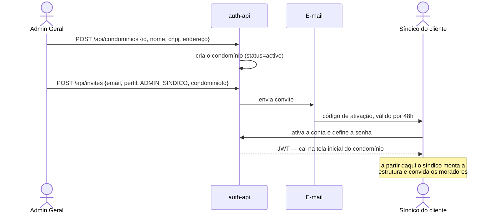
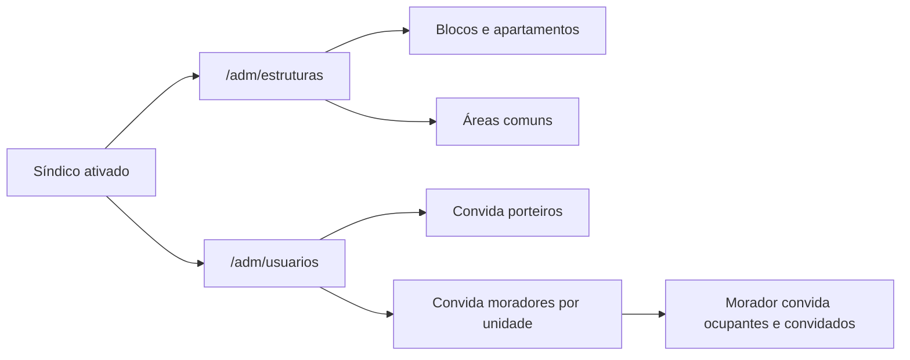
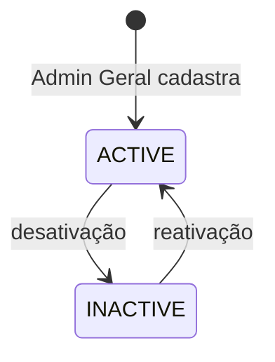
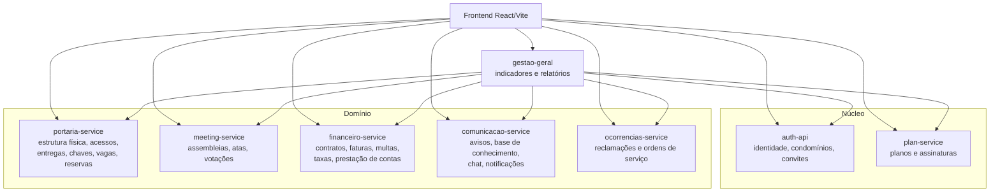
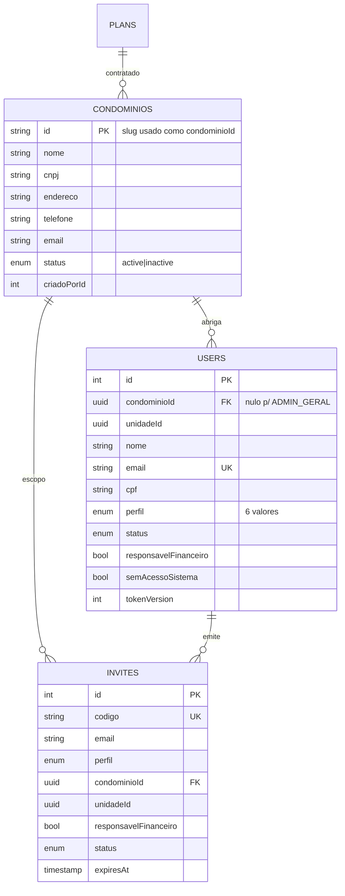

# Especificação do Projeto — Mora

**Curso:** Bacharelado em Sistemas de Informação — PUCPR
**Disciplina:** Desenvolvimento Ágil de Produto I
**Orientadores:** Prof. Geucimar Briatore · Profa. Joselaine Valaski
**Equipe:** João Victor Monteiro Tancon · Juan Rodrigues dos Santos Servelo · Luana Akemi Sakurada · Ray Govaski · Thais Oliveira Amaral
**Curitiba, 2026**

> **Versão 3** — 26/08/2026

---

## Sumário

1. [Objetivos](#1-objetivos)
2. [É / Não é · Faz / Não faz](#2-é--não-é--faz--não-faz)
3. [Visão do produto](#3-visão-do-produto)
4. [Atores e perfis](#4-atores-e-perfis)
5. [Fluxo de criação do cliente](#5-fluxo-de-criação-do-cliente)
6. [Requisitos funcionais](#6-requisitos-funcionais)
7. [Requisitos não-funcionais](#7-requisitos-não-funcionais)
8. [Arquitetura](#8-arquitetura)
9. [Modelo de dados](#9-modelo-de-dados)
10. [Analytics](#10-analytics)
11. [Roadmap](#11-roadmap)

Complementos: [HISTORIAS-DE-USUARIO.md](HISTORIAS-DE-USUARIO.md) ·
[FLUXOS-DE-USUARIO-E-TELAS.md](FLUXOS-DE-USUARIO-E-TELAS.md)

---

## 1. Objetivos


| # | Objetivo                                                                                                                            |
| - | ----------------------------------------------------------------------------------------------------------------------------------- |
| 1 | Centralizar a gestão condominial em uma única plataforma SaaS, reunindo dados de cadastro, operação e comunicação.            |
| 2 | Automatizar processos essenciais do condomínio, como autenticação, vínculo de moradores, reservas, financeiro e notificações. |
| 3 | Apoiar a tomada de decisão com dados consolidados e relatórios analíticos por meio de dashboards.                                |

---

## 2. É / Não é · Faz / Não faz


| É                                                                      | Não é                                                |
| ----------------------------------------------------------------------- | ------------------------------------------------------ |
| Uma plataforma SaaS de gestão condominial.                             | Um sistema de uso geral para qualquer tipo de empresa. |
| Um produto voltado para síndicos, porteiros e moradores.               | Um sistema apenas financeiro ou apenas de portaria.    |
| Um sistema multi-condomínio, em que**cada condomínio é um cliente**. | Um produto de uso exclusivo de equipe técnica.        |


| Faz                                                                                                     | Não faz                                                                                  |
| ------------------------------------------------------------------------------------------------------- | ----------------------------------------------------------------------------------------- |
| Centraliza cadastro, autenticação e perfis de usuários.                                              | Não substitui a atuação humana na tomada de decisão do condomínio.                   |
| Gerencia operações condominiais: unidades, ocupantes, reservas, finanças, assembleias e comunicados. | Não garante solução automática de problemas e conflitos.                              |
| Emite faturas e registra a quitação das cobranças do condomínio.                                    | **Não custodia o dinheiro do condomínio** — cada condomínio recebe na própria conta. |
| Gera dados para dashboards e relatórios analíticos.                                                   | Não oferece recursos de entretenimento ou lazer.                                         |

---

## 3. Visão do produto


| Campo                    | Descrição                                                                                                                                                                                                                                 |
| ------------------------ | ------------------------------------------------------------------------------------------------------------------------------------------------------------------------------------------------------------------------------------------- |
| **Problemas**            | A gestão condominial costuma ser espalhada em controles manuais, retrabalho administrativo, baixa integração entre áreas e dificuldade para acompanhar dados operacionais e financeiros.                                                |
| **Expectativas**         | Concentrar em um só sistema a administração do condomínio, reduzir tarefas repetitivas, melhorar o controle de acessos e vínculos de moradores, organizar informações financeiras e disponibilizar indicadores úteis para decisão. |
| **Cliente-alvo**         | Condomínios residenciais, contratados individualmente.                                                                                                                                                                                     |
| **Categoria / segmento** | Plataforma SaaS de gestão condominial.                                                                                                                                                                                                     |
| **Benefício-chave**     | Centralização e automação da gestão do condomínio.                                                                                                                                                                                    |
| **Diferenciador-chave**  | Comunicação integrada + gestão financeira + controle de reservas em uma única plataforma.                                                                                                                                               |
| **Meta-valor**           | Redução de retrabalho, mais controle operacional e melhor suporte à decisão.                                                                                                                                                            |

---

## 4. Atores e perfis

O modelo de acesso tem **6 perfis em 3 camadas**. Cada usuário pertence a exatamente uma
camada, e é ela que determina o alcance dos dados que ele enxerga.


| Camada          | Perfil          | Quem é                                                      | Alcance               |
| --------------- | --------------- | ------------------------------------------------------------ | --------------------- |
| **Plataforma**  | `ADMIN_GERAL`   | Opera o Mora: cadastra e configura os condomínios clientes  | Todos os condomínios |
| **Condomínio** | `ADMIN_SINDICO` | Síndico responsável pela gestão de um condomínio         | Um condomínio        |
|                 | `PORTEIRO`      | Opera a guarita                                              | Um condomínio        |
| **Unidade**     | `MORADOR`       | Mora em uma unidade — proprietário residente ou inquilino  | Sua unidade           |
|                 | `DONO_ALUGUEL`  | Proprietário que não mora no condomínio e aluga o imóvel | Sua unidade           |
|                 | `CONVIDADO`     | Visitante recorrente pré-autorizado                         | Sem acesso ao sistema |

### Matriz de delegação

Quem pode cadastrar quem, via convite:

```
ADMIN_GERAL   → todos os perfis
ADMIN_SINDICO → PORTEIRO, MORADOR, DONO_ALUGUEL, CONVIDADO
DONO_ALUGUEL  → MORADOR, CONVIDADO
MORADOR       → CONVIDADO
PORTEIRO      → (nenhum)
CONVIDADO     → (nenhum)
```

Perfis de unidade (`MORADOR`, `DONO_ALUGUEL`, `CONVIDADO`) exigem `unidadeId` no convite.

### Responsabilidade financeira

Proprietário residente e inquilino compartilham o perfil `MORADOR`. O que os distingue é a
flag **`responsavelFinanceiro`**: um morador por unidade a carrega, e é quem recebe a fatura.
Ao transferi-la a outro morador, quem transferiu passa a `DONO_ALUGUEL`.

---

## 5. Fluxo de criação do cliente

**O condomínio é o cliente.** Não existe camada intermediária de empresa ou administradora: ao
fechar contrato, cria-se o condomínio e todos os seus dados ficam associados a ele.

### 5.1 Cadastro

A venda ocorre fora do sistema. O `ADMIN_GERAL` registra o cliente já contratado.



### 5.2 Configuração pelo cliente



O `ADMIN_GERAL` também pode montar a estrutura inicial: a tela `/adm/estruturas` tem seletor
de cliente para esse caso.

### 5.3 Ciclo de vida do condomínio




| Estado     | Efeito                                        |
| ---------- | --------------------------------------------- |
| `active`   | Operação normal                             |
| `inactive` | Acesso suspenso;**os dados são preservados** |

Não há exclusão de condomínio. Apagar um cliente apagaria a operação inteira dele — a ação
disponível é desativar.

---

## 6. Requisitos funcionais

**18 requisitos.** Status refletindo o código em 26/08/2026.

Legenda: ✅ Implementado · ⚠️ Parcial · 📋 Planejado


| #  | Requisito Funcional                          | Ator                                         | Serviço            | Status |
| -- | -------------------------------------------- | -------------------------------------------- | ------------------- | ------ |
| 1  | Realizar Autenticação de Usuário          | Usuário com conta ativa                     | auth-api            | ✅     |
| 2  | Gerenciar Usuários e Vínculos de Unidade   | Admin Geral, Síndico, Morador, Dono Aluguel | auth-api            | ✅     |
| 3  | Gerenciar Clientes (Condomínios)            | Admin Geral                                  | auth-api            | ✅     |
| 4  | Gerenciar Planos e Assinaturas               | Admin Geral                                  | plan-service        | ⚠️   |
| 5  | Gerenciar Estrutura do Condomínio           | Admin Geral, Síndico                        | portaria-service    | ⚠️   |
| 6  | Controlar Acessos e Visitantes               | Porteiro, Morador                            | portaria-service    | ⚠️   |
| 7  | Gerenciar Entregas e Encomendas              | Porteiro                                     | portaria-service    | ⚠️   |
| 8  | Controlar Retirada e Devolução de Chaves   | Porteiro                                     | portaria-service    | ✅     |
| 9  | Gerenciar Funcionários e Turnos             | Síndico                                     | portaria-service    | ⚠️   |
| 10 | Gerenciar Reservas de Áreas Comuns          | Síndico, Morador                            | portaria-service    | ⚠️   |
| 11 | Gerenciar Assembleias, Atas e Votações     | Síndico, Morador                            | meeting-service     | ⚠️   |
| 12 | Gerenciar Comunicados e Base de Conhecimento | Síndico                                     | comunicacao-service | ⚠️   |
| 13 | Gerenciar Mensagens e Notificações         | Todos com conta ativa                        | comunicacao-service | 📋     |
| 14 | Gerenciar Ocorrências e Ordens de Serviço  | Morador, Síndico                            | ocorrencias-service | ⚠️   |
| 15 | Gerenciar Contratos de Locação             | Dono Aluguel, Síndico                       | financeiro-service  | 📋     |
| 16 | Gerenciar Cobranças da Unidade              | Síndico                                     | financeiro-service  | 📋     |
| 17 | Registrar Prestação de Contas              | Síndico                                     | financeiro-service  | 📋     |
| 18 | Gerar Relatórios e Dashboards Analíticos   | Admin Geral, Síndico                        | gestao-geral        | ⚠️   |

**Distribuição:** 3 implementados · 10 parciais · 5 planejados

### Escopo de cada requisito


| #  | Abrange                                                                                                                                  |
| -- | ---------------------------------------------------------------------------------------------------------------------------------------- |
| 1  | Login por senha e por conta Google, recuperação de senha, encerramento de sessão com revogação de token                             |
| 2  | Convite, ativação de conta, cadastro de ocupantes da unidade, vínculo com apartamento e transferência de responsabilidade financeira |
| 3  | Cadastro, edição, ativação e desativação dos condomínios contratantes                                                             |
| 4  | Catálogo de planos, assinatura do condomínio e aplicação dos limites contratados                                                     |
| 5  | Blocos, apartamentos, áreas comuns e vagas de estacionamento                                                                            |
| 6  | Registro de entrada e saída de moradores e funcionários, cadastro de visitantes e pré-autorização pelo morador                      |
| 7  | Recebimento de encomenda, notificação ao destinatário e baixa na retirada                                                             |
| 8  | Retirada e devolução, com responsável e histórico                                                                                    |
| 9  | Cadastro de funcionários, cargo, matrícula e controle de jornada                                                                       |
| 10 | Solicitação, aprovação, regras de conflito e antecedência, e taxa de locação                                                      |
| 11 | Convocação, integração com videoconferência, registro de ata e apuração de votos por unidade                                      |
| 12 | Avisos com confirmação de leitura, artigos de regras e FAQ                                                                             |
| 13 | Conversa direta entre usuários e notificações disparadas por evento do sistema                                                        |
| 14 | Registro da ocorrência, atendimento, abertura de ordem de serviço, responsável e prazo                                                |
| 15 | Contrato entre proprietário e inquilino, vigência e definição do responsável financeiro                                             |
| 16 | Tipos e regras de taxa, rateio, geração de faturas, multas e pagamento                                                                 |
| 17 | Lançamento de receitas e despesas, e publicação por competência                                                                      |
| 18 | Indicadores da plataforma e do condomínio, com séries históricas e exportação                                                       |

## 7. Requisitos não-funcionais

### 7.1 Segurança


| #      | Requisito                                                                           |
| ------ | ----------------------------------------------------------------------------------- |
| RNF-01 | Todo endpoint de domínio exige JWT válido; token ausente ou inválido retorna 401 |
| RNF-02 | Segredos vêm de variável de ambiente, sem valor default no repositório           |
| RNF-03 | Autorização por perfil aplicada no servidor, nunca apenas na interface            |
| RNF-04 | Senhas armazenadas com hash bcrypt, custo mínimo 10                                |
| RNF-05 | Logout e redefinição de senha revogam todos os tokens emitidos                    |
| RNF-06 | Token de acesso nunca trafega em URL, apenas em cabeçalho                          |
| RNF-07 | Fluxo OAuth protegido contra CSRF por parâmetro`state` assinado                    |
| RNF-08 | Rate limiting em login, recuperação de senha e validação de convite             |
| RNF-09 | Portas de serviços internos não publicadas no host; acesso via gateway            |

### 7.2 Privacidade e LGPD


| #      | Requisito                                                                         |
| ------ | --------------------------------------------------------------------------------- |
| RNF-10 | CPF cifrado em repouso, exibido mascarado exceto para perfis de gestão           |
| RNF-11 | Registros de acesso e movimentação retidos por 12 meses e expurgados            |
| RNF-12 | Base legal registrada por finalidade                                              |
| RNF-13 | Titular pode solicitar exportação e eliminação dos próprios dados            |
| RNF-14 | Dados de pagamento não são armazenados — apenas identificadores de transação |

### 7.3 Isolamento entre clientes


| #      | Requisito                                                                                                       |
| ------ | --------------------------------------------------------------------------------------------------------------- |
| RNF-15 | Toda tabela de domínio possui`condominioId`                                                                    |
| RNF-16 | Toda consulta de domínio aplica o filtro por condomínio                                                       |
| RNF-17 | Constraints de unicidade são compostas com`condominioId` quando o valor é único apenas dentro do condomínio |

### 7.4 Desempenho


| #      | Requisito                                                                 |
| ------ | ------------------------------------------------------------------------- |
| RNF-18 | Endpoints de listagem são paginados, com no máximo 50 itens por página |
| RNF-19 | Consultas por status, período e unidade têm índice correspondente      |
| RNF-20 | Contagens exibidas são agregadas no banco, não no navegador             |
| RNF-21 | Relacionamentos são`LAZY` por padrão                                    |

### 7.5 Disponibilidade e integridade


| #      | Requisito                                                                   |
| ------ | --------------------------------------------------------------------------- |
| RNF-22 | Operações multi-passo executam em transação                             |
| RNF-23 | O schema é versionado por migrations idempotentes                          |
| RNF-24 | Falha de um serviço não derruba os demais; o consumidor degrada por bloco |

### 7.6 Observabilidade


| #      | Requisito                                                   |
| ------ | ----------------------------------------------------------- |
| RNF-25 | Todo serviço expõe endpoint de saúde                     |
| RNF-26 | Logs estruturados, sem dados sensíveis                     |
| RNF-27 | Mensagens de erro ao cliente não revelam detalhes internos |

---

## 8. Arquitetura

Microsserviços com banco por serviço, orquestrados por Docker Compose, com Consul para
service discovery e Traefik como gateway.

### 8.1 Os oito serviços

Cada serviço é dono de um domínio e do seu próprio banco. Nenhum lê a base de outro.




| Serviço              | Responsabilidade                                                                         | Stack                 | Porta | Banco              | RFs               |
| --------------------- | ---------------------------------------------------------------------------------------- | --------------------- | ----- | ------------------ | ----------------- |
| `auth-api`            | Identidade, perfis, condomínios clientes, convites                                      | Node 20 / Express     | 3001  | `auth_db`          | 1, 2, 3           |
| `plan-service`        | Planos comerciais e assinaturas                                                          | Java 21 / Spring Boot | 8093  | `mora_plan`        | 4                 |
| `portaria-service`    | Estrutura física, acessos, entregas, chaves, vagas, visitantes, reservas, funcionários | Java 21 / Spring Boot | 8090  | `mora`             | 5, 6, 7, 8, 9, 10 |
| `meeting-service`     | Assembleias, atas e votações                                                           | Java 21 / Spring Boot | 8091  | `mora_meeting`     | 11                |
| `financeiro-service`  | Contratos de locação, faturas, multas, taxas, prestação de contas                    | Java 21 / Spring Boot | 8094  | `mora_financeiro`  | 15, 16, 17        |
| `comunicacao-service` | Avisos, base de conhecimento, chat e notificações                                      | Node 20 / Express     | 3003  | `mora_comunicacao` | 12, 13            |
| `ocorrencias-service` | Reclamações e ordens de serviço                                                       | Java 21 / Spring Boot | 8095  | `mora_ocorrencias` | 14                |
| `gestao-geral`        | Agregação de indicadores e relatórios                                                 | Node 20 / Express     | 3002  | —                 | 18                |

**Em operação:** `auth-api`, `plan-service`, `portaria-service`, `meeting-service` e
`gestao-geral`. Os três de domínio restantes atendem requisitos ainda planejados, e nascem à
medida que esses requisitos entram — a fila está na [seção 11](#11-roadmap).

### 8.2 Comunicação entre serviços


| Mecanismo           | Quando                                                                                       |
| ------------------- | -------------------------------------------------------------------------------------------- |
| **HTTP síncrono**  | Consulta que exige resposta imediata — verificação de unidade, agregação de indicadores |
| **Cache replicado** | Leitura local de dado de outro domínio, para operar mesmo com a fonte fora                  |
| **Outbox**          | Propagação de mudança de estado entre serviços                                           |

O `gestao-geral` é o único que consulta todos os demais. Ele não tem banco próprio: cada
serviço agrega os próprios dados em SQL e ele compõe a resposta, repassando o token do usuário.
O contrato prevê o campo `fontesIndisponiveis`, para degradar por bloco quando uma fonte
estiver fora do ar em vez de derrubar o painel inteiro.

### 8.3 Autenticação entre serviços

O `auth-api` emite o JWT com `{ id, perfil, tokenVersion, email }`, assinado em HS256 com
segredo compartilhado. A revogação usa `tokenVersion`: incrementá-la invalida todos os tokens
daquele usuário.

O login com Google não cria conta — exige convite prévio — e devolve um **código de uso único**
que o frontend troca pelo JWT, para que o token não trafegue na URL.

---

## 9. Modelo de dados

### 9.1 Núcleo



**O condomínio é a raiz do isolamento.** `ADMIN_GERAL` é o único perfil com `condominioId`
nulo, porque opera sobre todos.

### 9.2 Isolamento por condomínio

Toda tabela de domínio carrega `condominioId`. São **23 tabelas raiz** nos cinco bancos, com
índice próprio.

Constraints que seriam únicas globalmente passaram a ser únicas **por condomínio** — dois
clientes podem ter um "Salão de Festas", a mesma placa de veículo e o mesmo CPF cadastrado:

```
UNIQUE (condominioId, nome)    areas_comuns
UNIQUE (condominioId, numero)  vagas_estacionamento
UNIQUE (condominioId, placa)   veiculos
UNIQUE (condominioId, cpf)     moradores, funcionarios, visitantes
```

### 9.3 Convenções


| Item            | Regra                                                        |
| --------------- | ------------------------------------------------------------ |
| Chave primária | `UUID` nas tabelas novas                                     |
| Escopo          | `condominioId` obrigatório em toda tabela de domínio       |
| Auditoria       | `criadoEm` / `atualizadoEm`                                  |
| Exclusão       | Lógica, por flag`ativo` ou `status`, onde houver histórico |

---

## 10. Analytics

### 10.1 Painel do Admin Geral — entregue

Rota `/adm/geral`. Consome o `gestao-geral`.

**6 indicadores:**


| Indicador                           | Fonte                   |
| ----------------------------------- | ----------------------- |
| Condomínios ativos                 | `condominios.status`    |
| Novos em 30 dias                    | `condominios.createdAt` |
| Usuários ativos                    | `users.status`          |
| Média de usuários por condomínio | derivado                |
| Convites pendentes                  | `invites`               |
| Ocorrências abertas                | `reclamacoes.status`    |

**3 gráficos:** crescimento da carteira (12 meses, barras e linha acumulada) · distribuição
pelos 6 perfis (donut) · usuários por condomínio (barras clicáveis, levam ao cliente).

### 10.2 Painéis planejados


| Painel       | Público           | Depende de          |
| ------------ | ------------------ | ------------------- |
| Operacional  | Síndico, Porteiro | RF-12, RF-14        |
| Financeiro   | Síndico           | RF-16, RF-17        |
| Estratégico | Síndico           | RF-10, RF-11, RF-14 |

Os indicadores são agregados em SQL, sob demanda. Um processo de ETL com tabelas
consolidadas entra quando o volume exigir — o `gestao-geral` isola essa decisão do frontend,
que consome sempre o mesmo contrato.

---

## 11. Roadmap

Ordem de entrega, definida pelas dependências entre os requisitos.


| Fase  | Escopo                                                                                                         | RFs            |
| ----- | -------------------------------------------------------------------------------------------------------------- | -------------- |
| **1** | Isolamento por condomínio aplicado em todas as consultas, e rejeição de JWT inválido em todos os serviços | RNF-01, RNF-16 |
| **2** | Reservas de áreas comuns e pré-autorização de visitantes                                                   | 6, 10          |
| **3** | `ocorrencias-service` — reclamações e ordens de serviço                                                    | 14             |
| **4** | `comunicacao-service` — avisos com leitura, chat e notificações                                             | 12, 13         |
| **5** | `financeiro-service` — contratos, faturas, multas, taxas e prestação de contas                              | 15, 16, 17     |
| **7** | Painéis do síndico: operacional, financeiro e estratégico                                                   | 18             |

As fases 3 a 5 criam os três microsserviços de domínio ainda não implementados. A fase 5
é a que completa o diferenciador declarado na [visão do produto](#3-visão-do-produto).

---

## Controle de versões


| Versão | Data       | Escopo                                                                          |
| ------- | ---------- | ------------------------------------------------------------------------------- |
| 3       | 26/08/2026 | Modelo de acesso com 6 perfis; condomínio como cliente; painel administrativo  |
| 2       | 19/08/2026 | Status por requisito; requisitos não-funcionais; fluxo de criação do cliente |
| 1       | —         | Especificação original                                                        |
