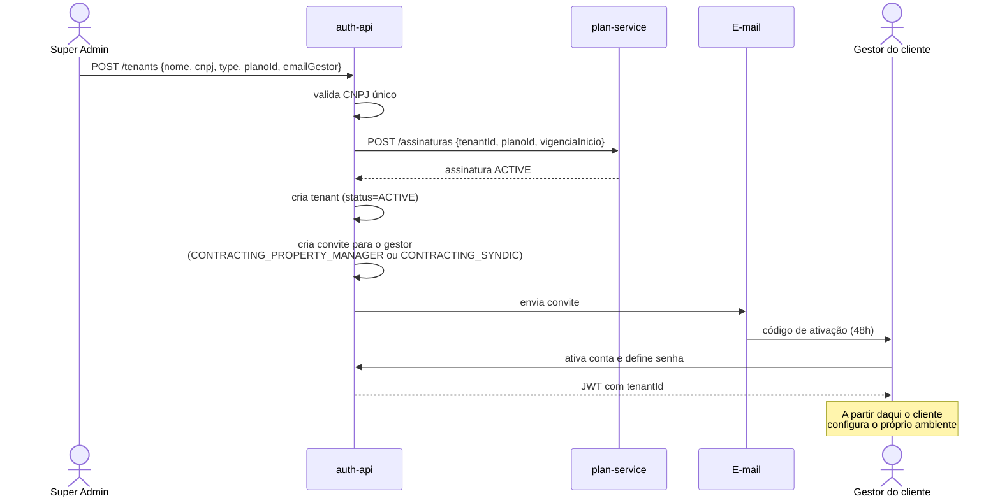
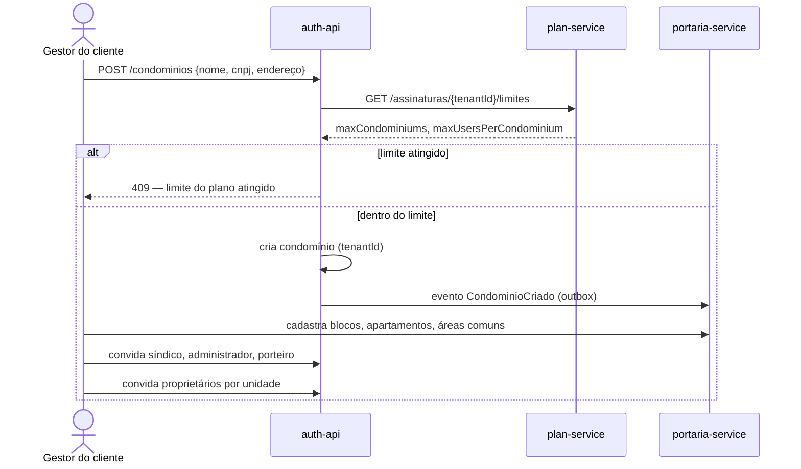
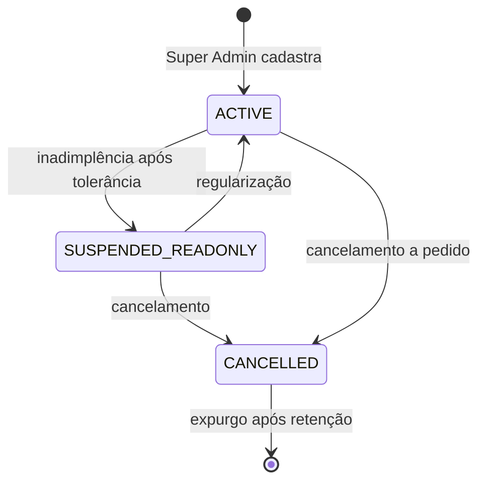
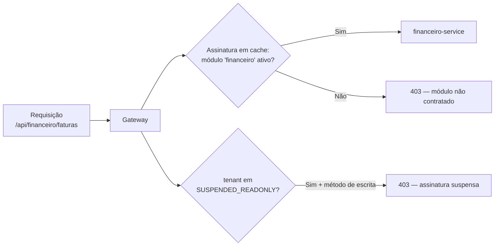
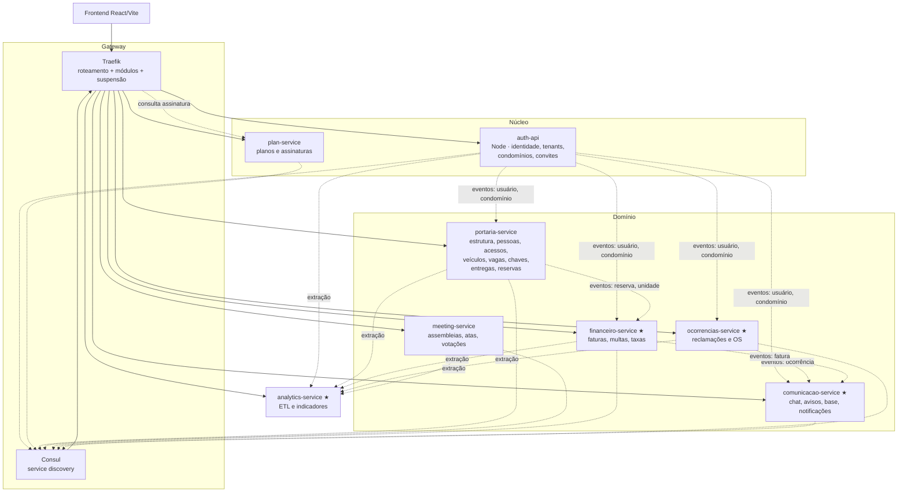
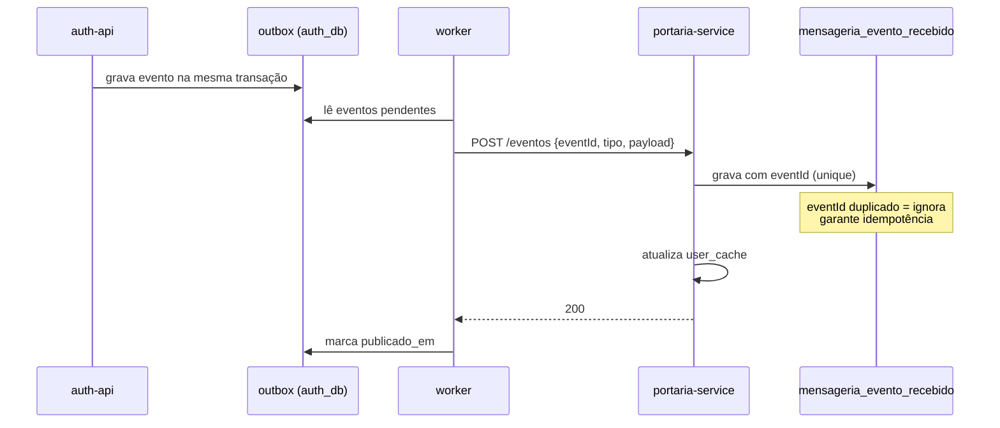
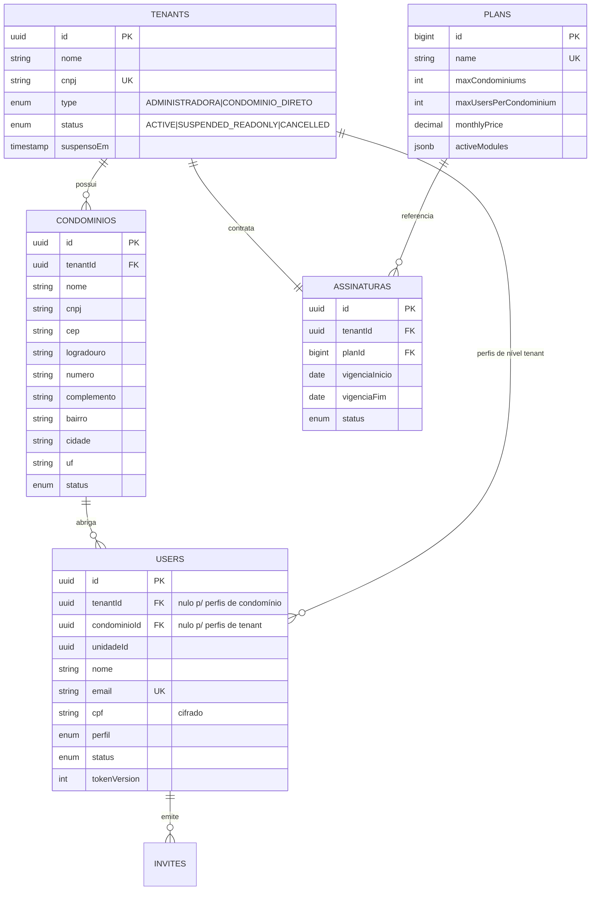

# Especificação do Projeto — Mora

**Curso:** Bacharelado em Sistemas de Informação — PUCPR
**Disciplina:** Desenvolvimento Ágil de Produto I
**Orientadores:** Prof. Geucimar Briatore · Profa. Joselaine Valaski
**Equipe:** João Victor Monteiro Tancon · Juan Rodrigues dos Santos Servelo · Luana Akemi Sakurada · Ray Govaski · Thais Oliveira Amaral
**Curitiba, 2026**

> Versão 2 da especificação. Revisada para refletir a arquitetura real do sistema, incorporar o
> fluxo de criação de cliente e atribuir status de implementação a cada requisito.
> As decisões que originaram esta revisão estão registradas em
> [DECISOES-ARQUITETURAIS.md](DECISOES-ARQUITETURAIS.md).

---

## Sumário

1. [Objetivos](#1-objetivos)
2. [É / Não é · Faz / Não faz](#2-é--não-é--faz--não-faz)
3. [Visão do produto](#3-visão-do-produto)
4. [Atores e perfis](#4-atores-e-perfis)
5. [Fluxo de criação do cliente](#5-fluxo-de-criação-do-cliente)
6. [Requisitos funcionais](#6-requisitos-funcionais)
7. [Requisitos não-funcionais](#7-requisitos-não-funcionais)
8. [Arquitetura](#8-arquitetura)
9. [Modelo de dados](#9-modelo-de-dados)
10. [Analytics](#10-analytics)
11. [Roadmap](#11-roadmap)

Histórias de usuário: documento separado — [HISTORIAS-DE-USUARIO.md](HISTORIAS-DE-USUARIO.md).

---

## 1. Objetivos

**Produto:** Mora

| # | Objetivo |
|---|---|
| 1 | Centralizar a gestão condominial em uma única plataforma SaaS, reunindo dados de cadastro, operação e comunicação. |
| 2 | Automatizar processos essenciais do condomínio, como autenticação, vínculo de moradores, reservas, financeiro e notificações. |
| 3 | Apoiar a tomada de decisão com dados consolidados e relatórios analíticos por meio de dashboards. |

---

## 2. É / Não é · Faz / Não faz

| É | Não é |
|---|---|
| Uma plataforma SaaS de gestão condominial. | Um sistema de uso geral para qualquer tipo de empresa. |
| Um produto voltado para administradoras, síndicos e usuários do condomínio. | Um sistema apenas financeiro ou apenas de portaria. |
| Um sistema multi-condomínio, contratável por administradora ou por síndico. | Um produto de uso exclusivo de equipe técnica. |

| Faz | Não faz |
|---|---|
| Centraliza cadastro, autenticação e perfis de usuários. | Não substitui a atuação humana na tomada de decisão do condomínio. |
| Gerencia operações condominiais: unidades, ocupantes, reservas, finanças, assembleias e comunicados. | Não garante solução automática de problemas e conflitos. |
| Emite faturas e registra a quitação das cobranças do condomínio. | **Não custodia o dinheiro do condomínio** — cada condomínio recebe na própria conta. |
| Gera dados para dashboards e relatórios analíticos. | Não oferece recursos de entretenimento ou lazer. |

> A linha em destaque é nova nesta versão. Decorre da decisão D29: o Mora emite e concilia
> cobranças, mas o valor pago pelo morador vai direto para a conta do condomínio, sem transitar
> pela plataforma.

---

## 3. Visão do produto

| Campo | Descrição |
|---|---|
| **Problemas** | A gestão condominial costuma ser espalhada em controles manuais, retrabalho administrativo, baixa integração entre áreas e dificuldade para acompanhar dados operacionais e financeiros. |
| **Expectativas** | Concentrar em um só sistema a administração do condomínio, reduzir tarefas repetitivas, melhorar o controle de acessos e vínculos de moradores, organizar informações financeiras e disponibilizar indicadores úteis para decisão. |
| **Cliente-alvo** | Administradoras de condomínio (carteira) e síndicos que contratam diretamente para um único condomínio. |
| **Categoria / segmento** | Plataforma SaaS de gestão condominial. |
| **Benefício-chave** | Centralização e automação da gestão do condomínio. |
| **Diferenciador-chave** | Comunicação integrada + gestão financeira + controle de reservas em uma única plataforma. |
| **Meta-valor** | Redução de retrabalho, mais controle operacional e melhor suporte à decisão. |

---

## 4. Atores e perfis

O sistema opera em **quatro camadas de autoridade**. Cada usuário pertence a exatamente uma
camada, e seu alcance de dados é determinado por ela.

| Camada | Perfil | Alcance |
|---|---|---|
| **Plataforma** | `SUPER_ADMIN` | Global — todos os tenants |
| **Tenant** | `CONTRACTING_PROPERTY_MANAGER` | Toda a carteira do tenant |
| | `CONTRACTING_SYNDIC` | Toda a carteira do tenant |
| **Condomínio** | `OPERATIONAL_SYNDIC` | Um condomínio |
| | `ADMINISTRATOR` | Um condomínio |
| | `DOORMAN` | Um condomínio |
| | `REAL_ESTATE_AGENCY` | Um condomínio |
| | `RESIDENT_OWNER` | Um condomínio + sua unidade |
| **Unidade** | `ABSENT_OWNER` | Sua unidade |
| | `LESSEE` | Sua unidade |
| | `OCCUPANT` | Sua unidade |
| | `GUEST` | Sua unidade, acesso restrito |

**Regra de alcance (D34):** um usuário pertence a um único condomínio. Perfis de camada Tenant
têm `tenantId` preenchido e `condominioId` nulo — é assim que a administradora enxerga a
carteira inteira sem precisar de múltiplos vínculos.

**Consequência assumida:** uma imobiliária que atua em vários condomínios precisará de uma
conta por condomínio, pois `REAL_ESTATE_AGENCY` é perfil de camada Condomínio.

### Matriz de delegação de cadastro

Quem pode cadastrar quem, em cascata:

```
SUPER_ADMIN
  └─ CONTRACTING_PROPERTY_MANAGER, CONTRACTING_SYNDIC        (via cadastro de cliente)

CONTRACTING_PROPERTY_MANAGER / CONTRACTING_SYNDIC
  └─ OPERATIONAL_SYNDIC, ADMINISTRATOR, DOORMAN,
     REAL_ESTATE_AGENCY, RESIDENT_OWNER, ABSENT_OWNER,
     LESSEE, OCCUPANT

ADMINISTRATOR / OPERATIONAL_SYNDIC
  └─ OPERATIONAL_SYNDIC, ADMINISTRATOR, DOORMAN,
     REAL_ESTATE_AGENCY, RESIDENT_OWNER

RESIDENT_OWNER
  └─ LESSEE, OCCUPANT, GUEST

ABSENT_OWNER
  └─ LESSEE

LESSEE
  └─ OCCUPANT, GUEST
```

Perfis que exigem `unidadeId` no convite: `RESIDENT_OWNER`, `ABSENT_OWNER`, `LESSEE`,
`OCCUPANT`, `GUEST`.

---

## 5. Fluxo de criação do cliente

> **Seção nova.** Cobre a lacuna entre a venda comercial e o sistema em uso. Nenhuma parte
> deste fluxo está implementada hoje — corresponde ao RF-2.

### 5.1 Modelo comercial

Existem duas trilhas de contratação (D01), unificadas por um mesmo registro de `tenant` (D05):

| Trilha | `tenants.type` | Quem contrata | Quantos condomínios |
|---|---|---|---|
| Administradora | `ADMINISTRADORA` | Property Manager | 1..N, limitado pelo plano |
| Contratação direta | `CONDOMINIO_DIRETO` | Síndico contratante | 1 |

Manter o `tenant` nas duas trilhas evita duas regras paralelas de plano, limite e cobrança.

### 5.2 Cadastro do cliente

A venda ocorre fora do sistema. O Super Admin registra o cliente já contratado (D02, D33).



O ato de cadastro cria **três coisas em uma transação**: o tenant, a assinatura e o convite do
primeiro gestor. Os condomínios ficam por conta do cliente.

### 5.3 Configuração pelo cliente



O limite do plano é verificado **no momento do cadastro do condomínio** e **na emissão de
convite** — os dois pontos onde o consumo cresce.

### 5.4 Ciclo de vida do tenant



| Estado | Login | Leitura | Escrita |
|---|---|---|---|
| `ACTIVE` | ✅ | ✅ | ✅ |
| `SUSPENDED_READONLY` | ✅ | ✅ | ❌ com aviso em tela |
| `CANCELLED` | ❌ | ❌ | ❌ |

**Suspensão (D36):** vencida a tolerância, o tenant perde escrita e mantém consulta. Preserva o
acesso do condomínio à informação que é dele e mantém alça de cobrança.

**Cancelamento:** os dados ficam retidos por prazo definido em contrato antes do expurgo, com
exportação disponível durante a retenção.

### 5.5 Controle de módulos contratados

O plano define `activeModules`. O bloqueio acontece **no gateway, por rota** (D35):



Nenhum serviço de domínio precisa conhecer plano ou assinatura. Exige manter um mapa
rota → módulo no gateway.

---

## 6. Requisitos funcionais

**28 requisitos.** Status refletindo o código em 19/08/2026.

Legenda: ✅ Implementado · ⚠️ Parcial · 📋 Planejado

| # | Requisito Funcional | Ator | Serviço | Sprint | Status |
|---|---|---|---|---|---|
| 1 | Gerenciar Planos | Super Admin | plan-service | 2 | ⚠️ |
| 2 | **Gerenciar Tenants (clientes)** | Super Admin | auth-api | 2 | 📋 |
| 3 | Gerenciar Cadastro de Usuário | Usuário com convite válido | auth-api | 1 | ✅ |
| 4 | Realizar Autenticação de Usuário | Usuário com conta ativa | auth-api | 1 | ✅ |
| 5 | Gerenciar Condomínio | Property Manager | auth-api | 2 | ⚠️ |
| 6 | Gerenciar Estrutura do Condomínio | Property Manager | portaria-service | 1 | ✅ |
| 7 | Gerenciar Vínculos de Ocupantes por Unidade | Property Manager, Resident/Absent Owner, Lessee | auth-api | 2 | ✅ |
| 8 | Registrar Entradas e Saídas de Acesso | Doorman | portaria-service | 2 | ⚠️ |
| 9 | Gerenciar Assembleias e Atas | Syndic, Administrator | meeting-service | 1 | ✅ |
| 10 | Gerenciar Base de Conhecimento e FAQ | Property Manager, Syndic, Administrator | comunicacao-service | 1 | ✅ |
| 11 | Gerenciar Entregas e Encomendas | Doorman | portaria-service | 1 | ⚠️ |
| 12 | Gerenciar Avisos e Comunicados | Syndic | comunicacao-service | 2 | ⚠️ |
| 13 | Controlar Vagas de Estacionamento | Doorman, Administrator | portaria-service | 1 | ⚠️ |
| 14 | Gerenciar Contratos de Locação | Property Manager, Real Estate Agency, Resident Owner | financeiro-service | 3 | 📋 |
| 15 | Gerar e Gerenciar Faturas por Unidade | Administrator, Property Manager | financeiro-service | 3 | 📋 |
| 16 | Gerenciar Multas | Syndic, Administrator | financeiro-service | 3 | 📋 |
| 17 | Registrar Prestação de Contas | Syndic, Administrator, Property Manager | financeiro-service | 3 | 📋 |
| 18 | Gerenciar Visitantes e Pré-Autorizações | Doorman, Resident Owner, Lessee | portaria-service | 3 | ⚠️ |
| 19 | Gerenciar Áreas Comuns e Reservas | Administrator, Resident Owner, Lessee, Occupant | portaria-service | 3 | ⚠️ |
| 20 | Controlar Retirada e Devolução de Chaves | Doorman | portaria-service | 4 | ✅ |
| 21 | Configurar Tipos e Regras de Taxas | Property Manager, Administrator | financeiro-service | 4 | 📋 |
| 22 | Gerenciar Reclamações e Ocorrências | Resident Owner, Lessee, Occupant, Syndic, Administrator | ocorrencias-service | 4 | ⚠️ |
| 23 | Gerenciar Votações | Syndic, Administrator, Resident Owner | meeting-service | 4 | ⚠️ |
| 24 | Gerenciar Ordens de Serviço e Manutenção | Syndic, Administrator, Resident Owner, Lessee | ocorrencias-service | 4 | 📋 |
| 25 | Gerenciar Envio de Mensagens (chat) | Todos os perfis com conta ativa | comunicacao-service | 4 | 📋 |
| 26 | Gerar Relatórios e Dashboards Analíticos | Super Admin, Property Manager, Syndic, Administrator | analytics-service | 4 | 📋 |
| 27 | **Gerenciar Notificações** | Sistema (evento) → todos os perfis | comunicacao-service | 4 | 📋 |
| 28 | **Gerenciar Funcionários e Turnos** | Syndic, Administrator | portaria-service | 4 | ⚠️ |

**Distribuição:** 7 implementados · 11 parciais · 10 planejados

**Novos nesta revisão:** RF-27 (Notificações — nenhum RF cobria notificação automática após
RF-25 ser definido como chat) e RF-28 (Funcionários e Turnos — código existente e
indocumentado).

### 6.1 O que falta em cada requisito parcial

| # | O que existe | O que falta |
|---|---|---|
| 1 | Catálogo de planos (CRUD) | `Assinatura` ligando tenant a plano; aplicação dos limites |
| 5 | CRUD de condomínio | Vínculo com tenant; endereço estruturado (CEP, logradouro, número, bairro, cidade, UF) |
| 8 | Duas implementações paralelas | Unificação no portaria-service; `user_cache`; migração dos registros |
| 11 | Registro de entrega | Destinatário como usuário cadastrado; notificação de chegada |
| 12 | Publicação de aviso | Registro de leitura por usuário (`aviso_leitura`) |
| 13 | Vaga e aluguel, duplicados em dois serviços | Fusão no portaria-service; remoção de `vagas_db` |
| 18 | Registro de visitante na chegada | Pré-autorização pelo morador, com validade e lista do dia na guarita |
| 19 | Cadastro de áreas comuns | Tabela `reservas`; regras de conflito, antecedência, limite, aprovação e taxa |
| 22 | `Reclamacao` no auth-api | Migração para ocorrencias-service; normalização do histórico |
| 23 | Voto por pessoa | Voto por unidade; constraint de unicidade por unidade |
| 28 | `funcionarios`, `turnos` e coleções de entrada/saída | Requisito documentado; telas de gestão de jornada |

---

## 7. Requisitos não-funcionais

> **Seção nova.** O documento anterior não continha requisitos não-funcionais.

### 7.1 Segurança

| # | Requisito | Verificação |
|---|---|---|
| RNF-01 | Todo endpoint de domínio exige JWT válido; token inválido ou ausente retorna 401 | Teste automatizado por serviço |
| RNF-02 | Segredos (`JWT_SECRET`, senha de banco, chaves de gateway) vêm de variável de ambiente, sem valor default no repositório | Revisão de `docker-compose.yml` |
| RNF-03 | Autorização por perfil aplicada no servidor, nunca apenas na interface | Teste de acesso negado por perfil |
| RNF-04 | Senhas armazenadas com hash bcrypt, custo mínimo 10 | Inspeção de código |
| RNF-05 | Revogação de sessão por incremento de `tokenVersion` | Teste de logout global |
| RNF-06 | Rate limiting em login, recuperação de senha e validação de convite | Teste de carga pontual |
| RNF-07 | Portas de serviços internos não publicadas no host; acesso apenas via gateway | Revisão do compose |

### 7.2 Privacidade e LGPD

| # | Requisito |
|---|---|
| RNF-08 | CPF armazenado cifrado em repouso, exibido mascarado exceto para perfis de gestão |
| RNF-09 | Registros de acesso e movimentação retidos por 12 meses e expurgados automaticamente |
| RNF-10 | Base legal registrada por finalidade: execução de contrato (gestão condominial) e legítimo interesse (segurança do condomínio) |
| RNF-11 | Titular pode solicitar exportação e eliminação dos próprios dados |
| RNF-12 | Dados de tenant cancelado retidos pelo prazo contratual e então expurgados |
| RNF-13 | Dados de pagamento não são armazenados pelo Mora — apenas identificadores de transação do gateway |

### 7.3 Isolamento entre clientes

| # | Requisito |
|---|---|
| RNF-14 | Toda tabela de domínio possui `condominioId`, e toda consulta aplica o filtro |
| RNF-15 | Um usuário jamais acessa dados de condomínio diferente do seu, mesmo manipulando a requisição |
| RNF-16 | Constraints de unicidade são compostas com `condominioId` quando o valor é único apenas dentro do condomínio |

### 7.4 Desempenho

| # | Requisito |
|---|---|
| RNF-17 | Endpoints de listagem são paginados, com no máximo 50 itens por página |
| RNF-18 | Consultas por status, período e unidade têm índice correspondente |
| RNF-19 | Relacionamentos são `LAZY` por padrão; carregamento antecipado apenas por consulta explícita |
| RNF-20 | Resposta de leitura em até 500 ms no percentil 95, com volume de 10 condomínios e 500 unidades |

### 7.5 Disponibilidade e integridade

| # | Requisito |
|---|---|
| RNF-21 | Operações multi-passo executam em transação |
| RNF-22 | O schema é versionado por migrations; `ddl-auto` opera em modo `validate` |
| RNF-23 | Falha de um serviço não derruba os demais — dados replicados por cache permitem operação degradada |
| RNF-24 | Eventos do outbox são reprocessáveis e idempotentes |

### 7.6 Observabilidade

| # | Requisito |
|---|---|
| RNF-25 | Todo serviço expõe `/actuator/health`, monitorado pelo Consul |
| RNF-26 | Logs em formato estruturado, com identificador de correlação propagado entre serviços |
| RNF-27 | `show-sql` desativado fora do ambiente de desenvolvimento |
| RNF-28 | Alterações em plano, assinatura e status de tenant registram trilha de auditoria |

---

## 8. Arquitetura

### 8.1 Topologia



★ = serviço novo

### 8.2 Comunicação entre serviços

Três mecanismos, cada um com seu papel:

| Mecanismo | Uso | Exemplo |
|---|---|---|
| **Outbox + polling HTTP** (D10) | Propagação de mudança de estado | Usuário ativado → replica no `user_cache` dos consumidores |
| **Cache replicado** (D09) | Leitura local de dado de outro domínio | Portaria mostra o nome do morador sem chamar o auth-api |
| **HTTP síncrono** | Consulta que exige resposta imediata e consistente | Verificação de limite do plano no cadastro de condomínio |



### 8.3 Roteamento

Serviços se registram no Consul com tags do Traefik. O gateway lê o catálogo e monta as rotas
dinamicamente. Além do roteamento, o gateway aplica duas verificações (D35, D36):

1. **Módulo contratado** — a rota pertence a um módulo em `activeModules` da assinatura?
2. **Estado do tenant** — se `SUSPENDED_READONLY`, métodos de escrita são recusados.

---

## 9. Modelo de dados

### 9.1 Bancos

| Banco | Serviço | Domínio |
|---|---|---|
| `auth_db` | auth-api | `tenants`, `condominios`, `users`, `invites` |
| `mora` | portaria-service | Estrutura física, pessoas, acessos, veículos, vagas, chaves, entregas, áreas comuns, reservas, funcionários, turnos |
| `mora_meeting` | meeting-service | Assembleias, atas, enquetes, votos |
| `mora_plan` | plan-service | Planos, assinaturas |
| `mora_financeiro` ★ | financeiro-service | Contratos, faturas, multas, taxas, prestação de contas |
| `mora_comunicacao` ★ | comunicacao-service | Avisos, leitura, base de conhecimento, conversas, notificações |
| `mora_ocorrencias` ★ | ocorrencias-service | Reclamações, ordens de serviço |
| `mora_analytics` ★ | analytics-service | Indicadores consolidados |
| ~~`vagas_db`~~ | — | **Descontinuado** (D11) |

### 9.2 Núcleo: tenant, condomínio e usuário



**Mudanças em relação ao ER anterior:**

| Mudança | Motivo |
|---|---|
| `tenants.schema_name` removido | D03 — isolamento por coluna |
| `tenants.type` mantido | D05 — distingue as duas trilhas comerciais |
| `tenants.status` ganha `SUSPENDED_READONLY` | D36 |
| `condominios` com endereço estruturado | Substitui `endereco VARCHAR(300)` |
| `assinaturas` criada | D14 — sem ela, os limites do plano são inaplicáveis |
| `users.id` de `INTEGER` para `UUID` | D28 |
| `users.role`, `.bloco`, `.apartamento`, `.vaga` removidos | D40 |
| `plans` movida para `mora_plan` | Alinhamento com o serviço dono |

### 9.3 Padrões transversais

Aplicados a **todas** as tabelas de domínio:

| Coluna | Tipo | Regra |
|---|---|---|
| `id` | `UUID` | Chave primária |
| `condominioId` | `UUID` | Obrigatório (RNF-14); filtro em toda consulta |
| `criadoEm` / `atualizadoEm` | `TIMESTAMP` | Padrão snake_case: `criado_em` / `atualizado_em` |
| `ativo` | `BOOLEAN` | Exclusão lógica onde houver histórico |

**Convenção de nomenclatura:** `snake_case` em todas as colunas novas. As colunas camelCase
existentes (`"criadoEm"`, `"blocoId"`) são normalizadas na migração de baseline.

### 9.4 Tabelas de integração

| Tabela | Onde | Papel |
|---|---|---|
| `user_cache` | Em cada serviço consumidor | Réplica de `users` (nome, email, perfil, condomínio, unidade, ativo) |
| `mensageria_evento_recebido` | Em cada serviço consumidor | Inbox: `event_id` único garante idempotência |
| `mensageria_evento_publicado` | Em cada serviço produtor | Outbox: gravado na mesma transação do fato |

### 9.5 Entidades novas por requisito

| RF | Entidades |
|---|---|
| 2 | `tenants` |
| 1 | `assinaturas` |
| 12 | `aviso_leitura` |
| 14 | `contratos_locacao` |
| 15 | `faturas`, `fatura_itens` |
| 16 | `multas` |
| 17 | `prestacao_contas`, `lancamentos` |
| 19 | `reservas` |
| 21 | `tipos_taxa`, `regras_taxa` |
| 24 | `ordens_servico`, `fornecedores` |
| 25 | `conversas`, `mensagens` |
| 26 | `indicadores_*` (consolidados pelo ETL) |
| 27 | `notificacoes`, `preferencias_notificacao` |

### 9.6 Entidades removidas

| Entidade | Motivo |
|---|---|
| `carros` | D22 — duplicava `veiculos` |
| `registros_acesso` (auth_db) | D08 — unificado no portaria |
| `reclamacoes` (auth_db) | D27 — migrada para ocorrencias-service |
| `blocos`, `apartamentos`, `moradores`, `vagas_estacionamento` (vagas_db) | D11 — banco descontinuado |

---

## 10. Analytics

### 10.1 Objetivo e processo

| Campo | Descrição |
|---|---|
| **Objetivo de negócio** | Centralizar a gestão condominial, reduzir retrabalho e apoiar decisões com dados consolidados de operação, financeiro e comunicação. |
| **Fonte de dados** | Cadastros, faturas, multas, ocorrências, reservas, assembleias, comunicações, acessos e prestação de contas. |
| **Processo de ETL** | Job diário às 02h00 extrai dos bancos de origem, padroniza, agrupa por período e condomínio, e carrega tabelas de indicadores em `mora_analytics`. KPIs operacionais são recalculados a cada 6h. |
| **Consumo** | O `analytics-service` expõe os indicadores por endpoint, filtrados pelo alcance do perfil. |

### 10.2 Painéis e origem dos indicadores

**Painel Estratégico** — Síndico e Administrador, escopo de um condomínio

| KPI | Origem | RF |
|---|---|---|
| Saldo do mês | `financeiro.lancamentos` | 17 |
| Inadimplência | `financeiro.faturas` | 15 |
| Participação em assembleia | `meeting.tb_meeting_convidados` | 9 |
| Ocorrências (30d) | `ocorrencias.reclamacoes` | 22 |
| Receita de reservas | `financeiro.faturas` (itens de reserva) | 19 |

**Painel Financeiro** — Administrador e Property Manager

| KPI | Origem | RF |
|---|---|---|
| Receita prevista / realizada | `financeiro.faturas` | 15 |
| Em atraso (+30d) e aging | `financeiro.faturas` | 15 |
| Despesas do mês | `financeiro.lancamentos` | 17 |
| Multas emitidas | `financeiro.multas` | 16 |
| Saldo do período | `financeiro.lancamentos` | 17 |

**Painel Operacional** — Síndico, Administrador e Porteiro

| KPI | Origem | RF |
|---|---|---|
| Ocorrências pendentes | `ocorrencias.reclamacoes` | 22 |
| Tempo médio de resposta | `ocorrencias.reclamacoes` | 22 |
| Leitura de comunicados | `comunicacao.aviso_leitura` | 12 |
| OS no prazo | `ocorrencias.ordens_servico` | 24 |
| Acessos hoje | `portaria.registros_acesso` | 8 |

**Painel da Carteira** — Super Admin e Property Manager, escopo multi-condomínio

| KPI | Origem | RF |
|---|---|---|
| Inadimplência da carteira | `financeiro.faturas` agregado por condomínio | 15 |
| Receita total | `financeiro.faturas` | 15 |
| Ocorrências abertas | `ocorrencias.reclamacoes` | 22 |
| OS críticas atrasadas | `ocorrencias.ordens_servico` | 24 |
| Taxa de ocupação | `portaria.apartamentos` + `auth.users` | 6, 7 |

> Na especificação anterior, **16 dos 21 KPIs não tinham fonte de dados**. Com os RFs 12, 15,
> 16, 17, 19, 22 e 24 definidos, todos passam a ter origem — ainda que a maioria dependa de
> implementação pendente.

---

## 11. Roadmap

Sequência derivada das dependências técnicas, não da numeração dos requisitos.

### Fase 1 — Fundação (habilita todo o resto)

| Ação | Decisão | Bloqueia |
|---|---|---|
| Remover segredos default e despublicar portas internas | RNF-02, RNF-07 | — |
| Filtro JWT com rejeição real em todos os serviços | RNF-01 | Todo o resto |
| Migração `INTEGER` → `UUID` em `users` | D28 | `user_cache`, RF-8 |
| Flyway com baseline; `ddl-auto: validate` | RNF-22 | Toda mudança de schema |
| Propagar `condominioId`; constraints compostas | D06, RNF-14 | Isolamento real |

### Fase 2 — Cliente e integração

| Ação | Decisão | RF |
|---|---|---|
| `tenants` + `assinaturas` + seed do Super Admin | D05, D14, D24 | 1, 2 |
| Outbox/inbox + `user_cache` | D09, D10 | — |
| Validação de módulo e suspensão no gateway | D35, D36 | 1 |
| Fusão do `vagas-service`; remoção de `Carro` | D11, D22 | 13 |
| Unificação do RF-8 no portaria | D08 | 8 |

### Fase 3 — Completar o operacional

| Ação | RF |
|---|---|
| `comunicacao-service` com avisos, base, leitura e notificações | 10, 12, 27 |
| `ocorrencias-service` com reclamações e OS | 22, 24 |
| Pré-autorização de visitante | 18 |
| Reservas com regras e taxa | 19 |
| Entregas com destinatário e notificação | 11 |
| Voto por unidade | 23 |
| Funcionários e turnos | 28 |

### Fase 4 — Financeiro e analytics

| Ação | RF |
|---|---|
| `financeiro-service`: contratos, faturas, multas, taxas, prestação de contas | 14, 15, 16, 17, 21 |
| Integração PIX e boleto | 15 |
| `analytics-service` com ETL e os quatro painéis | 26 |
| Chat entre usuários | 25 |

> **Nota de planejamento.** As Fases 3 e 4 somam quatro serviços novos e uma integração
> externa de pagamento. Se o prazo apertar, a recomendação é entregar as Fases 1 e 2 completas
> — que corrigem os problemas estruturais e viabilizam o modelo SaaS — mantendo as Fases 3 e 4
> especificadas e marcadas como Planejadas. Uma base sólida com escopo menor sustenta melhor a
> defesa do projeto do que um escopo amplo com fundação frágil.

---

## Referências

- [DECISOES-ARQUITETURAIS.md](DECISOES-ARQUITETURAIS.md) — as 40 decisões que originaram esta revisão
- [HISTORIAS-DE-USUARIO.md](HISTORIAS-DE-USUARIO.md) — 28 histórias com critérios de aceite
- [ARQUITETURA-E-FLUXOS.md](ARQUITETURA-E-FLUXOS.md) — como o sistema funciona hoje
- [relatorio-microservicos.md](relatorio-microservicos.md) — avaliação por serviço
