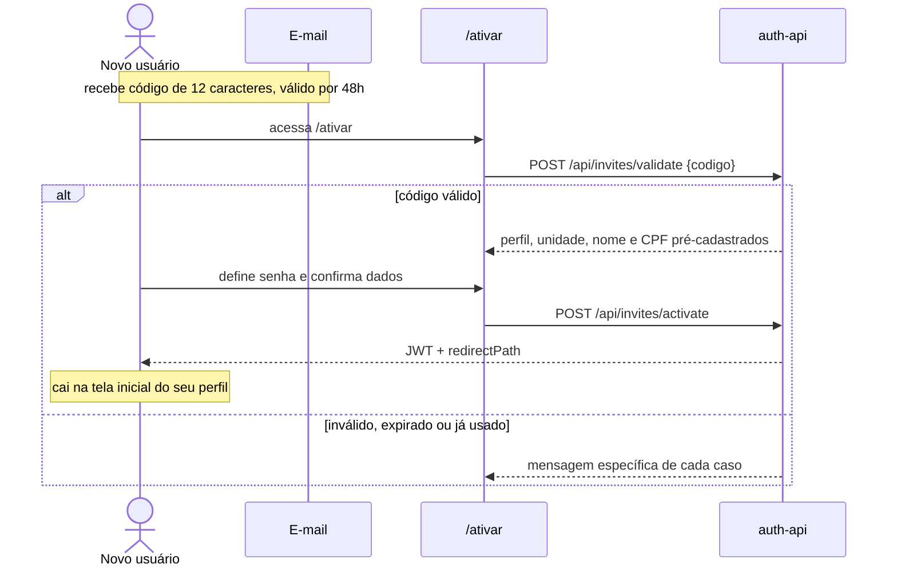
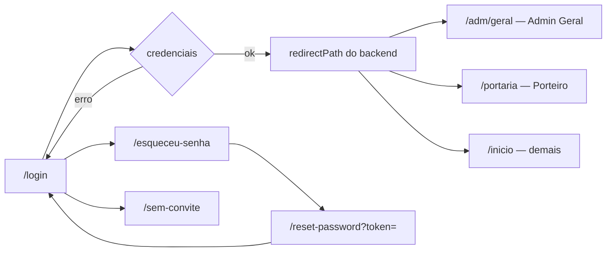
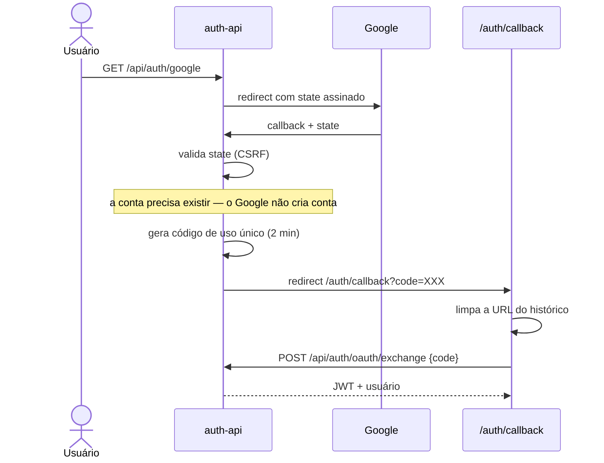
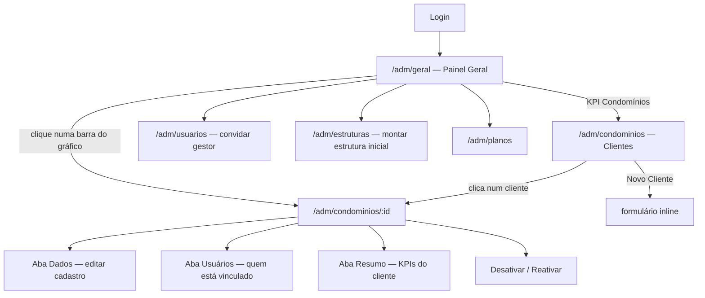
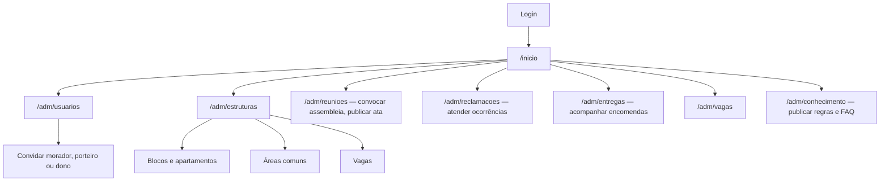
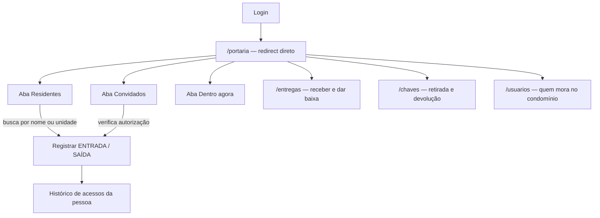
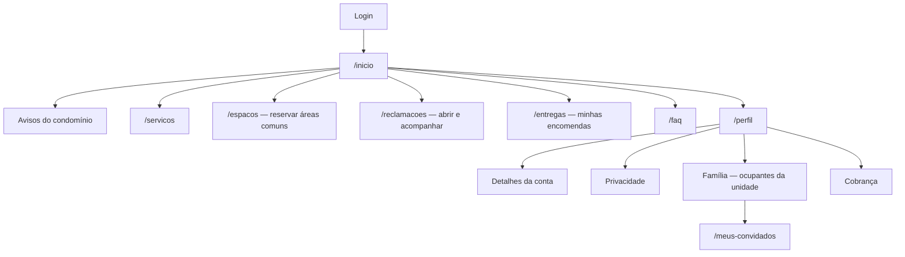
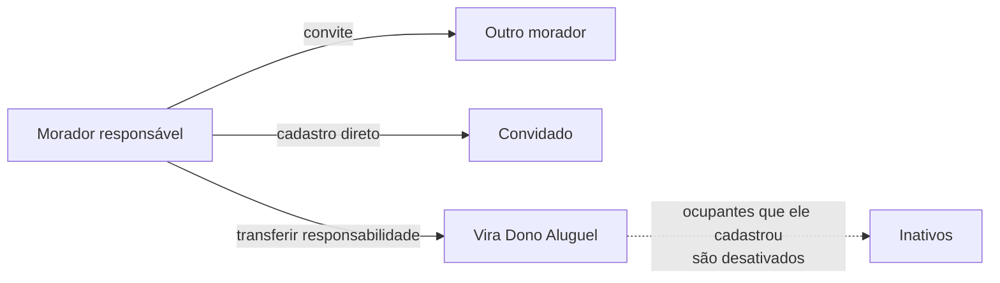
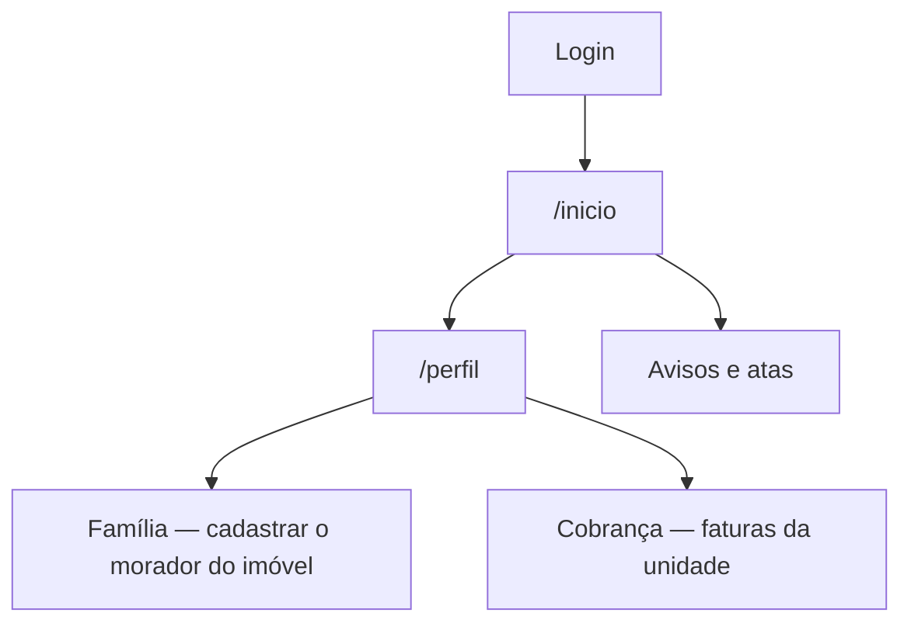
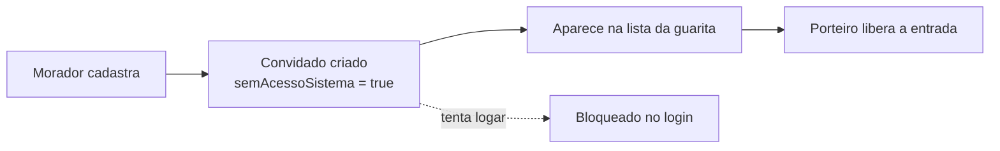

# Fluxos de Usuário e Telas — Mora

> Mapa de tudo que cada perfil faz no sistema e por quais telas passa.
> Levantado do código: `src/routes/index.jsx`, `src/utils/menuAdmin.js`, as 39 páginas
> em `src/pages/` e as rotas do backend.
>
> Estado em 25/08/2026, após a simplificação para 6 perfis.

---

## Sumário

1. [Os 6 perfis](#1-os-6-perfis)
2. [Mapa de telas por perfil](#2-mapa-de-telas-por-perfil)
3. [Fluxos de entrada](#3-fluxos-de-entrada)
4. [Fluxo do Admin Geral](#4-fluxo-do-admin-geral)
5. [Fluxo do Admin Síndico](#5-fluxo-do-admin-síndico)
6. [Fluxo do Porteiro](#6-fluxo-do-porteiro)
7. [Fluxo do Morador](#7-fluxo-do-morador)
8. [Fluxo do Dono Aluguel](#8-fluxo-do-dono-aluguel)
9. [Fluxo do Convidado](#9-fluxo-do-convidado)
10. [Inventário de telas](#10-inventário-de-telas)
11. [Lacunas conhecidas](#11-lacunas-conhecidas)

---

## 1. Os 6 perfis

| Perfil | Camada | Alcance | Layout |
|---|---|---|---|
| `ADMIN_GERAL` | Plataforma | Todos os condomínios | Sidebar |
| `ADMIN_SINDICO` | Condomínio | Um condomínio | Sidebar |
| `PORTEIRO` | Condomínio | Um condomínio | Sidebar |
| `MORADOR` | Unidade | Sua unidade | Navbar |
| `DONO_ALUGUEL` | Unidade | Sua unidade | Navbar |
| `CONVIDADO` | Unidade | — | **Sem acesso** |

O layout é escolhido em `AppLayout.jsx`: quem tem acesso administrativo ou é porteiro usa
barra lateral; os demais usam a navbar superior.

---

## 2. Mapa de telas por perfil

Fonte única em [`src/utils/menuAdmin.js`](../../Mora-Frontend/src/utils/menuAdmin.js), lida
pelo menu lateral, pela navbar e pelo guard de rota.

| Tela | Rota | Admin Geral | Síndico | Porteiro | Morador | Dono Aluguel |
|---|---|:--:|:--:|:--:|:--:|:--:|
| Painel Geral | `/adm/geral` | ✅ | | | | |
| Clientes | `/adm/condominios` | ✅ | | | | |
| Detalhe do cliente | `/adm/condominios/:id` | ✅ | | | | |
| Planos | `/adm/planos` | ✅ | | | | |
| Usuários | `/adm/usuarios` | ✅ | ✅ | | | |
| Estruturas | `/adm/estruturas` | ✅ | ✅ | | | |
| Perfis | `/adm/perfis` | ✅ | ✅ | | | |
| Reuniões | `/adm/reunioes` | | ✅ | | | |
| Reclamações (gestão) | `/adm/reclamacoes` | | ✅ | | | |
| Entregas (gestão) | `/adm/entregas` | | ✅ | | | |
| Vagas | `/adm/vagas` | | ✅ | | | |
| Conhecimento | `/adm/conhecimento` | | ✅ | | | |
| Entradas e Saídas | `/entradas-e-saidas` | | | ✅ | | |
| Chaves | `/chaves` | | | ✅ | | |
| Usuários do Condomínio | `/usuarios` | | | ✅ | | |
| Início | `/inicio` | | | ✅ | ✅ | ✅ |
| Serviços | `/servicos` | | | | ✅ | ✅ |
| Espaços | `/espacos` | | | | ✅ | ✅ |
| Reclamações | `/reclamacoes` | | | | ✅ | ✅ |
| Entregas | `/entregas` | | | | ✅ | ✅ |
| Meus Convidados | `/meus-convidados` | | | | ✅ | ✅ |
| Perfil | `/perfil` | ✅ | ✅ | ✅ | ✅ | ✅ |
| FAQ | `/faq` | | | | ✅ | ✅ |

**Proteção:** todas as rotas `/adm/*` passam pelo `AdminRoute`, que consulta o mesmo mapa do
menu — esconder um item do menu também barra a URL digitada à mão.

---

## 3. Fluxos de entrada

Não existe auto-cadastro. Toda conta nasce de um convite.

### 3.1 Ativação por convite

**Telas:** `/ativar` → `AtivacaoContaForm` (dois passos: código, depois dados)

### 3.2 Login

O destino vem do backend em `redirectPath` ([redirectPorPerfil.js](../services/auth-api/utils/redirectPorPerfil.js)),
consumido em `Login.jsx:65`.

**Bloqueios no login:** conta desativada, cadastro pendente e `semAcessoSistema` (o caso do
Convidado) recebem mensagens distintas.

### 3.3 Login com Google

Quem não tem convite prévio cai em `/sem-convite`.

### 3.4 Logout

`POST /api/auth/logout` incrementa `tokenVersion`, invalidando **todos** os tokens daquele
usuário — não apenas o do navegador atual.

---

## 4. Fluxo do Admin Geral

Opera a plataforma. Não participa do dia a dia de nenhum condomínio.

### O que ele faz

| Ação | Onde |
|---|---|
| Ver indicadores da plataforma | `/adm/geral` — 6 KPIs e 3 gráficos |
| Cadastrar um cliente novo | `/adm/condominios` → "Novo Cliente" |
| Editar dados de um cliente | `/adm/condominios/:id` → aba Dados |
| Desativar ou reativar um cliente | `/adm/condominios/:id` |
| Convidar o síndico de um cliente | `/adm/usuarios` (escopo global, com filtro por condomínio) |
| Montar a estrutura inicial | `/adm/estruturas` (tem seletor de cliente) |
| Manter os planos comerciais | `/adm/planos` |

### O painel

**6 KPIs:** condomínios ativos · novos em 30 dias · usuários ativos · média por condomínio ·
convites pendentes · ocorrências abertas.

**3 gráficos:** crescimento da carteira (barras + linha acumulada, 12 meses) · usuários por
perfil (donut) · usuários por condomínio (barras horizontais, clicáveis).

Os dados vêm do `gestao-geral-service` (porta 3002), que consolida o que o `auth-api` agrega.

---

## 5. Fluxo do Admin Síndico

Gere um condomínio. É quem faz o dia a dia da administração.

### O que ele faz

| Ação | Onde |
|---|---|
| Convidar usuários do condomínio | `/adm/usuarios` |
| Cadastrar blocos, apartamentos, áreas comuns | `/adm/estruturas` |
| Convocar assembleias e publicar atas | `/adm/reunioes` |
| Atender reclamações | `/adm/reclamacoes` |
| Acompanhar entregas | `/adm/entregas` |
| Gerir vagas | `/adm/vagas` |
| Publicar base de conhecimento e FAQ | `/adm/conhecimento` |
| Consultar o modelo de perfis | `/adm/perfis` |

**Não vê:** Painel Geral, Clientes nem Planos — são da plataforma.

---

## 6. Fluxo do Porteiro

Opera a guarita. Tem barra lateral própria, com 5 itens.

### O que ele faz

| Ação | Endpoint |
|---|---|
| Listar residentes | `GET /api/portaria/residentes` |
| Listar convidados autorizados | `GET /api/portaria/guests` |
| Ver quem está dentro agora | `GET /api/portaria/dentro` |
| Registrar entrada | `POST /api/portaria/entrada/:userId` |
| Registrar saída | `POST /api/portaria/saida/:userId` |
| Consultar histórico | `GET /api/portaria/historico/:userId` |
| Controlar chaves | `/chaves` |
| Receber encomendas | `/entregas` |

O status "dentro/fora" é **derivado** do último registro em `registros_acesso`, não é uma
coluna mantida.

---

## 7. Fluxo do Morador

Quem mora na unidade — proprietário residente ou inquilino. Navbar superior.

### O que ele faz

| Ação | Onde |
|---|---|
| Ver avisos do condomínio | `/inicio` |
| Reservar áreas comuns | `/espacos` |
| Abrir e acompanhar reclamações | `/reclamacoes` |
| Ver encomendas na portaria | `/entregas` |
| Consultar regras e FAQ | `/faq` |
| Editar dados e foto | `/perfil` → Detalhes |
| Cadastrar quem ocupa a unidade | `/perfil` → Família |
| Autorizar convidados na portaria | `/meus-convidados` |
| Ver cobranças da unidade | `/perfil` → Cobrança |

### Gestão da unidade (aba Família)

**Responsabilidade financeira:** um morador por unidade carrega a flag `responsavelFinanceiro`
— é quem recebe a fatura. Ao transferi-la a outro morador, quem transferiu vira `DONO_ALUGUEL`.

**Convidado não recebe convite por e-mail** — é cadastro direto, porque não acessa o sistema.

---

## 8. Fluxo do Dono Aluguel

Proprietário que não mora no condomínio. Mesma navbar do morador, com escopo menor.

| Ação | Onde |
|---|---|
| Cadastrar o morador que ocupa o imóvel | `/perfil` → Família |
| Acompanhar as faturas da unidade | `/perfil` → Cobrança |
| Consultar avisos e atas | `/inicio` |

Não participa da operação do condomínio: não reserva espaço nem abre reclamação, porque não
mora lá.

---

## 9. Fluxo do Convidado

Visitante recorrente pré-autorizado por um morador.

**Não é um usuário do sistema na prática.** Existe como registro para a portaria consultar. O
morador liga e desliga a permissão em `/meus-convidados`
(`PATCH /api/portaria/guests/:id/permissao`).

---

## 10. Inventário de telas

**39 páginas**, agrupadas por área.

### Autenticação (8)

| Arquivo | Rota | Papel |
|---|---|---|
| `Login.jsx` | `/login` | Entrada por senha ou Google |
| `AtivarConta.jsx` | `/ativar` | Ativação por código de convite |
| `AuthCallback.jsx` | `/auth/callback` | Troca do código OAuth por token |
| `EsqueceuSenha.jsx` | `/esqueceu-senha` | Solicita link de recuperação |
| `ResetPassword.jsx` | `/reset-password` | Define nova senha |
| `SemConvite.jsx` | `/sem-convite` | Quem tentou entrar sem convite |
| `SolicitarAcesso.jsx` | `/solicitar-acesso` | Redireciona para `/sem-convite` |
| `AcessoPendente.jsx` | `/acesso-pendente` | Conta aguardando ativação |

### Administração (14)

| Arquivo | Rota | Perfis |
|---|---|---|
| `IndexAdminGeral.jsx` | `/adm/geral` | Admin Geral |
| `GerenciarCondominios.jsx` | `/adm/condominios` | Admin Geral |
| `DetalheCondominio.jsx` | `/adm/condominios/:id` | Admin Geral |
| `GerenciarPlanos.jsx` | `/adm/planos` | Admin Geral |
| `GerenciarUsuarios.jsx` | `/adm/usuarios` | Admin Geral, Síndico |
| `GerenciarEstruturas.jsx` | `/adm/estruturas` | Admin Geral, Síndico |
| `GerenciarPerfis.jsx` | `/adm/perfis` | Admin Geral, Síndico |
| `GerenciarReunioes.jsx` | `/adm/reunioes` | Síndico |
| `GerenciarReclamacoes.jsx` | `/adm/reclamacoes` | Síndico |
| `GerenciarEntregas.jsx` | `/adm/entregas` | Síndico |
| `GerenciarVagas.jsx` | `/adm/vagas` | Síndico |
| `GerenciarConhecimento.jsx` | `/adm/conhecimento` | Síndico |
| `GerenciarVeiculos.jsx` | `/adm/veiculos`, `/veiculos` | Admin, Porteiro |
| `IndexAdminGeralLazy.jsx` | — | Carregamento sob demanda do Recharts |

### Portaria (3)

| Arquivo | Rota | Papel |
|---|---|---|
| `Portaria.jsx` | `/portaria`, `/entradas-e-saidas` | Registro de entrada e saída, 3 abas |
| `Chaves.jsx` | `/chaves` | Retirada e devolução |
| `UsuariosCondominio.jsx` | `/usuarios` | Consulta de moradores |
| `InicioDoorman.jsx` | — | Home do porteiro, dentro de `/inicio` |

### Morador (10)

| Arquivo | Rota | Papel |
|---|---|---|
| `Inicio.jsx` | `/inicio` | Avisos e atalhos |
| `Servicos.jsx` | `/servicos` | Serviços do condomínio |
| `Comodidades.jsx` | `/comodidades` | Estrutura de lazer |
| `MinhasReservas.jsx` | `/espacos` | Reserva de áreas comuns |
| `MinhasReclamacoes.jsx` | `/reclamacoes` | Ocorrências do morador |
| `MinhasEntregas.jsx` | `/entregas` | Encomendas |
| `MeusConvidados.jsx` | `/meus-convidados` | Autorização de convidados |
| `FAQ.jsx` | `/faq` | Perguntas frequentes |
| `Perfil.jsx` | `/perfil` | Contêiner das 4 abas |

### Abas do perfil (4)

`DetalhesContaView` · `PrivacidadeView` · `FamiliaView` · `CobrancaView`

---

## 11. Lacunas conhecidas

O que o mapa acima revela de inacabado:

| Lacuna | Detalhe |
|---|---|
| **Rótulos com nomes antigos de perfil** | `FamiliaView.jsx` ainda diz "Cadastrar Locatário (Lessee)", "Cadastrar Convidado (Guest)" e "seu perfil será atualizado para Absent Owner". A simplificação para 6 perfis não alcançou esses textos de tela. |
| **Home do Admin Geral e do Síndico** | `Inicio.jsx` só tem ramo para o Porteiro. O Admin Geral é desviado pelo `redirectPath`, mas quem chegar em `/inicio` pelo botão voltar cai na home de morador. O Síndico cai nela sempre. |
| **Reservas sem persistência** | `/espacos` existe, mas não há tabela `reservas` no banco — o RF-19 está pela metade. |
| **Cobrança sem fonte** | A aba Cobrança existe, mas nenhum dos RFs financeiros (14 a 17 e 21) foi implementado. |
| **Portaria duplicada** | `/portaria` usa `registros_acesso` do `auth_db`; o `portaria-service` mantém `visitantes` e `veiculos` em outro banco. Os dois não se conversam. |
| **Filtro por condomínio ausente** | As tabelas ganharam `condominioId`, mas só Bloco, Apartamento, AreaComum e Aviso filtram por ele. As telas de entregas, chaves e veículos ainda mostram dados de todos os condomínios. |
| **`/comodidades` e `/servicos`** | Conteúdo estático, sem ligação com `areas_comuns`. |

---

## Referências

- [ESPECIFICACAO-PROJETO.md](ESPECIFICACAO-PROJETO.md) — requisitos e status
- [HISTORIAS-DE-USUARIO.md](HISTORIAS-DE-USUARIO.md) — critérios de aceite por RF
- [ARQUITETURA-E-FLUXOS.md](ARQUITETURA-E-FLUXOS.md) — fluxos entre serviços
- [DECISOES-ARQUITETURAIS.md](DECISOES-ARQUITETURAIS.md) — as decisões que levaram até aqui
