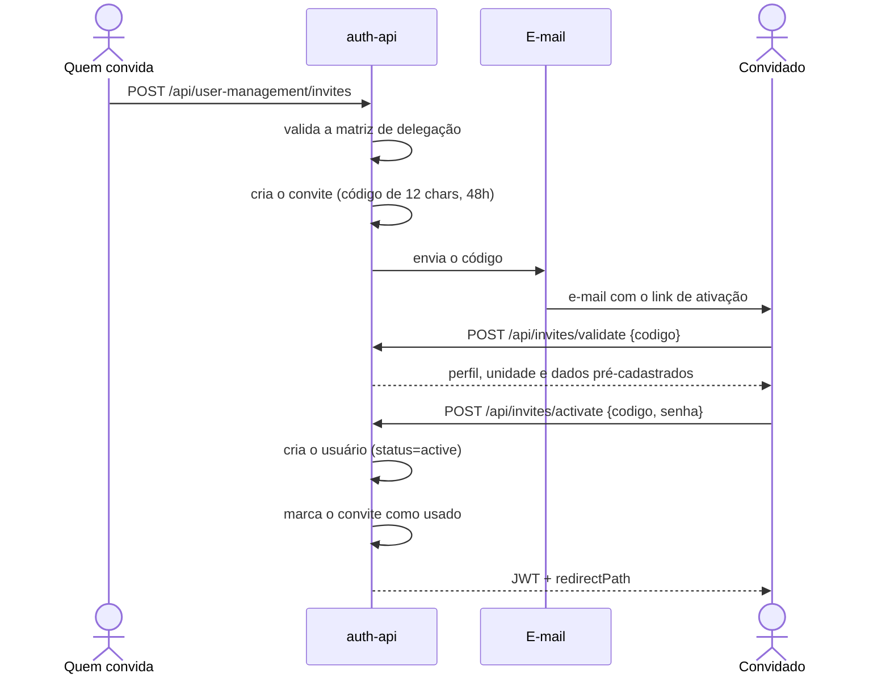
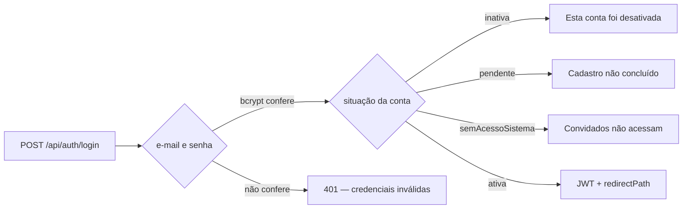
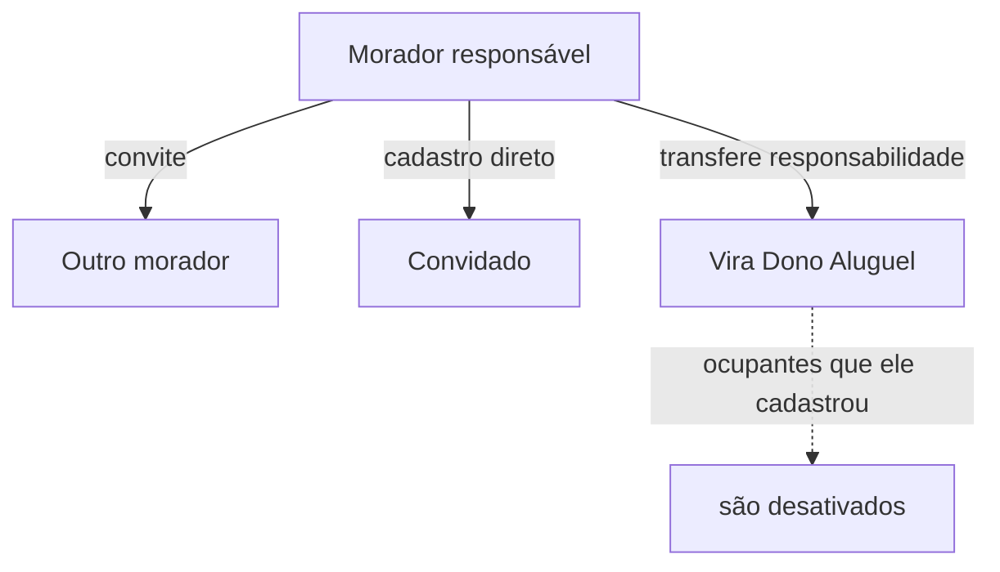

# auth-api

**Stack:** Node 20 · Express 4 · Sequelize 6 — **Porta:** 3001 — **Banco:** `auth_db`
**Status:** em operação

---

#### Responsabilidade

É o dono da **identidade** na plataforma: quem existe, qual perfil tem, a que condomínio
pertence e se pode entrar. Emite os JWT que todos os outros serviços validam.

Também é o dono do **condomínio como cliente** — a entidade raiz de todo o isolamento de dados
do sistema.


| RF | Requisito                                  |
| -- | ------------------------------------------ |
| 1  | Realizar Autenticação de Usuário        |
| 2  | Gerenciar Usuários e Vínculos de Unidade |
| 3  | Gerenciar Clientes (Condomínios)          |

---

## Fluxos de usuário

### Cadastro por convite

Não existe auto-registro. Toda conta nasce de um convite.



**Quem convida quem:**

```
ADMIN_GERAL   → todos os perfis
ADMIN_SINDICO → PORTEIRO, MORADOR, DONO_ALUGUEL, CONVIDADO
DONO_ALUGUEL  → MORADOR, CONVIDADO
MORADOR       → CONVIDADO
```

O `CONVIDADO` é exceção: **não recebe e-mail**, porque não acessa o sistema. É cadastro direto.

### Login



O `redirectPath` decide a tela inicial: `/adm/geral` para Admin Geral, `/portaria` para
Porteiro, `/inicio` para os demais.

### Login com Google

A conta precisa existir — o Google **não cria conta**. O callback devolve um código de uso
único, válido por 2 minutos, que o frontend troca pelo JWT em `POST /oauth/exchange`. O token
nunca trafega na URL.

### Gestão de ocupantes da unidade



Um morador por unidade carrega `responsavelFinanceiro` — é quem recebe a fatura. Ao
transferi-la, quem transferiu passa a `DONO_ALUGUEL`.

### Cadastro de cliente

O `ADMIN_GERAL` cadastra o condomínio e convida o síndico. A partir daí o síndico monta a
estrutura e convida os moradores.

---

## Banco de dados — `auth_db`

### `users`

Identidade de toda pessoa com acesso ao sistema.


| Grupo           | Colunas                                                                 |
| --------------- | ----------------------------------------------------------------------- |
| Identificação | `id`, `nome`, `email`, `cpf`, `telefone`, `dataNascimento`, `fotoUrl`   |
| Acesso          | `senha`, `perfil`, `status`, `semAcessoSistema`, `tokenVersion`         |
| Vínculo        | `condominioId`, `unidadeId`, `cadastradoPorId`, `responsavelFinanceiro` |
| Login social    | `googleId`, `provider`, `oauthCode`, `oauthCodeExpira`                  |
| Recuperação   | `resetToken`, `resetTokenExpira`                                        |
| Auditoria       | `activatedAt`, `createdAt`, `updatedAt`                                 |

**`perfil`** aceita os 6 valores do modelo de acesso. **`condominioId` é nulo apenas para
`ADMIN_GERAL`**, que opera sobre todos os condomínios.

**`tokenVersion`** é o mecanismo de revogação: o middleware compara a claim do JWT com esta
coluna, e incrementá-la derruba todas as sessões daquele usuário.

### `condominios`

O cliente da plataforma. Seu `id` é um slug usado como `condominioId` em **todas as tabelas de
domínio dos demais serviços**.

`id`, `nome`, `cnpj`, `endereco`, `telefone`, `email`, `status`, `criadoPorId`,
`createdAt`, `updatedAt`

Sem exclusão: `status` alterna entre `active` e `inactive`, preservando os dados.

### `invites`

`id`, `codigo`, `email`, `perfil`, `condominioId`, `unidadeId`, `nomePrecadastro`,
`cpfPrecadastro`, `cadastradoPorId`, `status`, `expiresAt`, `usedAt`, `usedByUserId`,
`responsavelFinanceiro`, `createdAt`, `updatedAt`

`responsavelFinanceiro` viaja no convite para que a informação não se perca entre o convite e a
ativação da conta.

### `registros_acesso`

`id`, `usuarioId`, `tipo`, `registradoPorId`, `condominioId`, `createdAt`

Entradas e saídas de usuários cadastrados. O status "dentro/fora" é **derivado** do último
registro, não é coluna mantida.

> Esta tabela duplica responsabilidade com `visitantes` e `veiculos` do `portaria-service`. A
> unificação está prevista.

### `reclamacoes`

`id`, `userId`, `protocolNumber`, `category`, `description`, `attachmentUrl`, `status`,
`interactions`, `condominioId`, `createdAt`, `updatedAt`

> Migra para o `ocorrencias-service`. O campo `interactions` é JSON não estruturado; a
> normalização acompanha a migração.

---

## Endpoints


| Grupo                    | Rotas                                                                                                                                                    |
| ------------------------ | -------------------------------------------------------------------------------------------------------------------------------------------------------- |
| **Autenticação**       | `POST /api/auth/login` · `POST /logout` · `GET /me` · `PUT /me` · `POST /me/foto` · `POST /forgot-password` · `POST /reset-password/:token`        |
| **OAuth**                | `GET /api/auth/google` · `GET /google/callback` · `POST /oauth/exchange` · `GET /google/disponivel`                                                   |
| **Convites**             | `POST /api/invites/validate` · `POST /activate`                                                                                                         |
| **Condomínios**         | `GET /api/condominios` · `GET /:id` · `POST /` · `PUT /:id` · `PATCH /:id/activate` · `/deactivate` · `GET /:id/users` · `PATCH /:id/assign-user` |
| **Gestão de usuários** | `GET /api/user-management/users` · `POST /invites` · `POST /invites/:id/resend` · `PATCH /users/:id/deactivate` · rotas de ocupantes por unidade     |
| **Perfis**               | `GET /api/perfis/info` · `GET /info/:perfil`                                                                                                            |
| **Estatísticas**        | `GET /api/estatisticas/plataforma` · `GET /condominios/:id`                                                                                             |
| **Portaria**             | `GET /api/portaria/residentes` · `/guests` · `/dentro` · `POST /entrada/:userId` · `/saida/:userId`                                                  |

`POST /api/auth/register` existe e responde **403** — o cadastro é sempre por convite.

---

## Integrações


| Com                | Como         | Para quê                                             |
| ------------------ | ------------ | ----------------------------------------------------- |
| `portaria-service` | HTTP         | Validar se uma unidade existe antes de emitir convite |
| `gestao-geral`     | É consumido | Fornece as agregações da plataforma                 |
| Gmail SMTP         | `nodemailer` | Convites e recuperação de senha                     |
| Google OAuth       | `passport`   | Login social                                          |

---

## Segurança

- Senha com bcrypt, custo 10, aplicado por hook do model
- Campos sensíveis excluídos por scope: consulta padrão nunca traz `senha`, `resetToken` nem `oauthCode`
- `state` assinado na sessão protege o OAuth contra CSRF
- `SESSION_SECRET` separado do `JWT_SECRET`
- Três limitadores de taxa: login, recuperação de senha e rotas com token
- Aborta o boot sem `JWT_SECRET`; em produção, também sem `SESSION_SECRET`

---

## Pendências

| Item | Situação |
|---|---|
| `registros_acesso` a unificar com o controle de acesso do `portaria-service` | Bloqueado: exige que o `portaria-service` assuma o domínio |
| `reclamacoes` a migrar para o `ocorrencias-service` | Bloqueado: o serviço de destino ainda não existe |
| Cifrar CPF em repouso — RNF-10 | Em aberto |

### Resolvidas

| Item | Como |
|---|---|
| Colunas de legado no schema | `role`, `bloco`, `apartamento`, `vaga` e `entradaPermitida` removidas por `migrate-remover-legado.js`, junto do tipo `enum_users_role` |
| Filtro por condomínio incompleto | `GET /api/users`, `GET /api/reclamacoes/todas`, `PATCH /api/reclamacoes/:id` e `PUT /api/users/:id` passaram a respeitar o escopo do ator |
