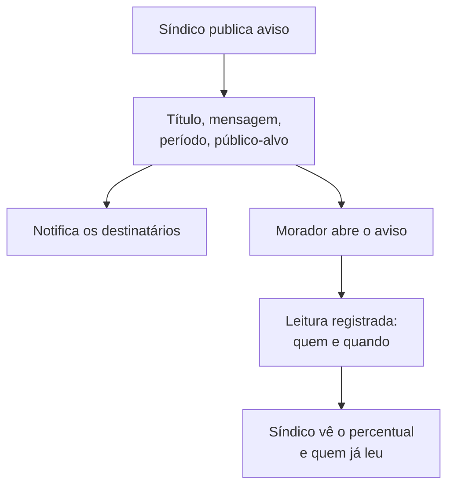
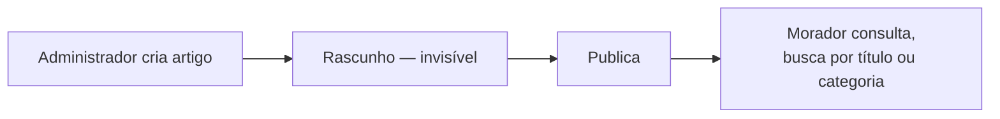
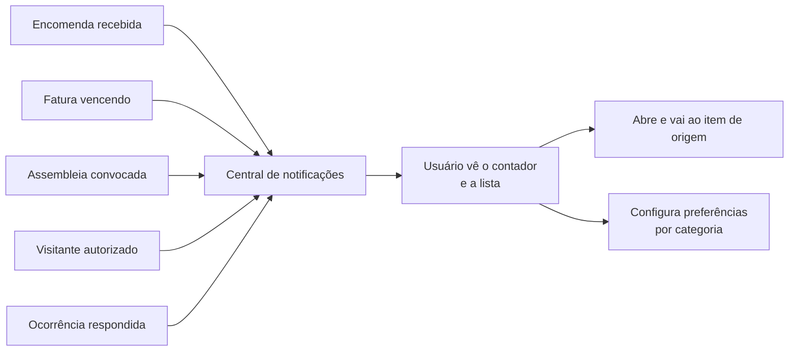

# comunicacao-service

**Stack:** Node 20 · Express — **Porta:** 3003 — **Banco:** `mora_comunicacao`
**Status:** 📋 planejado — parte do domínio roda hoje no `portaria-service`

---

## Responsabilidade

Concentra tudo que **leva informação ao morador**: avisos oficiais, base de conhecimento,
conversas diretas e notificações automáticas.

| RF | Requisito |
|---|---|
| 12 | Gerenciar Comunicados e Base de Conhecimento |
| 13 | Gerenciar Mensagens e Notificações |

**Escopo dos requisitos**, conforme a especificação:

- **RF-12** — avisos com confirmação de leitura, artigos de regras e FAQ
- **RF-13** — conversa direta entre usuários e notificações disparadas por evento do sistema

---

## Situação atual

Duas partes do domínio **já existem, no `portaria-service`**:

| Recurso | Onde está hoje | Estado |
|---|---|---|
| Avisos | `mora.avisos` · `AvisoController` (7 endpoints) | Publicação funciona; **sem registro de leitura** |
| Base de conhecimento | `mora.artigos_conhecimento` · `ArtigoConhecimentoController` (9 endpoints) | Funciona, com rascunho e publicação |
| Chat | — | Não existe |
| Notificações | — | Não existe |

Foram implementados ali antes da divisão de domínios. **Migram para este serviço**, junto com
os dados.

---

## Fluxos de usuário

### Aviso com confirmação de leitura

O registro de leitura é o que permite ao síndico comprovar ciência de uma regra — e é o que
falta hoje.

### Base de conhecimento

### Chat

Conversa direta entre morador, síndico e portaria, com histórico. Serve para assuntos pontuais
que não justificam abrir uma ocorrência formal.

### Notificações

Notificações nasceram como requisito próprio porque, ao definir o RF-13 como chat entre
usuários, nenhum requisito cobria o disparo automático por evento.

---

## Banco de dados — proposta

> **As tabelas abaixo são proposta, não decisão** — exceto `avisos` e `artigos_conhecimento`,
> que já existem no banco `mora` e serão migradas.

| Tabela | Papel | Origem |
|---|---|---|
| `avisos` | Aviso: título, mensagem, período, público-alvo, autor | Migra de `mora` |
| `aviso_leitura` | Quem leu qual aviso e quando | Nova |
| `artigos_conhecimento` | Artigos de regras e FAQ, com categoria e status | Migra de `mora` |
| `conversas` | Conversa entre dois ou mais participantes | Nova |
| `mensagens` | Mensagens da conversa, com confirmação de leitura | Nova |
| `notificacoes` | Notificação por usuário, com origem e status de leitura | Nova |
| `preferencias_notificacao` | Categorias que o usuário optou por não receber | Nova |

Todas com `condominioId`.

### Em aberto

| Questão |
|---|
| Canal das notificações: apenas in-app, ou também e-mail e push |
| Se o chat é apenas morador↔administração, ou também entre moradores |
| Retenção das notificações — não há prazo definido |
| Se a base de conhecimento é por condomínio ou global da plataforma |

---

## Integrações previstas

| Com | Para quê |
|---|---|
| `auth-api` | Identidade dos participantes e destinatários |
| `portaria-service` | Encomenda recebida e visitante autorizado disparam notificação |
| `meeting-service` | Assembleia convocada dispara notificação |
| `financeiro-service` | Fatura vencendo dispara notificação |
| `ocorrencias-service` | Ocorrência respondida dispara notificação |
| `gestao-geral` | Percentual de leitura alimenta o painel operacional |

É o serviço com mais integrações de entrada: quase todo evento relevante do sistema termina
numa notificação.

---

## O que a migração precisa resolver

| Item |
|---|
| Mover `avisos` e `artigos_conhecimento` de `mora` para `mora_comunicacao` |
| Remover `AvisoController` e `ArtigoConhecimentoController` do `portaria-service` |
| Criar `aviso_leitura` — sem ela o indicador de leitura do painel operacional não é computável |
| Atualizar o frontend, que hoje chama a porta 8090 para esses recursos |
