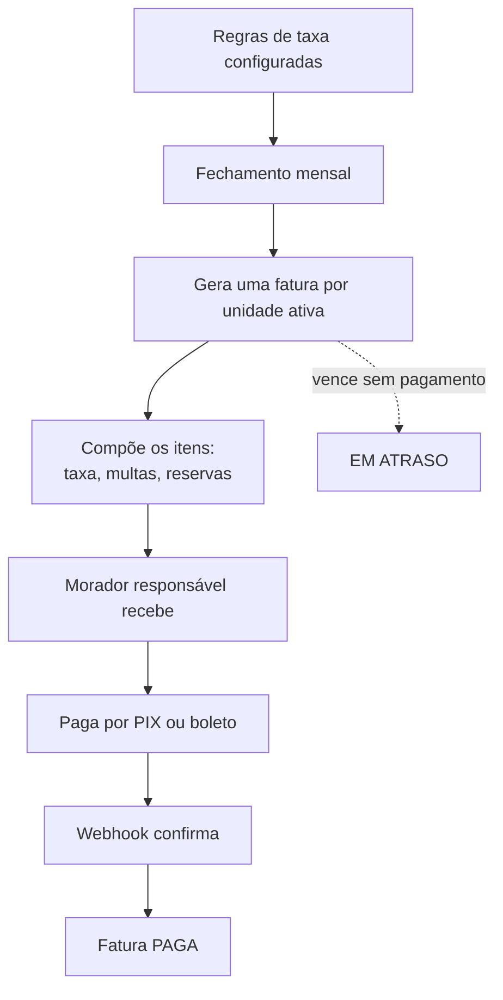
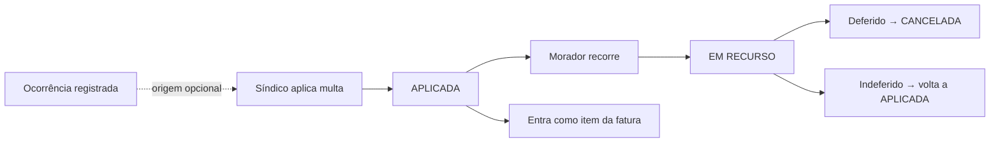
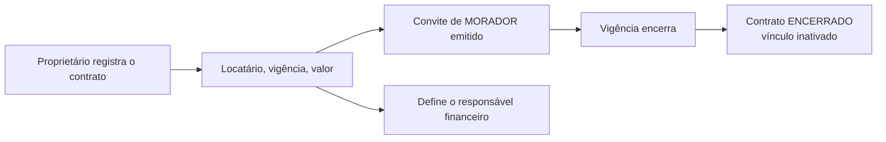

# financeiro-service

**Stack:** Java 21 · Spring Boot — **Porta:** 8094 — **Banco:** `mora_financeiro`
**Status:** 📋 planejado — não implementado

> Nada deste serviço existe em código. O documento registra o que foi decidido e sinaliza o que
> ainda está em aberto.

---

## Responsabilidade

Cuidará do **dinheiro que circula dentro do condomínio**: o que cada unidade deve, o que foi
pago e como o condomínio presta contas disso.

| RF | Requisito |
|---|---|
| 15 | Gerenciar Contratos de Locação |
| 16 | Gerenciar Cobranças da Unidade |
| 17 | Registrar Prestação de Contas |

**Escopo dos requisitos**, conforme a especificação:

- **RF-15** — contrato entre proprietário e inquilino, vigência e definição do responsável financeiro
- **RF-16** — tipos e regras de taxa, rateio, geração de faturas, multas e pagamento
- **RF-17** — lançamento de receitas e despesas, e publicação por competência

---

## Decisões tomadas

| Decisão | Detalhe |
|---|---|
| **Dois fluxos de dinheiro** | O condomínio cobra o morador, **e** a plataforma cobra o condomínio pela assinatura |
| **Contas separadas** | Cada condomínio recebe na própria conta; a plataforma na dela. O dinheiro do condomínio **nunca transita pelo Mora** |
| **PIX e boleto integrados** | Via gateway, com webhook de confirmação |
| **Rateio configurável** | Cada condomínio escolhe entre valor fixo por unidade ou proporcional à fração ideal |
| **Quem paga** | O morador com a flag `responsavelFinanceiro`, definida no `auth-api` |

---

## Fluxos de usuário

### Geração de faturas

O rateio segue a regra do condomínio: valor fixo, ou proporcional à fração ideal da unidade.

### Multas

### Contrato de locação

### Prestação de contas

O síndico lança receitas e despesas por competência e publica. Publicada, a competência não
aceita alteração de lançamento — só estorno registrado.

---

## Banco de dados — proposta

> **As tabelas abaixo são proposta, não decisão.** Foram esboçadas a partir do escopo dos
> requisitos e precisam ser validadas antes da implementação.

| Tabela | Papel |
|---|---|
| `contratos_locacao` | Proprietário, locatário, vigência, valor, responsável financeiro |
| `tipos_taxa` | Catálogo de taxas do condomínio: nome, valor base, periodicidade |
| `regras_taxa` | Regra de rateio do condomínio: fixo ou por fração ideal |
| `faturas` | Fatura por unidade e competência, com vencimento e status |
| `fatura_itens` | Itens que compõem a fatura: taxas, multas, reservas |
| `multas` | Motivo, valor, data da infração, status, ocorrência de origem |
| `prestacao_contas` | Competência publicada |
| `lancamentos` | Receitas e despesas, com categoria, valor e comprovante |

Todas com `condominioId`, como as demais tabelas de domínio.

### Em aberto

| Questão |
|---|
| Qual gateway de pagamento |
| Como a fração ideal chega até aqui — hoje não há esse campo em `apartamentos` |
| Formato do comprovante na prestação de contas: arquivo ou apenas lançamento |
| Se a assinatura da plataforma vive aqui ou no `plan-service` |

---

## Integrações previstas

| Com | Para quê |
|---|---|
| `auth-api` | Saber quem é o responsável financeiro de cada unidade |
| `portaria-service` | Reservas com taxa viram item de fatura |
| `ocorrencias-service` | Multa originada de uma ocorrência |
| `gestao-geral` | Alimentar o painel financeiro |
| Gateway de pagamento | Emissão de cobrança e webhook de confirmação |

---

## Requisitos que se aplicam

Do conjunto de requisitos não-funcionais, valem com peso especial aqui:

- **RNF-14** — dados de pagamento não são armazenados; apenas identificadores de transação
- **RNF-22** — operações multi-passo em transação
- **RNF-01** — todo endpoint exige JWT válido

O serviço movimenta valores. O modelo de autorização a seguir é o do
[`gestao-geral`](gestao-geral.md), que rejeita token inválido.
