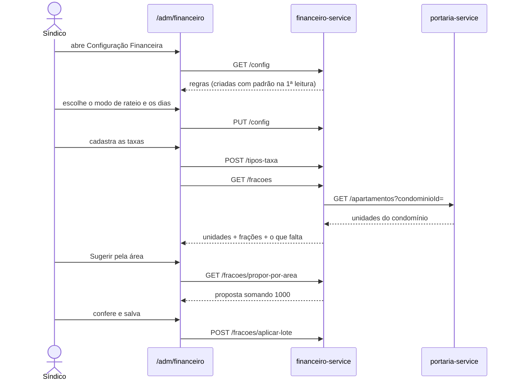

# financeiro-service

**Stack:** Node 20 · Express 4 — **Porta:** 3004 — **Banco:** `mora_financeiro`
**Status:** em operação — cadastros prontos, faturamento pendente

---

## Responsabilidade

Cuida do **dinheiro que circula dentro do condomínio**: o que cada unidade deve, o que foi pago
e como o condomínio presta contas disso.

| RF | Requisito | Situação |
|---|---|---|
| 15 | Gerenciar Contratos de Locação | tabela criada, sem endpoints |
| 16 | Gerenciar Cobranças da Unidade | cadastros prontos; faturamento pendente |
| 17 | Registrar Prestação de Contas | tabelas criadas, sem endpoints |

É o único serviço com **banco próprio e migrações versionadas** (`node-pg-migrate`), o que
atende o RNF-23 — nenhum outro serviço da malha cumpre isso hoje.

### O que já funciona

Os cadastros que antecedem a primeira fatura: **regras de fechamento**, **tipos de taxa** e
**fração ideal por unidade**, mais a integração com o gateway de pagamento, validada de ponta a
ponta em sandbox.

### O que falta

O **fechamento do mês** — o rateio está pronto e testado, mas nada ainda transforma isso em
faturas gravadas. E o **webhook de baixa**: as tabelas de idempotência existem, o handler não.

---

## Dinheiro é inteiro, em centavos

A decisão que mais afeta quem for mexer aqui. Todo valor monetário é `BIGINT` de centavos, em
banco e em API, com o sufixo `Centavos` no nome do campo.

JavaScript não tem tipo decimal: `0.1 + 0.2` não dá `0.3`. E `NUMERIC` do Postgres chega como
**string** no driver `pg`, justamente porque não cabe em `Number` — um `+` esquecido produziria
`"350.00350.00"` em silêncio. Inteiro elimina a classe inteira de erro: soma, comparação e
rateio são exatos, e a formatação acontece só na borda, em `utils/dinheiro.js`.

O `plan-service` usa `BigDecimal(10,2)`, que é exato em Java. A divergência é deliberada: cada
linguagem usa o que é seguro nela.

---

## Rateio

O síndico escolhe o modo em `regras_taxa`, e cada tipo de taxa diz o que seu valor significa.

| Modo | `base_calculo` | Resultado |
|---|---|---|
| `FIXO` | `POR_UNIDADE` | toda unidade recebe o mesmo valor |
| `FIXO` | `TOTAL_CONDOMINIO` | divisão igual entre as unidades |
| `FRACAO_IDEAL` | `TOTAL_CONDOMINIO` | proporcional à fração de cada unidade |

**`base_calculo` existe porque sem ela o cadastro é ambíguo:** R$ 350 é o que cada apartamento
paga, ou é o total que o prédio inteiro divide? Deixar implícito faria a mesma linha significar
coisas diferentes conforme uma configuração guardada em outra tabela.

### A sobra de centavos

A divisão proporcional quase nunca dá inteiro. `ratear()` trunca cada parcela e entrega a
diferença inteira à **unidade de maior peso**, de modo que a soma feche exatamente com o total.

Sete apartamentos somando 571 m²:

| Unidade | Área | Milésimos |
|---|---|---|
| 101, 102, 202, 302 | 62,5 m² | 109 cada |
| 201, 301 | 88 m² | 154 cada |
| **401** | 145 m² | **256** |

Truncando, a soma daria 997. Os 3 milésimos que sobram vão para a 401, e o total fecha em 1000.
Sem isso o condomínio arrecadaria a menos todo mês, e ninguém perceberia.

### Fração faltando

Por convenção, as frações somam **1000 milésimos**. O rateio em si não depende disso — divide
pela soma real — mas o total redondo é a conferência: se não fecha, alguém digitou errado.

Quando faltar fração de alguma unidade, o fechamento **não roda** e devolve quais faltam. Cair
para "divide igual" cobraria o valor errado de todo mundo, e o erro só apareceria na assembleia.

---

## Fluxo de usuário

### Preparo, antes da primeira fatura



A proposta por área **só preenche os campos** — quem confirma é o síndico. Fração ideal consta
da convenção do condomínio, documento registrado; deduzir da área é atalho para quem ainda não
digitou, não a fonte da verdade.

### Teste de cobrança

Emite uma cobrança real no sandbox e mostra o que o morador receberia: QR do PIX ou linha
digitável do boleto. Responde "a integração está de pé?" sem depender de haver fatura.

A rota **recusa qualquer ambiente que não seja sandbox** — em produção um clique mandaria
cobrança de verdade para alguém, e a proteção não pode depender de ninguém lembrar de não
clicar.

---

## Endpoints

Prefixo `/api/financeiro`, roteado pelo Traefik, registrado no Consul.

| Rota | Quem pode | Devolve |
|---|---|---|
| `GET/PUT /config` | Perfis de gestão | Modo de rateio e calendário |
| `GET /tipos-taxa` · `POST` · `PUT /:id` · `DELETE /:id` | Perfis de gestão | Catálogo de taxas |
| `GET /fracoes` | Perfis de gestão | Unidades, frações e o que falta |
| `PUT/DELETE /fracoes/:unidadeId` | Síndico | Fração de uma unidade |
| `GET /fracoes/propor-por-area` | Perfis de gestão | Proposta somando 1000 |
| `POST /fracoes/aplicar-lote` | Síndico | Grava várias, tudo ou nada |
| `GET /gateway/status` | Perfis de gestão | Ambiente e final da chave |
| `POST /gateway/teste` · `GET/DELETE /gateway/teste/:id` | Síndico, só sandbox | Cobrança de teste |
| `GET /contexto` | Autenticado | Escopo resolvido — diagnóstico |
| `GET /health` | Público | Estado do banco e do gateway |

`DELETE /tipos-taxa/:id` **desativa, não apaga**: faturas emitidas apontam para o tipo de taxa,
e remover a linha deixaria a composição de uma fatura antiga sem explicação.

---

## Autorização

Segue o modelo do `gestao-geral`: **401** para token ausente ou inválido, sem exceção engolida,
**403** por perfil. Aqui pesa mais que num painel — estas rotas movem dinheiro.

| Perfil | Pode |
|---|---|
| `ADMIN_SINDICO` | Tudo, restrito ao próprio condomínio |
| `ADMIN_GERAL` | Ver os números; **não opera cobrança** de condomínio algum |
| `MORADOR` · `DONO_ALUGUEL` | Nada ainda — as rotas de fatura própria virão com o faturamento |
| `PORTEIRO` · `CONVIDADO` | Nada |

O `condominioId` vem da claim do JWT, **nunca** do corpo ou da query. O Admin Geral é o único
que escolhe qual condomínio olhar; para os demais o parâmetro é ignorado, e não recusado —
recusar diria a quem tentou que o outro condomínio existe.

### O token não carrega a unidade

As claims do `auth-api` são `{ id, perfil, tokenVersion, email, condominioId }` — verificado em
`routes/auth.js`. Não há `unidadeId`.

Escopo de unidade, então, é perguntado: `GET /api/auth/me` responde com `unidadeId` e
`responsavelFinanceiro` usando o Bearer do próprio interessado, e o resultado fica em cache
curto.

Isso **falha fechado**: auth-api indisponível vira 503, nunca acesso liberado. Se "sem unidade"
virasse "sem filtro", um morador enxergaria as faturas do prédio inteiro.

---

## Estrutura

```
services/financeiro/
  server.js                     Express, helmet, CORS, /health, Consul
  config/
    servicos.js                 URLs das fontes, timeouts, porta
    database.js                 pool pg, transações, parser de BIGINT
    asaas.js                    credenciais e base URL do gateway
    consul.js                   registro e desregistro
  middleware/
    auth.js                     valida JWT e REJEITA
    escopo.js                   condomínio do token, unidade sob demanda
  clients/
    authClient.js               identidade do ator, com cache
    portariaClient.js           unidades do condomínio
  models/                       SQL por tabela
  services/
    taxaService.js              validação de taxas e regras
    fracaoService.js            frações, proposta por área, lote
  gateway/asaasClient.js        chamadas ao Asaas
  routes/
    cadastros.js  gateway.js  contexto.js
  migrations/                   5 arquivos .sql versionados
  scripts/
    testar-local.js             11 checagens de saúde e autorização
    smoke-asaas.js              exercita o gateway de ponta a ponta
    seed-estrutura-teste.js     cria blocos e apartamentos de teste
  tests/dinheiro.test.js        dinheiro e rateio
  utils/                        dinheiro, competência, httpClient
```

---

## Banco de dados

Todas as tabelas têm `condominio_id` (RNF-15) e índice por ele. Nenhuma FK atravessa banco:
`unidade_id` e `usuario_id` são referências frouxas, validadas na aplicação.

| Tabela | Papel |
|---|---|
| `regras_taxa` | Uma linha por condomínio: modo de rateio e calendário |
| `tipos_taxa` | Catálogo de taxas, com `base_calculo` |
| `unidades_fracao` | Fração ideal por unidade, em milésimos inteiros |
| `faturas` · `fatura_itens` | Emitidas por unidade e competência |
| `multas` | Aplicação, recurso e julgamento |
| `contratos_locacao` | Vínculo proprietário↔inquilino |
| `lancamentos` · `prestacao_contas` | Receitas, despesas e publicação |
| `cobrancas` · `webhook_eventos` | Ponte com o gateway e idempotência |

### Constraints que carregam regra

```sql
-- Impede o mês fechar duas vezes. Parcial, e não UNIQUE de tabela, porque
-- cancelar precisa liberar a competência para reemissão: um UNIQUE total
-- prenderia a unidade a uma única tentativa para sempre.
CREATE UNIQUE INDEX uq_fatura_competencia ON faturas (condominio_id, unidade_id, competencia)
  WHERE status <> 'CANCELADA';

-- O que impede a baixa dupla quando o gateway reenvia o webhook.
UNIQUE (evento_id) -- webhook_eventos

-- Estorno é o único item que abate. Multa cancelada depois de faturada vira
-- estorno; apagar o item original reescreveria uma fatura já emitida.
CHECK ((tipo = 'ESTORNO' AND valor_centavos <= 0)
    OR (tipo <> 'ESTORNO' AND valor_centavos >= 0)) -- fatura_itens
```

Os dias de fechamento e vencimento vão até **28**, e não 31: fevereiro existe, e a regra precisa
valer para os doze meses.

---

## Integração com o Asaas

Sandbox, autenticação por header **`access_token`** — o Asaas **não** usa
`Authorization: Bearer`. Verificado contra a API real, não só contra a documentação.

| Item | Situação |
|---|---|
| Pagador (`/customers`) | busca por CPF antes de criar, para não duplicar a cada fatura |
| Cobrança PIX | funciona — **exige chave PIX cadastrada na conta**, senão o QR é recusado |
| Boleto | `bankSlipUrl` e linha digitável de 47 dígitos |
| Cartão | barrado por allowlist — o RNF-14 proíbe guardar dado de pagamento |
| Cancelamento | `DELETE` devolve **500 na primeira chamada, reprodutível no boleto**; há retentativa |

A retentativa não é zelo excessivo: sem ela, uma fatura cancelada aqui deixaria a cobrança viva
no gateway, e o morador pagaria o que já não existe.

### A armadilha do `$` na chave

A chave começa com `$`, e isso quebra em dois lugares antes de chegar ao serviço:

1. **PowerShell**, entre aspas duplas, expande `$aact_...` como variável inexistente e grava
   string vazia. Use aspas simples, ou edite o arquivo num editor.
2. **Docker Compose** interpola o `.env` do projeto do mesmo jeito. No `docker/.env` o `$` tem de
   estar escapado como `$$`; o Compose entrega um `$` literal ao container.

O `.env` local do serviço, lido por `dotenv`, **não** interpola — ali a chave vai literal. O
mesmo segredo é escrito de duas formas em dois arquivos, e trocá-las faz a autenticação falhar
sem mensagem clara.

### Onde o dinheiro cai

Cada condomínio cadastra a própria conta; a plataforma cobra a assinatura na dela. **O dinheiro
do condomínio nunca transita pelo Mora** — decisão que reduz muito a responsabilidade legal e
fiscal.

---

## Variáveis de ambiente

| Variável | Para quê |
|---|---|
| `JWT_SECRET` | Validar os tokens do `auth-api`. **Obrigatória** |
| `POSTGRES_*` | Conexão com `mora_financeiro`. Senha **obrigatória** |
| `AUTH_API_URL` · `PORTARIA_SERVICE_URL` | Fontes consultadas |
| `FRONTEND_URL` | Origem liberada no CORS |
| `ASAAS_BASE_URL` · `ASAAS_API_KEY` | Gateway. Sem a chave o serviço sobe; só as rotas de cobrança ficam indisponíveis |
| `ASAAS_WEBHOOK_TOKEN` | Assinatura do webhook |
| `CONSUL_HOST` · `CONSUL_PORT` | Registro no catálogo |

O serviço **aborta na inicialização** sem `JWT_SECRET` ou `POSTGRES_PASSWORD`. Falhar ao subir é
melhor que subir aceitando token que não sabe validar.

---

## Como rodar

```bash
# O init-databases.sql só roda em volume novo; em instalação existente:
docker exec -i postgres psql -U admin -d postgres < docker/criar-banco-financeiro.sql

cd services/financeiro
npm install
npm run migrate:up
npm test            # dinheiro e rateio
npm run verificar   # saúde e autorização, contra a stack no ar
npm run smoke:asaas # exercita o gateway (precisa de chave válida)
```

Para exercitar as telas, `node scripts/seed-estrutura-teste.js qa-vila-serena` cria blocos e
apartamentos — o seed de condomínios do `auth-api` cria usuários mas não a estrutura física.

---

## Pendências

| Item | Situação |
|---|---|
| Fechamento do mês | O rateio está pronto e testado; falta gravar as faturas |
| Webhook de baixa | Tabelas de idempotência criadas, handler não escrito |
| Multas, contratos, prestação de contas | Tabelas criadas, sem endpoints |
| Faturas do morador | Depende do faturamento existir |
| **O job não tem identidade** | `auth-api/middleware/auth.js:19` faz `User.findByPk`, então nenhum token de serviço passa. O faturamento agendado vai precisar de rota interna no `auth-api` |
| `financialGuardService` órfão | Ligar exige o endpoint de cobranças em aberto |
| Painel financeiro do síndico | `gestao-geral/services/dashboardService.js:113` espera `GET /resumo` |
| **Usuários de teste sem `unidadeId`** | Nenhum dos 228 tem vínculo com unidade — sem isso não há a quem emitir fatura |
| Reservas de área comum | `AreaComum.taxaLocacao` existe mas não é exposta, e não há tabela de reservas em lugar nenhum |

### Em aberto, para decidir

| Questão |
|---|
| Asaas: chave própria de cada condomínio, ou subcontas criadas pela plataforma? É decisão comercial antes de técnica |
| Pagamento parcial: a fatura vira `PAGA` ou precisa de `PARCIAL`? |
| Estorno de fatura paga: novo estado, ou crédito na competência seguinte? |
| Comprovante da prestação de contas: arquivo enviado, ou só a referência? |
| Assinatura da plataforma é faturada aqui, ou fica no `plan-service`? |
