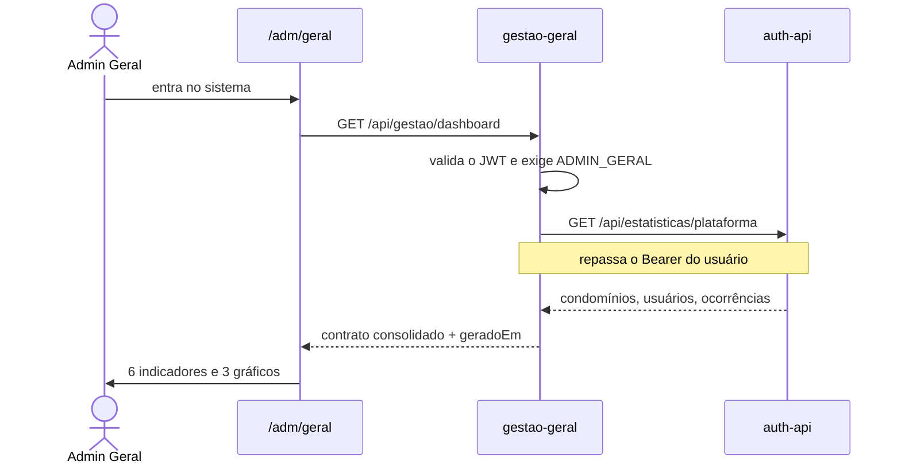

# gestao-geral

**Stack:** Node 20 · Express 4 — **Porta:** 3002 — **Banco:** nenhum
**Status:** em operação

---

## Responsabilidade

Consolida, num contrato único para o frontend, indicadores que vivem espalhados pelos demais
serviços. Nasceu servindo o painel do Admin Geral e é onde os painéis analíticos do síndico
entram depois.

| RF | Requisito |
|---|---|
| 18 | Gerar Relatórios e Dashboards Analíticos |

**Não tem banco próprio.** Cada serviço agrega os próprios dados em SQL, e este compõe a
resposta — não lê base alheia nem mantém cópia.

---

## Fluxo de usuário

### Painel do Admin Geral



**O que o painel mostra:**

| Indicador | Origem |
|---|---|
| Condomínios ativos | `condominios.status` |
| Novos em 30 dias | `condominios.createdAt` |
| Usuários ativos | `users.status` |
| Média de usuários por condomínio | derivado |
| Convites pendentes | `invites` |
| Ocorrências abertas | `reclamacoes.status` |

**Gráficos:** crescimento da carteira em 12 meses · distribuição pelos 6 perfis · usuários por
condomínio, com as barras levando ao detalhe do cliente.

### Resumo de um condomínio

Alimenta os indicadores da tela de detalhe do cliente. Diferente do painel, **não exige
`ADMIN_GERAL`** — o `auth-api` decide se o solicitante pertence àquele condomínio, e duplicar a
regra aqui faria a autorização viver em dois lugares.

---

## Endpoints

| Rota | Quem pode | Devolve |
|---|---|---|
| `GET /api/gestao/dashboard` | Só `ADMIN_GERAL` | Indicadores e séries da plataforma |
| `GET /api/gestao/dashboard/exportar` | Só `ADMIN_GERAL` | CSV dos indicadores, com BOM para o Excel |
| `GET /api/gestao/painel` | Perfis de gestão | Painel do condomínio do ator |
| `GET /api/gestao/condominios/:id/resumo` | Admin Geral, ou quem pertence ao condomínio | Resumo com estrutura e assinatura |
| `GET /health` | Público | `{ status, servico }` |

No `/painel`, o Admin Geral escolhe o condomínio por `?condominioId=`; os demais
ficam presos ao próprio, mesmo passando outro na URL.

---

## Autorização

É o **primeiro serviço da malha que rejeita token inválido**. Os serviços Java fazem o parse do
JWT e deixam a requisição seguir mesmo quando ele falha; aqui não.

| Situação | Resposta |
|---|---|
| Sem cabeçalho `Authorization` | **401** |
| Token inválido ou expirado | **401** |
| Perfil diferente de `ADMIN_GERAL` em `/plataforma` | **403** |

O motivo é o alcance: este endpoint expõe dados de **todos** os condomínios. É o lugar errado
para falhar aberto. Serve de modelo para os demais serviços.

O token é validado localmente (HS256, `JWT_SECRET` compartilhado) e **repassado** ao `auth-api`,
que revalida — inclusive a revogação por `tokenVersion`. Não há credencial de serviço.

---

## Estrutura

```
services/gestao-geral/
  server.js                     Express, helmet, CORS, /health
  config/servicos.js            URLs das fontes e timeout
  middleware/auth.js            valida JWT e exige ADMIN_GERAL
  clients/httpClient.js         fetch com timeout, devolve {ok, dados, erro}
  clients/authClient.js         chamadas ao auth-api
  services/dashboardService.js  compõe a resposta
  routes/dashboard.js
  Dockerfile
```

---

## Integrações

| Com | Situação |
|---|---|
| `auth-api` | Condomínios, usuários, convites e ocorrências |
| `portaria-service` | Blocos, apartamentos e áreas comuns, por `?condominioId=` |
| `plan-service` | Assinatura vigente, com os limites do plano resolvidos |

O `portaria-service` ainda não expõe endpoints de contagem, então o
`portariaClient` conta a partir das listagens. Funciona no porte atual; se o
volume crescer, o caminho é adicionar contagem lá, sem que o contrato mude.

### Degradação

`httpClient` devolve `{ ok, dados, erro }` em vez de lançar exceção. Uma fonte indisponível vira
um bloco vazio com aviso, e o campo **`fontesIndisponiveis`** no contrato diz ao frontend o que
não pôde ser carregado — em vez de derrubar o painel inteiro.

A exceção é o `auth-api`: sem ele não há painel, então a falha vira **503** com mensagem clara.

Timeout por fonte: 3 segundos, configurável por `FONTE_TIMEOUT_MS`.

---

## Variáveis de ambiente

| Variável | Para quê |
|---|---|
| `JWT_SECRET` | Validar os tokens emitidos pelo `auth-api`. **Obrigatória** |
| `AUTH_API_URL` | Endereço do `auth-api` |
| `PORTARIA_SERVICE_URL`, `PLAN_SERVICE_URL` | Fontes previstas |
| `FRONTEND_URL` | Origem liberada no CORS |
| `FONTE_TIMEOUT_MS` | Tempo máximo por fonte |

---

## Pendências

| Item | Situação |
|---|---|
| Painel financeiro do síndico | Bloqueado: depende do `financeiro-service`. O bloco `financeiro` vem nulo no contrato, reservado |
| Séries históricas com snapshot | A série de condomínios por mês é derivada de `createdAt`; séries que sobrevivam a exclusões exigiriam snapshot diário |

### Resolvidas

| Item | Como |
|---|---|
| Painel do síndico | `GET /api/gestao/painel`, com usuários, convites, ocorrências, estrutura e plano contratado |
| Consumo do `portaria-service` | `portariaClient` traz blocos, apartamentos e áreas comuns; a taxa de ocupação sai daí |
| Consumo do `plan-service` | `planClient` traz a assinatura vigente — destravado pela criação da entidade `Assinatura` |
| Exportação de relatórios | `GET /dashboard/exportar` devolve CSV com BOM, para o Excel abrir a acentuação certa |
| Registro no Consul | O serviço se registra com as tags do Traefik e sai do catálogo ao encerrar. Falha de registro não derruba o serviço |
