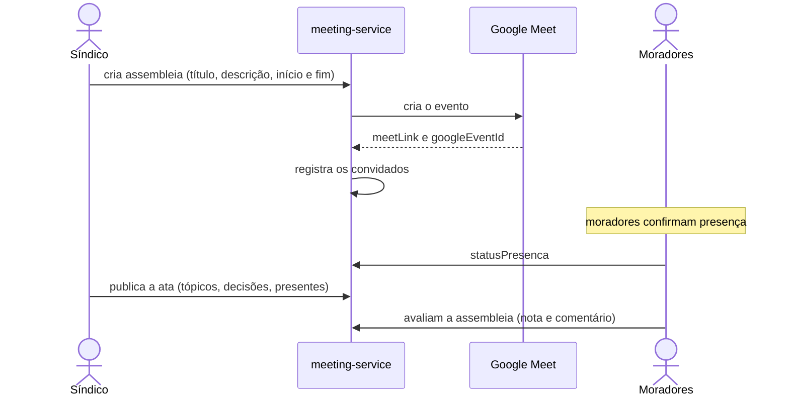
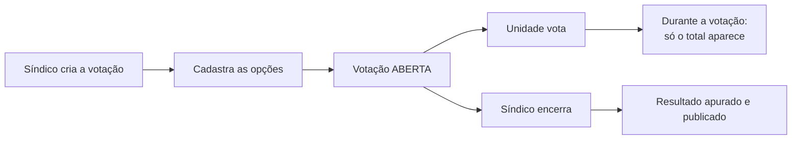

# meeting-service

**Stack:** Java 21 · Spring Boot 3.2.4 · JPA · MapStruct — **Porta:** 8091 — **Banco:** `mora_meeting`
**Status:** em operação

---

## Responsabilidade

Cuida da **vida deliberativa do condomínio**: convocação de assembleias, registro das atas e
apuração das votações.

| RF | Requisito |
|---|---|
| 11 | Gerenciar Assembleias, Atas e Votações |

---

## Fluxos de usuário

### Assembleia

A integração com o Google Meet é **síncrona** na criação. A ata tem relação de um para um com a
assembleia.

### Votação

**Um voto por unidade**, exercido pelo proprietário ou por quem ele indicar — não um voto por
pessoa. Uma unidade com quatro moradores não pesa quatro vezes.

---

## Banco de dados — `mora_meeting`

7 tabelas.

| Tabela | Papel |
|---|---|
| `tb_meetings` | Assembleia: título, descrição, início, fim, organizador, status, `meetLink`, `googleEventId` |
| `tb_meeting_convidados` | Convidados, com presença, nota e comentário de avaliação |
| `tb_atas` | Ata: tópicos discutidos, decisões tomadas, data de publicação. Um para um com a assembleia |
| `tb_ata_presentes` | Presentes na assembleia |
| `poll` | Votação: título, descrição, status |
| `tb_poll_option` | Opções de voto |
| `tb_poll_vote` | Votos registrados |

`googleEventId` é único, para não duplicar evento no Google.

Todas carregam `condominio_id` — o serviço usa `snake_case` nas colunas, diferente do
`portaria-service`.

---

## Endpoints

| Controller | Base | Endpoints |
|---|---|---|
| `MeetingController` | `/api/meetings` | 8 |
| `AtaController` | `/api/meetings/{meetingId}/ata` | 3 |
| `PollController` | `/api/polls` | 6 |

Documentação interativa via Swagger — é o único serviço do projeto com OpenAPI configurado.

---

## Integrações

| Com | Como |
|---|---|
| Google Meet / Calendar | `google-api-services-meet` — cria o evento e guarda o link |
| Consul | Registro e health check |
| Traefik | `PathPrefix(/api/meetings)` |

Credenciais do Google ficam fora do repositório (`credentials.json` e `tokens/` estão no
`.gitignore`).

---

## Notas técnicas

É o serviço Java com melhor arquitetura do projeto:

- `@Transactional` usado com consistência
- MapStruct para mapeamento entre entidade e DTO — evita conversão manual
- `FetchType.LAZY` em todos os relacionamentos
- Pool de conexões HikariCP explicitamente configurado
- `GlobalExceptionHandler` centralizado

---

## Pendências

| Item | Detalhe |
|---|---|
| **Sem autenticação** | Não há filtro de JWT; qualquer requisição cria, edita ou apaga assembleia e ata |
| **Voto sem unicidade garantida** | `tb_poll_vote` não tem constraint por unidade — a regra de um voto por unidade não está no banco |
| Sem paginação | Listar assembleias traz o histórico inteiro |
| Chamada ao Google sem timeout ou retry | Se o Google demorar, a criação da assembleia trava |
| `show-sql` ativo | Verbosidade indevida para produção |
| Spring Boot 3.2.4 | Os demais serviços Java estão em 3.5.6 |
