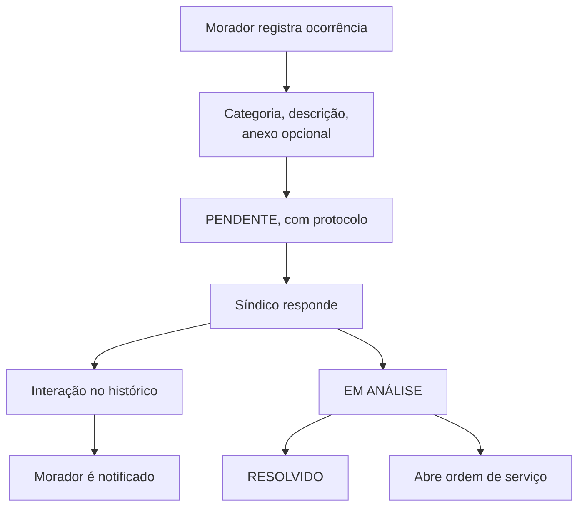
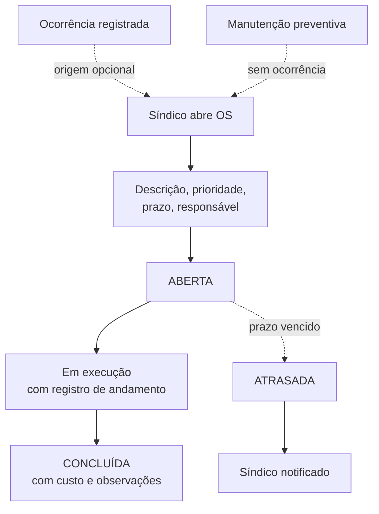

# ocorrencias-service

**Stack:** Java 21 · Spring Boot — **Porta:** 8095 — **Banco:** `mora_ocorrencias`
**Status:** 📋 planejado — a parte de reclamações roda hoje no `auth-api`

---

## Responsabilidade

Cobre o ciclo que vai da **queixa do morador até a manutenção executada**: registrar a
ocorrência, atender, e abrir ordem de serviço quando exigir intervenção técnica.

| RF | Requisito |
|---|---|
| 14 | Gerenciar Ocorrências e Ordens de Serviço |

**Escopo do requisito**, conforme a especificação: registro da ocorrência, atendimento, abertura
de ordem de serviço, responsável e prazo.

---

## Situação atual

Metade do domínio já existe, **no `auth-api`**:

| Recurso | Onde está hoje | Estado |
|---|---|---|
| Reclamações | `auth_db.reclamacoes` · `routes/reclamacoes.js` (4 endpoints) | Funciona: abrir, listar, alterar status |
| Ordens de serviço | — | Não existe |

`reclamacoes` está no `auth-api` por implementação anterior à divisão de domínios — não é o
lugar dela. **Migra para este serviço**, junto com os dados.

A tabela atual tem `id`, `userId`, `protocolNumber`, `category`, `description`,
`attachmentUrl`, `status`, `interactions`, `condominioId`, `createdAt`, `updatedAt`.

O campo `interactions` é **JSON não estruturado** — o histórico de atendimento não é
consultável. A normalização acompanha a migração.

---

## Fluxos de usuário

### Ocorrência

O morador vê apenas as próprias ocorrências; o síndico vê todas as do condomínio.

### Ordem de serviço

**A OS pode nascer de uma ocorrência ou ser aberta direto** — o segundo caso cobre manutenção
programada, que não vem de queixa de morador.

---

## Banco de dados — proposta

> **As tabelas abaixo são proposta, não decisão** — exceto `reclamacoes`, que já existe no
> `auth_db` e será migrada.

| Tabela | Papel | Origem |
|---|---|---|
| `reclamacoes` | Ocorrência: protocolo, categoria, descrição, anexo, status | Migra de `auth_db` |
| `reclamacao_interacoes` | Histórico de atendimento, com autor e data | Nova — substitui o JSON `interactions` |
| `ordens_servico` | OS: descrição, prioridade, prazo, responsável, status, custo, ocorrência de origem | Nova |
| `fornecedores` | Prestadores de serviço acionados nas OS | Nova |

Todas com `condominioId`.

### Em aberto

| Questão |
|---|
| Categorias de ocorrência: fixas ou configuráveis por condomínio |
| Se fornecedor é cadastro próprio ou apenas um campo de texto na OS |
| Definição de SLA por prioridade |
| Onde ficam os anexos — hoje `attachmentUrl` guarda apenas o caminho |

---

## Integrações previstas

| Com | Para quê |
|---|---|
| `auth-api` | Identidade de quem abriu a ocorrência e de quem atende |
| `comunicacao-service` | Notificar o morador quando a ocorrência é respondida |
| `financeiro-service` | Multa originada de uma ocorrência |
| `gestao-geral` | Alimenta indicadores em três painéis |

### Indicadores que dependem deste serviço

O `gestao-geral` já exibe **ocorrências abertas** no painel do Admin Geral, consumindo a tabela
que hoje está no `auth-api`. Com a migração, a fonte passa a ser este serviço.

Os painéis planejados dependem dele para: ocorrências pendentes, tempo médio de resposta, OS no
prazo e OS críticas atrasadas.

---

## O que a migração precisa resolver

| Item |
|---|
| Mover `reclamacoes` de `auth_db` para `mora_ocorrencias` |
| Normalizar `interactions` em `reclamacao_interacoes` |
| Remover `routes/reclamacoes.js` e o model do `auth-api` |
| Atualizar o `gestao-geral`, que hoje busca ocorrências no `auth-api` |
| Atualizar o frontend: `/reclamacoes` e `/adm/reclamacoes` |
