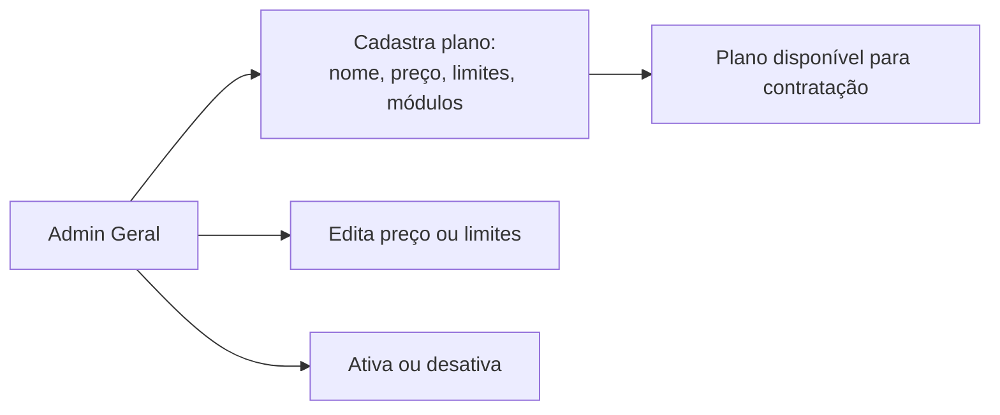
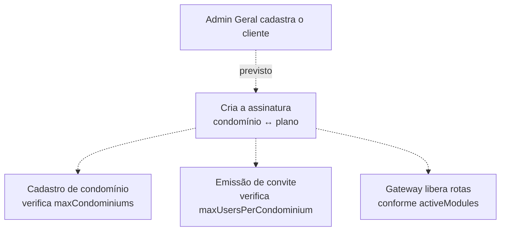

# plan-service

**Stack:** Java 21 · Spring Boot 3.2.4 · JPA · MapStruct — **Porta:** 8093 — **Banco:** `mora_plan`
**Status:** em operação, parcial

---

## Responsabilidade

Guarda os **parâmetros comerciais do produto**: quais planos existem, o que cada um custa, que
limites impõe e quais módulos libera. Deve também registrar qual plano cada condomínio
contratou.

| RF | Requisito |
|---|---|
| 4 | Gerenciar Planos e Assinaturas |

---

## Fluxos de usuário

### Manutenção do catálogo — implementado

### Contratação e aplicação de limites — **planejado**

> As setas tracejadas não existem no código. **Não há entidade de assinatura**, então os
> limites `maxCondominiums`, `maxUsersPerCondominium` e `activeModules` estão cadastrados mas
> **não são aplicados em lugar nenhum** — não há como saber qual plano cada condomínio tem.

---

## Banco de dados — `mora_plan`

2 tabelas.

### `tb_plans`

| Coluna | Papel |
|---|---|
| `id` | Identificador |
| `name` | Nome do plano, único |
| `maxCondominiums` | Limite de condomínios |
| `maxUsersPerCondominium` | Limite de usuários por condomínio |
| `monthlyPrice` | Mensalidade, `decimal(10,2)` |
| `isActive` | Se está disponível para contratação |
| `createdAt`, `updatedAt` | Preenchidas por callback de ciclo de vida |

### `tb_plan_modules`

Coleção dos módulos ativos de cada plano.

### Entidade prevista — não existe

**`assinaturas`** — ligaria `condominioId` a `planId`, com vigência e status. Sem ela, o
catálogo é decorativo: nenhum limite é aplicável.

O banco também **não tem seed**: a plataforma sobe sem nenhum plano cadastrado.

---

## Endpoints

| Controller | Base | Endpoints |
|---|---|---|
| `PlanController` | `/api/plans` | 6 |

CRUD do catálogo. Não há endpoints de assinatura.

---

## Integrações

| Com | Situação |
|---|---|
| Consul | Registro e health check |
| Traefik | `PathPrefix(/api/plans)`, sem remoção de prefixo — o controller já carrega o caminho completo |
| `gestao-geral` | Previsto: consumir assinaturas para o painel |
| `auth-api` | Previsto: verificar limite antes de criar condomínio ou emitir convite |
| Gateway | Previsto: bloquear rotas de módulos não contratados |

---

## Notas técnicas

`Plan.java` é a entidade mais rigorosa do projeto: `nullable` e `precision` explícitos em cada
coluna, `@PrePersist`/`@PreUpdate` para timestamps, `BigDecimal(10,2)` para valor monetário e
`unique` no nome.

---

## Pendências

| Item | Detalhe |
|---|---|
| **Entidade de assinatura** | Sem ela os limites do plano não são aplicáveis. É a lacuna principal |
| **Sem autenticação** | Não há filtro de JWT. Este serviço define preço e limites do produto, e está aberto a quem alcançar a porta |
| **Sem trilha de auditoria** | Não se registra quem alterou preço ou limite |
| **Sem seed** | Nenhum plano nasce com a plataforma |
| **Sem testes** | Único serviço sem nem o teste de contexto |
| `show-sql` ativo | Verbosidade indevida para produção |
| Spring Boot 3.2.4 | Os demais serviços Java estão em 3.5.6 |
