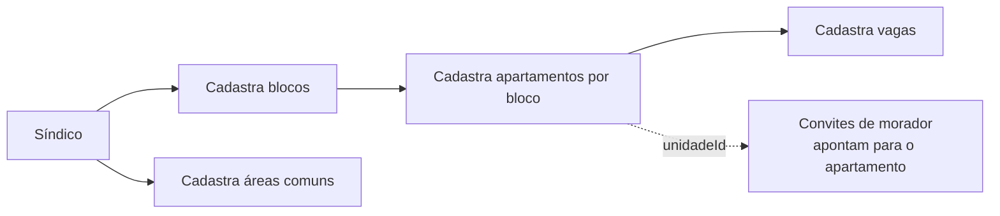
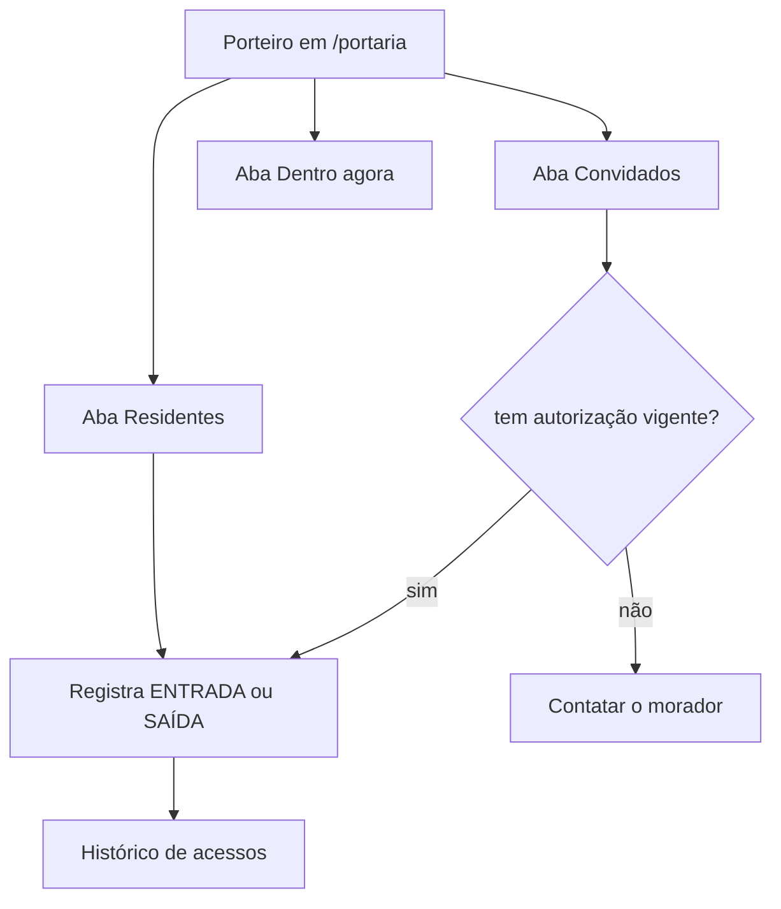
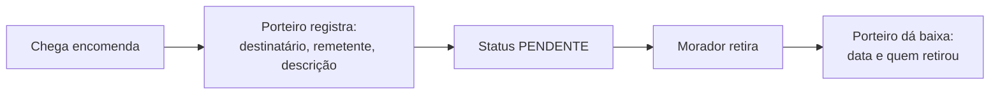

# portaria-service

**Stack:** Java 21 · Spring Boot 3.5.6 · JPA — **Porta:** 8090 — **Banco:** `mora`
**Status:** em operação

---

## Responsabilidade

É o serviço do **mundo físico do condomínio**: o que existe nele (blocos, apartamentos, áreas
comuns, vagas), quem circula por ele (moradores, funcionários, visitantes, veículos) e o que
passa pela guarita (acessos, encomendas, chaves).

É o maior serviço do sistema — 15 controllers.

| RF | Requisito |
|---|---|
| 5 | Gerenciar Estrutura do Condomínio |
| 6 | Controlar Acessos e Visitantes |
| 7 | Gerenciar Entregas e Encomendas |
| 8 | Controlar Retirada e Devolução de Chaves |
| 9 | Gerenciar Funcionários e Turnos |
| 10 | Gerenciar Reservas de Áreas Comuns |

---

## Fluxos de usuário

### Montagem da estrutura — Síndico ou Admin Geral



O `unidadeId` que viaja nos convites do `auth-api` é o `id` do apartamento cadastrado aqui — é
por isso que o `auth-api` consulta este serviço antes de emitir um convite de unidade.

### Guarita — Porteiro



### Encomendas



### Chaves

Retirada registra o responsável e a data; a chave fica indisponível até a devolução. Uma chave
retirada não pode ser retirada por outra pessoa.

### Veículos e vagas

Veículos são vinculados a uma vaga e a um proprietário. O `VeiculoService` é o único ponto do
serviço que hoje consulta o perfil do usuário autenticado para decidir o que ele pode fazer.

---

## Banco de dados — `mora`

16 tabelas.

### Estrutura física

| Tabela | Papel |
|---|---|
| `blocos` | Blocos do condomínio. Único por `(nome, condominioId)` |
| `apartamentos` | Unidades, vinculadas ao bloco. O `id` é o `unidadeId` usado nos convites |
| `areas_comuns` | Espaços comuns, com capacidade, taxa e flag de reserva |
| `vagas_estacionamento` | Vagas, vinculadas ao apartamento |

### Pessoas

| Tabela | Papel |
|---|---|
| `moradores` | Quem mora na unidade |
| `funcionarios` | Equipe do condomínio, com cargo e matrícula |
| `visitantes` | Visitantes, com status de acesso (`DENTRO` / `SAIU`) |

As três estendem uma superclasse comum, com `id`, `nome`, `cpf`, `email`, `telefone`, `ativo` e
`condominioId`.

### Operação da guarita

| Tabela | Papel |
|---|---|
| `entregas` | Encomendas, com destinatário, remetente e status |
| `chaves` | Chaves, com responsável e datas de retirada e devolução |
| `veiculos` | Veículos com categoria e vínculo com vaga |
| `carros` | **Duplicata de `veiculos`** — a fundir |
| `turnos` | Jornada dos funcionários |
| `turno_entradas`, `turno_saidas` | Marcações do turno |

### A migrar

| Tabela | Destino |
|---|---|
| `avisos` | `comunicacao-service` |
| `artigos_conhecimento` | `comunicacao-service` |

Estão aqui por implementação anterior à divisão de domínios.

### Isolamento

Todas as 16 tabelas carregam `condominioId`, com índice. As unicidades que seriam globais são
compostas com ele:

```
UNIQUE (condominioId, nome)    areas_comuns, blocos
UNIQUE (condominioId, numero)  vagas_estacionamento
UNIQUE (condominioId, placa)   veiculos, carros
UNIQUE (condominioId, cpf)     moradores, funcionarios, visitantes
```

**As colunas existem; o filtro nas consultas ainda não é aplicado em todos os domínios** — hoje
só `Bloco`, `Apartamento`, `AreaComum` e `Aviso` filtram.

---

## Endpoints

| Controller | Base | Endpoints |
|---|---|---|
| `BlocoController` | `/blocos` | 8 |
| `ApartamentoController` | `/apartamentos` | 10 |
| `AreaComunController` | `/areas-comuns` | 10 |
| `VagaController` | `/vagas` | 8 |
| `MoradorController` | `/moradores` | 6 |
| `FuncionarioController` | `/funcionarios` | 6 |
| `VisitanteController` | `/visitantes` | 5 |
| `VeiculoController` | `/veiculos` | 10 |
| `CarroController` | `/carros` | 7 |
| `EntregaController` | `/entregas` | 7 |
| `ChaveController` | `/chaves` | 7 |
| `TurnoController` | `/turnos` | 5 |
| `AvisoController` | `/avisos` | 7 |
| `ArtigoConhecimentoController` | `/conhecimento` | 9 |
| `UsuarioController` | `/usuarios` | 1 |

---

## Integrações

| Com | Como |
|---|---|
| `auth-api` | É consultado para validar existência de unidade |
| Consul | Registra-se para descoberta; expõe `/actuator/health` |
| Traefik | Roteado por `PathPrefix(/api/portaria)` com remoção do prefixo |

Recebe o `condominioId` e o `perfil` pelas claims do JWT emitido pelo `auth-api`.

---

## Pendências

| Item | Detalhe |
|---|---|
| **Filtro JWT não rejeita** | O `AuthFilter` engole token inválido e deixa a requisição seguir. O `AuthContext` é consultado em um único service dos 15 |
| **Filtro por condomínio incompleto** | 4 dos 14 domínios aplicam; os demais têm a coluna e não filtram |
| `carros` e `veiculos` duplicados | Fundir em `veiculos`, que é mais completo |
| Sem `@Transactional` | Operações multi-passo rodam sem atomicidade |
| Sem paginação | Todas as listagens usam `findAll` |
| `avisos` e `artigos_conhecimento` | Migram para o `comunicacao-service` |
| Reservas (RF-10) | Não há tabela de reservas; só o cadastro de áreas comuns |
| Aluguel de vagas | Virá do `vagas-service` na fusão prevista |
