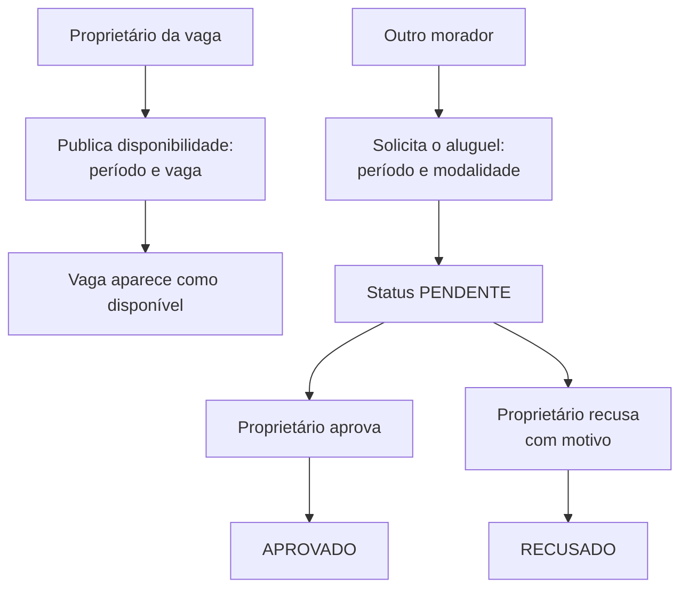

# vagas-service

**Stack:** Java 21 · Spring Boot 3.5.6 · JPA — **Porta:** 8092 — **Banco:** `vagas_db`
**Status:** em operação — **a ser fundido no `portaria-service`**

> Este serviço não consta na [especificação do projeto](../ESPECIFICACAO-PROJETO.md), que lista
> oito serviços. Ele existe no repositório e roda, mas está previsto para ser absorvido pelo
> `portaria-service`, que já é dono das vagas de estacionamento. Este documento descreve o
> estado atual, para guiar quem fizer a fusão.

---

## Responsabilidade atual

Aluguel de vagas de estacionamento **entre moradores**: o proprietário publica a
disponibilidade da sua vaga e outro morador a solicita por um período.

Corresponde a uma parte do **RF-5 (Gerenciar Estrutura do Condomínio)**, cujo escopo inclui as
vagas — atendido hoje em dois serviços ao mesmo tempo.

---

## Fluxo de usuário

Os valores são registrados em `BigDecimal(10,2)` — `valorTotal` e, quando houver,
`valorPenalidade`.

---

## Banco de dados — `vagas_db`

6 tabelas, das quais **4 são cópias** de tabelas do banco `mora`.

### Domínio próprio

| Tabela | Papel |
|---|---|
| `disponibilidade_vagas` | Janelas em que o proprietário oferece a vaga: `dataInicio`, `dataFim`, `ativa` |
| `alugueis_vagas` | Solicitações: `solicitanteId`, `proprietarioId`, `modalidade`, `valorTotal`, `valorPenalidade`, `status`, `motivoRecusa` |

### Cópias — a descontinuar

| Tabela | Original |
|---|---|
| `blocos` | `mora.blocos` |
| `apartamentos` | `mora.apartamentos` |
| `moradores` | `mora.moradores` |
| `vagas_estacionamento` | `mora.vagas_estacionamento` |

São réplicas das entidades do `portaria-service`, **sem nenhum mecanismo de sincronização**. As
duas cópias divergem livremente conforme os dados mudam de um lado.

`alugueis_vagas` e `disponibilidade_vagas` receberam `condominioId` com índices compostos por
período, junto da propagação feita nos demais bancos.

---

## Endpoints

| Controller | Base | Endpoints |
|---|---|---|
| `AluguelController` | `/alugueis` | 10 |
| `VagaController` | `/vagas` | 8 |

---

## Integrações

| Com | Como |
|---|---|
| Consul | Registro e health check |
| Traefik | `PathPrefix(/api/vagas)` com remoção do prefixo |

Não conversa com o `portaria-service` — daí as cópias.

---

## O que a fusão precisa resolver

| Item | Detalhe |
|---|---|
| **Mover o domínio** | `disponibilidade_vagas` e `alugueis_vagas` vão para o banco `mora`, onde `vagas_estacionamento` já existe |
| **Descartar as cópias** | As 4 tabelas espelho deixam de existir; o `portaria-service` já é dono dos originais |
| **Descontinuar `vagas_db`** | Depois da migração dos dados |
| **Identificador de pessoa** | `solicitanteId` e `proprietarioId` são `UUID` sem correspondência com o `users.id` do `auth_db` |
| **Seed apontando para o banco errado** | `seed-estruturas-fisicas.sql` é cópia byte a byte do arquivo do portaria, incluindo o `\c mora;` — popula o banco errado |

---

## Pendências enquanto existir

| Item |
|---|
| **Sem autenticação** — não há filtro de JWT, e o serviço movimenta valores financeiros |
| `solicitanteId` vem no corpo da requisição, não do token — não há como provar quem solicitou |
| Sem constraint impedindo aluguéis sobrepostos na mesma vaga |
| Teste órfão chamado `PortariaServiceApplicationTests.java`, em `src/main/test/` — diretório que o Maven ignora |
